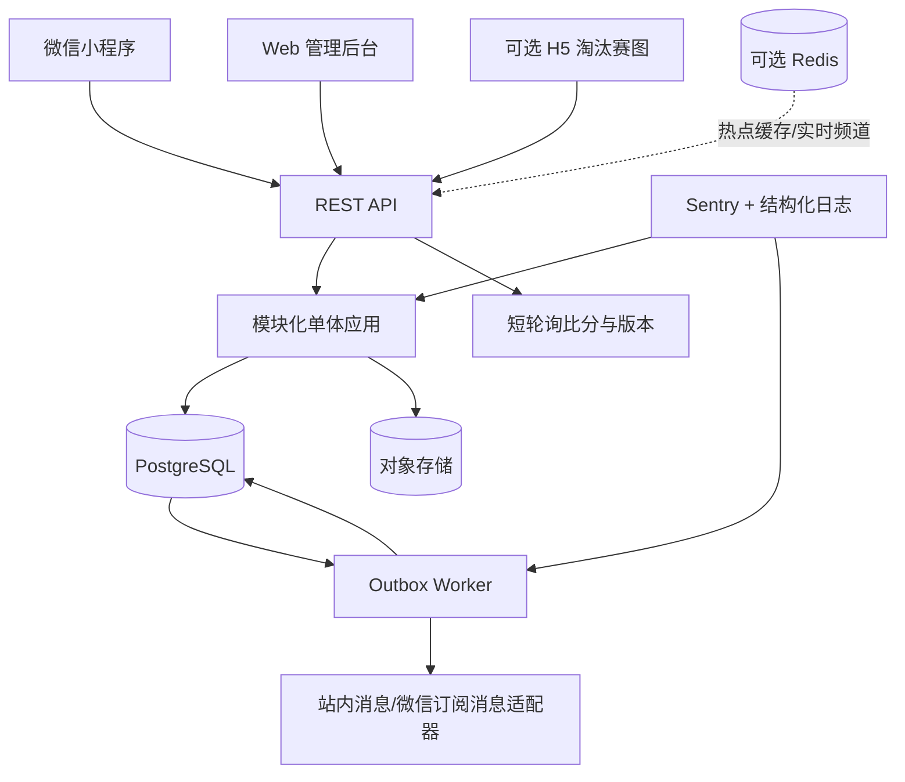
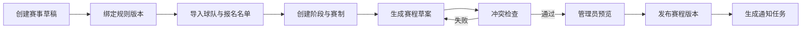
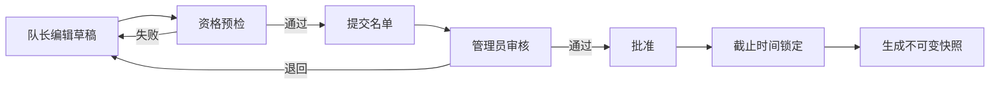
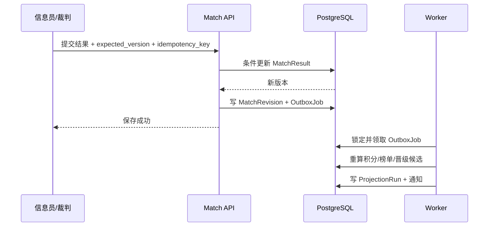
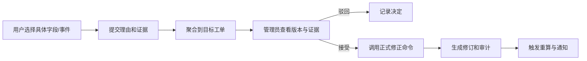

# 晓球更新架构方案 A：赛事落地型模块化单体

> 文档版本：V0.3-A  
> 编制日期：2026-06-10  
> 方案定位：以 1-3 人团队在一个学期内支撑真实校园杯赛为第一目标。  
> 核心取舍：少部署组件、强业务闭环、数据库保证一致性、为未来扩展留接口但不提前承担平台化成本。

## 一、方案摘要

方案 A 延续 V0.2 已经正确的方向：

- 微信小程序作为主要用户端。
- Web 管理后台承担复杂管理工作。
- 服务端权威计算比分、积分、榜单和晋级结果。
- 使用作用域角色、乐观锁、版本审计和对象级质疑保障数据可信。
- 保持模块化单体，不拆微服务。

本次更新重点补齐六个真实赛事必需但 V0.2 尚未完全展开的部分：

1. **赛事规则版本：** 已开赛赛事绑定不可静默变化的规则快照。
2. **名单治理：** 区分球队成员、赛事报名名单和单场出场名单。
3. **赛程发布：** 内部排期、正式发布、变更通知和历史版本分离。
4. **比赛报告：** 比赛进行状态与数据报告审核状态分离。
5. **可靠异步：** 使用数据库 Outbox 驱动通知、重算和缓存失效。
6. **运营工作台：** 把缺失数据、冲突、申诉和质疑转为明确待办。

本方案不把 Redis、独立搜索、消息中间件、视频 AI 和微服务列为首发必需。首发可以只部署应用、Worker、PostgreSQL 和对象存储，降低比赛当天的故障面。

## 二、适用条件与成功标准

### 1. 适用条件

- 开发与维护人员为 1-3 人。
- 首年主要服务一所学校或少量校园赛事。
- 活跃用户在数百到数千量级。
- 同时进行的热门比赛数量有限。
- 第一目标是完成赛事闭环，而不是立刻建设开放平台。

### 2. 首届赛事成功标准

- 管理员可以从表格导入身份、球队和名单。
- 可以创建小组赛与淘汰赛并发布赛程。
- 赛程变更能够通知受影响人员。
- 裁判或现场负责人能快速提交比赛结果。
- 信息员可以稍后补录进球、助攻和红黄牌。
- 比分、榜单、晋级和后续对阵不会因并发或重算失败产生静默错误。
- 争议数据可以定位到具体字段或事件并完成仲裁。
- 所有关键修改可追溯、可比较、可恢复。
- 比赛结束后能产出积分榜、射手榜和基础球员赛季数据。

## 三、总体架构



### 1. 首发部署单元

首发只保留三个自有运行单元：

- `api`：HTTP API、鉴权、业务命令和查询。
- `worker`：消费数据库 Outbox，执行通知、投影重算、导出等任务。
- `admin-web`：管理后台静态资源或独立 Web 应用。

微信小程序单独发布，对象存储使用托管服务。`api` 与 `worker` 可以来自同一代码仓库和同一镜像，仅启动命令不同。

### 2. 技术栈建议

| 层 | 推荐 | 说明 |
| --- | --- | --- |
| 微信端 | 原生微信小程序 + TypeScript + TDesign MiniProgram | 首发目标明确，调试链路最短 |
| Web 后台 | React + react-admin + FullCalendar + ECharts | CRUD 快速落地，复杂赛事页面单独开发 |
| 服务端 | NestJS + TypeScript | 与前端共享语言，模块与依赖注入边界清晰 |
| 数据库 | PostgreSQL | 事务、约束、JSONB、全文检索和恢复能力充分 |
| ORM | Prisma 或 TypeORM，二选一并全局统一 | 关键并发写入允许使用显式 SQL |
| 异步任务 | PostgreSQL Outbox + 单 Worker | 首发不强依赖 Redis |
| 文件 | S3 兼容对象存储 | 队徽、图片、证据附件和导出文件 |
| 监控 | Sentry + JSON 结构化日志 | 首发必须具备错误追踪 |
| 部署 | Docker Compose + GitHub Actions + Coolify | 单机可维护，并保留自动回滚镜像 |

## 四、领域边界与模块职责

服务端按业务能力拆模块，每个模块拥有自己的应用服务、领域规则和数据访问入口。模块之间不能随意跨表写入。

```text
auth
identity
organization
competition
scheduling
team-roster
match-reporting
ranking
dispute
community
notification
media
admin-operations
audit
```

### 1. `auth`

负责：

- 密码注册与登录。
- 微信身份绑定、改绑和自动登录。
- 会话签发、刷新、撤销与 `auth_version`。
- 登录限速、失败计数和安全事件。

不负责：

- 学生白名单业务状态。
- 球员档案。
- 赛事角色授权规则。

### 2. `identity`

负责：

- `StudentIdentity` 白名单导入与认领。
- 隐私字段访问控制。
- 账号冒用申诉和线下核验记录。
- 可选 `ExternalIdentity`，为未来校园 CAS/OAuth 预留。

### 3. `organization`

方案 A 不做完整多租户，但增加轻量 `Organization`：

```text
Organization
- id
- name
- type: SCHOOL / COLLEGE / CLUB / OTHER
- status
```

所有赛事归属一个组织。首发可以只有一个默认组织，这能避免未来增加院系或第二所学校时重构全部赛事表。

### 4. `competition`

负责：

- 赛季、赛事、阶段、分组、轮次。
- 赛事规则版本和规则快照。
- 赛制生成适配器。
- 阶段确认和晋级操作。

不直接负责赛程发布时间和场地资源，这些属于 `scheduling`。

### 5. `scheduling`

负责：

- 场地、球场和比赛工作人员。
- 赛程草稿、冲突检查、发布与变更。
- 比赛时间、地点、对手变化的差异记录。
- 发布后的定向通知任务。

### 6. `team-roster`

负责：

- 球队资料和当前成员。
- 赛事报名、报名名单、提交、退回、锁定和快照。
- 单场可参赛名单、出勤响应、签到和实际出场。
- 球员多队冲突和资格检查。

### 7. `match-reporting`

负责：

- 比赛事实状态。
- 快速比赛报告。
- 完整事件报告。
- 比分、点球、弃权、官方判罚和事件完整度。
- 字段级并发控制、修订和管理员修正。

### 8. `ranking`

负责：

- 小组积分和同分规则。
- 射手榜、助攻榜、零封等事实型榜单。
- 晋级候选计算。
- 榜单计算快照、解释和回放。

排名计算通过明确输入生成明确输出，不允许在控制器中临时拼接规则。

### 9. `dispute`

负责：

- 对比分字段、比赛事件、名单和球员归属等对象提出质疑。
- 相同目标的聚合工单。
- 证据附件、处理意见和信誉流水。
- 接受质疑后调用目标模块的正式修正命令。

### 10. `community`

负责：

- 动态、评论、点赞和举报。
- 动态与比赛、球队、球员的结构化关联。
- 官方赛果动态草稿。

社区数据不得直接修改赛事数据。

### 11. `notification`

负责：

- 站内收件箱。
- 聚合规则、已读状态和通知偏好。
- 微信订阅消息适配。

通知失败不回滚主业务事务。

### 12. `media`

负责：

- 图片和附件元数据。
- 上传凭证、访问权限和删除/下架状态。
- 质疑证据、队徽、动态图片和比赛图片。

方案 A 不做视频转码和 AI 分析，仅保留 `related_match_id`、`related_event_id` 和 `cue_point_ms` 扩展字段。

## 五、核心数据模型

### 1. 账号与身份

```text
Organization
StudentIdentity
User
Credential
WechatBinding
ExternalIdentity
UserSession
AccountAppeal
RoleAssignment
SecurityEvent
```

关键约束：

- `StudentIdentity(organization_id, student_no)` 唯一。
- 一个有效身份最多绑定一个用户。
- `User.login_name_normalized` 唯一。
- 一个有效微信 `openid` 最多绑定一个用户。
- `RoleAssignment(user_id, role, scope_type, scope_id)` 唯一。
- 隐私字段不进入公开搜索索引。

### 2. 赛事与规则

```text
Season
Tournament
CompetitionRuleVersion
RankingRule
EligibilityRule
SuspensionRule
Stage
Group
Round
BracketSlot
AdvancementRule
StageProgression
```

`CompetitionRuleVersion` 保存：

- 规则名称和版本。
- 胜平负积分。
- 同分比较顺序。
- 弃权比分处理。
- 点球大战是否计入净胜球。
- 红牌停赛规则。
- 淘汰赛资格规则。
- 生效时间和发布人。

赛事开始后绑定 `rule_version_id`。修改模板只能影响未来赛事；若必须修改当前赛事，创建新版本并记录管理员决议，不覆盖旧规则。

### 3. 赛程与资源

```text
Venue
Pitch
OfficialProfile
SchedulePlan
ScheduleRevision
Match
MatchOfficialAssignment
```

`SchedulePlan` 状态：

```text
DRAFT
VALIDATING
READY
PUBLISHED
SUPERSEDED
CANCELLED
```

`ScheduleRevision` 至少记录：

- 版本号。
- 发布时间。
- 发布人。
- 变更比赛列表。
- 每场比赛的时间、场地、对手变化摘要。
- 通知任务状态。

### 4. 球队与名单

```text
Team
TeamMember
TeamRegistration
RosterSubmission
RosterEntry
RosterSnapshot
MatchAvailability
MatchCheckIn
MatchLineup
MatchLineupEntry
Suspension
```

必须区分：

- `TeamMember`：当前组织关系，可随时间变化。
- `RosterEntry`：某赛事报名名单。
- `RosterSnapshot`：名单锁定时生成的不可变历史快照。
- `MatchLineupEntry`：某场比赛实际报名或出场球员。

`RosterSubmission` 状态：

```text
DRAFT
SUBMITTED
RETURNED
APPROVED
LOCKED
REOPENED
WITHDRAWN
```

### 5. 比赛与报告

```text
Match
MatchResult
MatchReport
MatchEvent
MatchEventParticipant
MatchRevision
FieldRevision
DataCompleteness
```

`Match` 只描述比赛事实进程：

```text
SCHEDULED
CHECK_IN
LIVE
FINISHED
CONFIRMED
CANCELLED
ABANDONED
```

`MatchReport` 描述数据审核进程：

```text
DRAFT
SUBMITTED
CONFIRMED
DISPUTED
CORRECTED
REOPENED
```

两套状态分离后，可以表达“比赛已经结束，但报告尚未确认”以及“比赛结果确认后又发生修正”。

`MatchResult` 明确保存：

- 常规时间比分。
- 加时赛比分。
- 点球大战比分。
- 是否弃权。
- 官方判定比分。
- 胜者来源和结果备注。
- 结果版本号。

### 6. 榜单与投影

```text
StandingsSnapshot
StandingsRow
PlayerStatSnapshot
PlayerStatRow
ProgressionProposal
ProjectionRun
```

方案 A 的读模型仍保存在同一个 PostgreSQL 中，但与写模型分表：

- 写入比赛结果后创建 Outbox 任务。
- Worker 重算受影响分组、榜单和晋级候选。
- 每次重算记录输入版本、规则版本、输出摘要和校验结果。
- 查询接口只读取最新成功投影。

### 7. 质疑、审计与任务

```text
Dispute
DisputeEvidence
DisputeAggregation
DisputeDecision
ReputationLedger
AuditLog
OutboxJob
JobAttempt
```

`OutboxJob` 建议字段：

```text
id
event_type
aggregate_type
aggregate_id
payload_json
deduplication_key
available_at
status
attempt_count
last_error
created_at
processed_at
```

唯一 `deduplication_key` 保证同一业务任务不会重复创建。

## 六、关键状态机与业务流程

### 1. 赛事创建与发布



发布前校验：

- 同一球队比赛时间是否重叠。
- 同一场地是否重叠。
- 裁判或现场负责人是否重叠。
- 球队是否已通过报名审核。
- 阶段、分组和轮次是否完整。
- 淘汰赛来源席位是否可解释。

### 2. 名单提交与锁定



锁定后新增或替换球员必须走“重新开放名单”操作，并记录原因与新快照。

### 3. 比赛报告双通道

快速报告面向裁判或现场负责人：

- 比赛是否正常结束。
- 最终比分。
- 点球比分。
- 是否弃权或中止。
- 红牌数量和简短备注。

完整报告面向信息员：

- 进球、助攻、乌龙球。
- 红黄牌。
- 事件时间和参与球员。
- 实际出场名单。
- 图片或证据附件。

快速报告可以先提交并进入 `SUBMITTED`；完整事件允许稍后补充。管理员确认结果时，系统明确显示事件完整度。

### 4. 比分确认与榜单更新



如果异步重算失败：

- 官方比分仍然保存。
- 前台继续显示上一份成功投影，并标记“数据更新中”。
- Worker 自动重试。
- 超过阈值后进入管理员待办和 Sentry 告警。

### 5. 阶段推进

阶段推进必须显式确认：

1. 系统检查当前阶段必须完成的比赛。
2. 检查结果报告是否达到赛事配置的确认条件。
3. 使用绑定的排名规则生成晋级建议。
4. 管理员预览同分比较过程、晋级名单和异常项。
5. 管理员确认后创建 `StageProgression`。
6. 系统填充下一阶段席位并生成新的赛程版本。

后续比赛已开始时，历史比分修正不得自动替换参赛队。系统创建高优先级冲突工单，由管理员决定保留历史、重赛或人工调整。

### 6. 对象级质疑与修正



管理员不能直接在数据库中改值。所有修正必须经过应用服务，以便产生完整副作用。

## 七、授权与隐私

### 1. 作用域授权

继续使用：

```text
RoleAssignment(user_id, role, scope_type, scope_id)
```

建议角色：

- `TEAM_CAPTAIN`
- `TEAM_MANAGER`
- `MATCH_REPORTER`
- `MATCH_OFFICIAL`
- `TOURNAMENT_OPERATOR`
- `TOURNAMENT_ADMIN`
- `CONTENT_MODERATOR`
- `PLATFORM_ADMIN`

作用域：

- `ORGANIZATION`
- `TOURNAMENT`
- `TEAM`
- `MATCH`

权限判断统一在授权服务中完成：

```text
authorize(user, action, resource)
```

首发不引入 Casbin。权限规则明显增长后，可以替换授权服务内部实现，控制器和领域模块不感知。

### 2. 字段级可见性

| 字段 | 公开用户 | 队长 | 赛事管理员 | 平台管理员 |
| --- | --- | --- | --- | --- |
| 姓名/号码/位置 | 可按赛事配置公开 | 可见 | 可见 | 可见 |
| 学号 | 不可见 | 默认不可见 | 可见脱敏值或按权限查看 | 可见 |
| 联系方式 | 不可见 | 本队可见 | 可见 | 可见 |
| 申诉材料 | 不可见 | 不可见 | 指定处理人可见 | 可见 |
| 登录与安全日志 | 不可见 | 不可见 | 不可见 | 按职责可见 |

### 3. 数据保留

- 学号和申诉材料加密或使用受限列保存。
- 审计日志不记录密码、令牌和完整学号。
- 动态和媒体软删除，提供举报与下架记录。
- 历史比赛、名单快照和规则版本原则上不物理删除。

## 八、接口与一致性规范

### 1. API 风格

- 资源查询使用 REST。
- 高风险动作使用明确命令接口，不伪装成普通字段更新。
- 列表默认游标分页。
- API 返回稳定错误码和可展示冲突信息。

示例：

```text
POST /auth/register
POST /tournaments/{id}/schedule/publish
POST /roster-submissions/{id}/submit
POST /roster-submissions/{id}/lock
POST /matches/{id}/quick-report
POST /matches/{id}/events
POST /match-reports/{id}/confirm
POST /stages/{id}/progression/preview
POST /stages/{id}/progression/confirm
POST /disputes
POST /disputes/{id}/accept
```

### 2. 幂等

以下接口必须携带 `Idempotency-Key`：

- 注册。
- 比分或比赛报告提交。
- 新增比赛事件。
- 名单提交和锁定。
- 阶段推进确认。
- 质疑处理。
- 文件上传确认。

服务端保存请求摘要与响应结果。相同键、不同请求体应返回冲突。

### 3. 乐观锁

- `MatchResult`、`MatchReport`、`RosterSubmission`、`SchedulePlan` 使用 `version`。
- 更新时要求 `expected_version`。
- 版本冲突返回 `409`，附当前版本、当前值和用户提交值。
- 新增事件使用客户端 UUID 和数据库唯一约束防重。

### 4. 事务边界

必须同一事务完成：

- 注册用户、占用白名单和绑定微信。
- 比分更新、修订记录和 Outbox 写入。
- 名单锁定、快照生成和 Outbox 写入。
- 管理员修正、审计记录和 Outbox 写入。
- 阶段推进确认、席位写入和赛程草案创建。

不得把外部推送、图片处理或导出文件生成放入业务事务。

## 九、查询、缓存与实时策略

### 1. 查询模型

高频页面读取专门投影：

- `TournamentOverviewView`
- `ScheduleListView`
- `MatchDetailView`
- `StandingsView`
- `TopScorersView`
- `TeamSeasonView`
- `PlayerSeasonView`
- `AdminWorkQueueView`

投影表由 Worker 更新，避免每次请求跨十余张业务表实时聚合。

### 2. 缓存

首发优先使用：

- HTTP `ETag` / `If-None-Match`。
- 小程序本地短时缓存。
- PostgreSQL 投影表。

Redis 只在出现以下情况后引入：

- 热门比赛读流量明显增加。
- 多实例 API 需要共享实时频道。
- Worker 任务量超过数据库 Outbox 的舒适范围。

### 3. 实时比分

方案 A 首发使用版本短轮询：

- 比赛详情页进行中时每 5-10 秒查询轻量版本接口。
- 列表页每 15-30 秒刷新焦点比赛。
- 小程序进入后台后停止轮询。
- `ETag` 未变化时返回 `304`。

决赛或热门比赛可单独增加 Socket.IO，但它不是整个系统首发的硬依赖。

## 十、管理后台信息架构

### 1. 工作台

首页只展示需要处理的事项：

- 待审核名单。
- 待发布赛程。
- 赛程冲突。
- 未确认比赛报告。
- 事件不完整比赛。
- 重算失败任务。
- 高优先级质疑。
- 账号申诉。

### 2. 赛事管理

- 基本信息与规则版本。
- 阶段、分组、轮次和赛制。
- 球队报名与名单状态。
- FullCalendar 赛程排期。
- 发布版本和变更记录。
- 阶段推进预览。

### 3. 比赛管理

- 快速报告与完整报告并排展示。
- 比分、事件和实际阵容。
- 修订版本差异。
- 数据完整度和质疑。
- 管理员修正与恢复。

### 4. 数据与导入导出

- 白名单、球队和名单模板下载。
- CSV/XLSX 导入预检。
- 错误行报告，不允许部分静默失败。
- 赛程、名单、积分榜和比赛报告导出。
- 所有导入任务生成批次号和审计记录。

## 十一、测试策略

### 1. 必须具备的规则测试

- 单循环和双循环对阵。
- 小组同分的每一种比较顺序。
- 弃权、取消、中止和官方判罚比分。
- 加时与点球大战。
- 轮空、三四名比赛和比分修正。
- 红牌停赛跨轮次执行。
- 名单截止、重新开放和快照。
- 多人同时提交同一空白字段。
- 同一事件重复提交。
- 下轮已开赛后的上轮比分修正。

### 2. 测试分层

| 类型 | 范围 |
| --- | --- |
| 单元测试 | 排名、资格、赛制、完整度等纯规则 |
| 集成测试 | PostgreSQL 事务、唯一约束、乐观锁、Outbox |
| API 测试 | 权限、幂等、错误码和状态机 |
| 端到端测试 | 报名到颁奖的完整赛事样例 |
| 恢复演练 | 数据库备份恢复和版本回滚 |

开发环境准备一套固定的“16 队校园杯赛”种子数据，覆盖小组赛、淘汰赛、弃权、点球和争议修正。

## 十二、可观测性、备份与运维

### 1. 结构化日志

所有写操作至少记录：

```text
request_id
user_id
organization_id
tournament_id
match_id
action
result
duration_ms
```

敏感字段必须脱敏。

### 2. 指标与告警

首发重点指标：

- API 5xx 和 P95 延迟。
- 登录失败率。
- 比分提交冲突率。
- Outbox 待处理数量和最老任务年龄。
- 投影重算失败次数。
- 对象存储上传失败率。

### 3. 备份

- 每日数据库备份。
- 比赛周提高到更短间隔或启用 WAL/PITR。
- 对象存储开启版本化或保留关键文件副本。
- 每月至少执行一次恢复演练。
- 每个正式比赛周前创建稳定发布标签和数据库迁移备份点。

### 4. 发布

```text
提交代码
→ CI 执行检查与测试
→ 构建不可变镜像
→ 部署预发布
→ 执行迁移预检
→ 人工确认
→ 部署生产
→ 健康检查
```

数据库迁移必须向前兼容，避免应用回滚后无法读取数据库。

## 十三、实施路线

### 阶段 A0：架构骨架与规则冻结，2-3 周

- 冻结模块边界和命名。
- 确定规则版本、名单、比赛报告和赛程发布模型。
- 建立迁移、种子数据、审计和 Outbox 基础设施。
- 接通 CI、预发布和 Sentry。

### 阶段 A1：赛事建立与只读端，3-4 周

- 赛事创建向导。
- 球队与名单导入。
- 赛程草案、冲突检查和发布。
- 小程序赛程、球队、球员和榜单只读页面。
- Web/H5 淘汰赛图。

### 阶段 A2：账号与名单闭环，3-4 周

- 白名单注册、密码登录和微信绑定。
- 作用域角色。
- 名单提交、审核、锁定和快照。
- 账号申诉。

### 阶段 A3：比赛数据闭环，4-5 周

- 快速报告和完整报告。
- 字段级提交、幂等和版本冲突。
- 榜单投影、晋级预览和确认。
- 数据完整度工作台。

### 阶段 A4：纠错、通知与社区，3-4 周

- 对象级质疑和聚合工单。
- 管理员修正和版本恢复。
- 站内消息。
- 基础动态、评论、点赞和举报。

### 阶段 A5：真实赛事演练，2 周

- 用完整种子赛事进行压力与故障演练。
- 执行备份恢复。
- 编写比赛日值守手册。
- 冻结比赛周版本。

## 十四、首发范围

### 必须完成

- 身份、账号、微信绑定和作用域权限。
- 赛事规则版本。
- 球队报名、名单提交、锁定和快照。
- 场地、裁判/现场负责人和赛程发布版本。
- 快速比赛报告、完整事件报告和报告确认。
- 比分、积分榜、射手榜和淘汰赛。
- Outbox、投影、审计和数据完整度工作台。
- 对象级质疑、管理员修正和站内通知。
- 基础社区。
- 导入导出、监控和备份恢复。

### 明确暂缓

- 微服务。
- Kubernetes。
- 独立消息中间件。
- 全量 Socket.IO 实时系统。
- 独立搜索引擎。
- 视频转码和视频 AI。
- 复杂球员评分、热力图和 xG。
- 即时聊天。
- 面向第三方的开放 API。

## 十五、风险与控制

| 风险 | 控制方式 |
| --- | --- |
| 规则边界遗漏 | 固定样例赛事 + 规则单元测试 + 管理员人工兜底 |
| 第三方赛制库行为不符合足球规则 | 通过 `BracketEngine` 适配器隔离，数据库仍是真相源 |
| Worker 失败导致榜单滞后 | Outbox 重试、失败待办、展示上一成功投影 |
| 信息员并发覆盖 | 版本号、条件更新、事件唯一键和 409 冲突 |
| 管理员直接改库破坏审计 | 生产库限制权限，所有修正走后台命令 |
| 比赛周发布故障 | 稳定标签、预发布演练、迁移备份和回滚镜像 |
| 团队被社区或视频功能拖慢 | 首发以赛事闭环为验收门槛，增强能力后置 |

## 十六、选择本方案的理由

优先选择方案 A，如果当前最重要的是：

- 尽快在一届真实校园杯赛中使用。
- 团队人数少，维护时间有限。
- 希望业务模型足够正式，但部署和调试保持简单。
- 现阶段没有明确的多校、多组织或第三方开放需求。
- 可以接受实时比分以短轮询为主。

方案 A 并不是一次性原型。它已经保留 `Organization`、规则版本、Outbox、读模型、媒体关联和授权适配层。未来若业务被真实赛事验证，可以逐步迁移到方案 B，而无需推翻核心数据。
