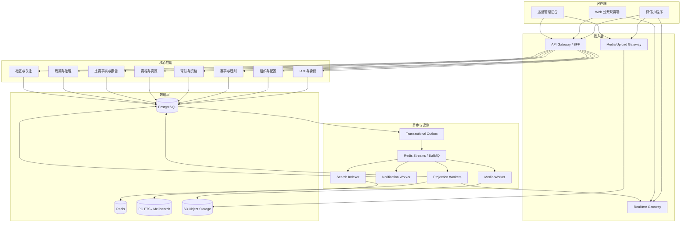
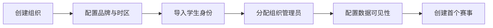
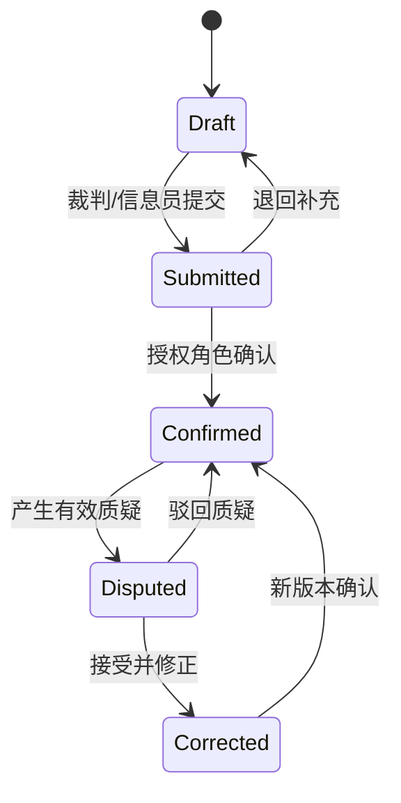
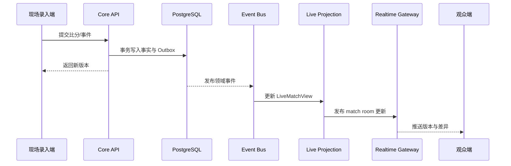

# 晓球更新架构方案 B：平台演进型事件架构

> 文档版本：V0.3-B  
> 编制日期：2026-06-10  
> 方案定位：面向多组织、多赛事、多端和持续运营的校园体育数据平台。  
> 核心取舍：仍以模块化单体起步，但从第一天建立清晰限界上下文、事务 Outbox、事件总线、读模型、实时网关和媒体边界，为未来按模块拆分服务做好准备。

## 一、方案摘要

方案 B 把“晓球”定义为三个相互连接的平台：

1. **赛事运营平台：** 规则、报名、资格、名单、排期、裁判、报告、纠错与发布。
2. **体育数据平台：** 比赛事实、事件流、榜单、生涯、荣誉、搜索与对外查询。
3. **校园内容平台：** 动态、战报、媒体、关注、通知和可分享内容。

与方案 A 相比，方案 B 的主要区别不是立刻拆微服务，而是提前建立以下能力：

- 一等公民的 `Organization/Tenant` 与组织级配置。
- 命令写模型和查询读模型分离。
- 统一领域事件信封和可靠事件分发。
- Redis/BullMQ、实时网关和投影 Worker 作为首发基础设施。
- Web 观赛端、小程序和管理后台共享 API 契约与设计系统。
- 媒体处理、搜索索引和分享卡片进入正式架构边界。
- 模块拥有独立 schema、事件契约和可提取部署边界。

方案 B 的目标不是追求分布式复杂度，而是避免项目在第二届、第三届赛事后因多组织、历史统计、实时读流量和内容增长而重新设计核心。

## 二、适用条件与成功标准

### 1. 适用条件

- 团队预计长期维护，稳定投入至少 3-6 人。
- 明确计划服务多个院系、学校、社团或不同体育赛事。
- 小程序之外，Web 公开站和运营后台同样重要。
- 需要热门比赛实时更新、关注通知和媒体内容。
- 希望积累跨赛季生涯、荣誉和可分享数据资产。
- 接受更高的基础设施、测试和运维投入。

### 2. 平台级成功标准

- 新组织可以通过配置接入，不需要复制一套系统。
- 不同赛事可以绑定独立规则、品牌、权限和通知策略。
- 比分提交后，实时页、榜单、球员数据和关注通知可可靠更新。
- 写侧短暂故障不会破坏已确认的赛事事实。
- 读模型可以重建，搜索和缓存不是唯一数据来源。
- 媒体与比赛、事件、球员形成可追溯关联。
- 模块能够按负载或团队边界独立部署，而无需改写领域模型。
- 全链路可以定位某次比分修改触发了哪些投影、通知和内容。

## 三、架构原则

### 1. 模块化单体先行，服务化边界预建

首发仍可以部署为一个 `core-api`，但代码和数据按限界上下文隔离：

- 模块不能直接访问其他模块的 repository。
- 跨模块写操作通过应用服务或领域事件完成。
- 每个模块声明公开命令、查询和事件。
- 每个模块拥有独立数据库 schema。
- 允许共享数据库实例，不共享任意表写权限。

### 2. 写模型是事实源，读模型可重建

- 比赛结果、名单快照、规则版本和审计记录属于事实源。
- 积分榜、射手榜、首页信息流和搜索文档属于派生读模型。
- 读模型失败时可以从事实和事件重新生成。
- 前台必须展示读模型的版本和更新时间，避免把滞后误认为事实错误。

### 3. 事件最终一致，但核心命令强一致

同一聚合内强一致：

- 注册与身份占用。
- 比分和报告状态。
- 名单锁定和快照。
- 阶段推进确认。
- 管理员修正和审计。

跨模块最终一致：

- 榜单投影。
- 搜索索引。
- 实时推送。
- 通知。
- 自动战报草稿。
- 分享卡片。

### 4. 外部组件可替换

赛制、搜索、推送、对象存储和任务队列都通过端口/适配器接入。第三方库不能成为业务数据真相源。

## 四、总体架构



## 五、仓库与工程组织

推荐使用 monorepo：

```text
apps/
  mini-program/
  public-web/
  admin-web/
  core-api/
  realtime-gateway/
  worker/
packages/
  api-contracts/
  design-tokens/
  auth-client/
  domain-kernel/
  observability/
  test-fixtures/
modules/
  iam/
  organization/
  competition/
  roster/
  scheduling/
  match/
  ranking/
  governance/
  social/
  notification/
  media/
  search/
infra/
  docker/
  migrations/
  monitoring/
  deployment/
```

### 1. 前端建议

| 应用 | 推荐技术 |
| --- | --- |
| 微信小程序 | Taro + React + TypeScript，或团队更熟悉时继续原生小程序 |
| Web 公开端 | Next.js |
| 管理后台 | React + react-admin 基础能力 + 自定义业务页面 |
| 设计系统 | 共享 design token，不强求跨端共享全部组件 |

选择 Taro 的前提是 Web 与小程序长期并行。如果未来一年仍只有微信端，应认真评估原生小程序是否更稳。

### 2. 后端建议

- NestJS 模块化应用。
- PostgreSQL 作为事实数据库。
- Redis 用于缓存、任务队列、实时房间和限速。
- BullMQ 或 Redis Streams 承载异步事件。
- S3 兼容对象存储承载媒体。
- 搜索首期可用 PostgreSQL FTS，但保留 `SearchPort`。

## 六、限界上下文

### 1. IAM 与身份上下文

实体：

```text
User
Credential
StudentIdentity
WechatIdentity
ExternalIdentity
Session
AccountAppeal
RoleAssignment
PermissionPolicy
```

职责：

- 多登录方式映射到统一用户。
- 组织级身份和平台级用户分离。
- 会话撤销与安全事件。
- 作用域角色和策略决策。

关键设计：

```text
User              平台账号
Membership        用户在组织中的成员身份
StudentIdentity   组织提供的学生身份
PlayerProfile     体育领域中的球员档案
```

四者不可合并，避免“账号、学生、球员”概念长期纠缠。

### 2. 组织与配置上下文

```text
Organization
OrganizationMembership
OrganizationBranding
FeatureFlag
DataVisibilityPolicy
NotificationPolicy
```

组织可以是学校、院系、社团或赛事运营方。平台级表携带 `organization_id`，公开全局资源除外。

方案 B 建议使用共享数据库、共享表或 schema 隔离的逻辑多租户，不采用“每组织一套数据库”。

### 3. 赛事与规则上下文

```text
Season
Tournament
CompetitionRuleVersion
RankingRule
EligibilityRule
SuspensionRule
Stage
Group
Round
BracketDefinition
AdvancementRule
StageProgression
```

该上下文只定义赛事结构和规则，不保存实时比分事件。

赛制引擎接口：

```text
BracketEngine
- validateDefinition()
- generateRoundRobin()
- generateKnockout()
- calculateProgressionCandidates()
- reconcileResultCorrection()
```

`brackets-manager.js` 可以是一个适配器。所有输出都要转为内部模型并由内部约束验证。

### 4. 球队、资格与名单上下文

```text
Team
TeamMembership
TeamRegistration
RosterSubmission
RosterEntry
RosterSnapshot
EligibilityDecision
AvailabilityResponse
MatchCheckIn
MatchLineup
Suspension
```

资格判断采用“规则 + 决定”模式：

- 规则给出自动检查结果。
- 管理员可以在授权范围内作出例外决定。
- 例外必须记录依据、有效范围和决定人。
- 历史比赛引用当时的决定，不被后续规则变化重算。

### 5. 赛程与资源上下文

```text
Venue
Pitch
Official
ResourceAvailability
ScheduleDraft
ScheduleConflict
SchedulePublication
ScheduleChange
OfficialAssignment
```

排程分为两层：

- 赛制层决定“谁与谁、属于哪一轮”。
- 资源层决定“何时、何地、由谁执法”。

这能避免把赛制生成和场地排班写成一个难以测试的大函数。

### 6. 比赛事实与报告上下文

```text
Match
MatchClock
MatchResult
MatchReport
MatchEvent
MatchLineupReference
MatchRevision
CorrectionDecision
DataCompleteness
```

比赛事实分为：

- **身份事实：** 对阵、赛事、阶段、轮次。
- **排程事实：** 时间、场地和工作人员。
- **赛场事实：** 比分、事件、阵容和状态。
- **治理事实：** 报告确认、质疑和修正。

每类事实由对应上下文修改，比赛详情读模型负责汇总展示。

### 7. 排名与统计上下文

```text
StandingsProjection
PlayerTournamentStats
PlayerCareerStats
TeamFormProjection
ProgressionCandidate
AwardDefinition
AwardGrant
Milestone
ProjectionCheckpoint
```

排名计算输出“解释链”：

```text
排名第 1
→ 积分 12
→ 与第 2 名同分
→ 相互战绩积分更高
→ 因此排名靠前
```

该解释用于后台复核，也能减少前台争议。

### 8. 治理上下文

```text
Dispute
DisputeAggregation
Evidence
ModerationCase
Decision
ReputationLedger
AuditEntry
```

赛事数据争议与社区内容举报共享“案件、证据、决定”基础模型，但保持不同处理策略。

### 9. 社区与关注上下文

```text
Post
Comment
Reaction
Follow
ContentRelation
ContentReport
GeneratedStoryDraft
```

结构化关联：

```text
ContentRelation(
  content_id,
  relation_type,
  target_type,
  target_id
)
```

同一动态可以同时关联比赛、球队和球员，不受多个可空外键限制。

### 10. 通知上下文

```text
Notification
NotificationRecipient
NotificationAggregation
NotificationPreference
DeliveryAttempt
SubscriptionMessageGrant
```

通知由事件触发，通过规则决定：

- 谁应该收到。
- 是否聚合。
- 使用站内、微信订阅消息或仅后台待办。
- 是否受免打扰和关注关系影响。

### 11. 媒体上下文

```text
MediaAsset
MediaVariant
MediaBinding
UploadSession
ProcessingJob
ModerationStatus
CuePoint
```

媒体通过 `MediaBinding` 关联比赛、事件、球队、球员或动态。对象存储 key 不直接暴露给客户端，访问通过短期 URL 或 CDN。

首期媒体处理：

- 图片压缩和多尺寸变体。
- EXIF 清理。
- 封面裁剪。
- 分享卡片生成。

后期：

- 视频转码。
- 手动事件时间点。
- FootAndBall/SoccerNet 候选时间点。

AI 结果始终是候选信息，不自动修改官方比赛事实。

## 七、数据架构

### 1. PostgreSQL schema

建议按上下文划分：

```text
iam.*
org.*
competition.*
roster.*
scheduling.*
match.*
ranking.*
governance.*
social.*
notification.*
media.*
platform.*
```

每个模块只通过自己的 repository 写入本 schema。跨 schema 外键可谨慎使用：

- 同一部署阶段可保留关键外键。
- 模块提取前通过契约测试替代跨服务外键。

### 2. 主键与公共字段

所有核心表使用不可变 UUID/ULID：

```text
id
organization_id
created_at
created_by
updated_at
updated_by
version
```

不要使用学号、昵称、队名、赛季名或外部组件 ID 作为主键。

### 3. 事实表与投影表

事实表：

- 规则版本。
- 名单快照。
- 比赛结果与事件。
- 修订、决定和审计。
- Outbox 事件。

投影表：

- 首页赛事摘要。
- 公开赛程。
- 比赛详情。
- 积分榜与球员榜。
- 球队赛季页。
- 球员生涯页。
- 管理员待办。
- 搜索文档。

投影表可以丢弃并重建，事实表不能依赖投影反推。

### 4. 时间模型

统一保存 UTC 时间，展示时按组织时区转换。比赛时间额外保存：

- `scheduled_start_at`
- `actual_start_at`
- `actual_end_at`
- `timezone`

事件时间保存比赛内时间：

- `period`
- `minute`
- `second`
- `added_time`
- 可选 `video_cue_point_ms`

## 八、领域事件与异步架构

### 1. 事件信封

```text
DomainEventEnvelope
- event_id
- event_type
- event_version
- occurred_at
- producer
- organization_id
- aggregate_type
- aggregate_id
- aggregate_version
- correlation_id
- causation_id
- actor_id
- payload
```

`event_type` 示例：

```text
match.result_submitted.v1
match.report_confirmed.v1
match.result_corrected.v1
roster.locked.v1
schedule.published.v1
stage.progression_confirmed.v1
dispute.decided.v1
media.ready.v1
```

### 2. Outbox 发布

核心命令在同一数据库事务中：

1. 修改聚合。
2. 写入修订和审计。
3. 写入 Outbox 事件。
4. 提交事务。

Publisher 领取 Outbox 后发送到 Redis Streams/BullMQ。消费者必须幂等。

### 3. 消费者

| 事件 | 消费者 |
| --- | --- |
| `match.result_submitted` | 比赛详情投影、实时推送、管理员待办 |
| `match.report_confirmed` | 积分榜、球员数据、晋级候选、关注通知 |
| `match.result_corrected` | 全部相关投影重算、搜索更新、修正通知 |
| `schedule.published` | 赛程投影、变更摘要、球队通知 |
| `roster.locked` | 名单公开投影、资格缓存 |
| `stage.progression_confirmed` | 下一阶段赛程草案、晋级内容草稿 |
| `media.ready` | 动态卡片、比赛媒体列表、搜索索引 |

### 4. 失败处理

- 自动重试使用指数退避。
- 超过阈值进入死信任务。
- 后台展示失败事件、消费者、错误和重放按钮。
- 重放以 `event_id + consumer_name` 幂等。
- 不允许人工修改事件 payload 后直接重放；需要通过补偿命令产生新事件。

## 九、读模型与 CQRS

方案 B 采用“轻量 CQRS”：

- 命令 API 面向聚合和业务动作。
- 查询 API 面向页面和场景，不强求与数据库实体一一对应。
- 不引入事件溯源，数据库当前状态仍是权威事实。

### 1. 主要读模型

```text
PublicHomeView
TournamentHubView
ScheduleCalendarView
LiveMatchView
MatchCenterView
StandingsView
BracketView
TeamProfileView
PlayerProfileView
CareerSummaryView
InboxView
AdminOperationsView
DataQualityView
```

### 2. 版本与新鲜度

每个读模型保存：

```text
source_version
projection_version
projected_at
status
```

前台可以显示“更新中”，后台可以比较事实版本与投影版本，快速发现落后。

### 3. 重建

提供管理员命令：

```text
rebuild tournament projections
rebuild match projections
reindex search documents
recalculate player career stats
```

重建任务不能阻塞正常写入，并需要记录检查点。

## 十、关键业务流程

### 1. 组织接入



### 2. 赛事生命周期

```text
DRAFT
REGISTRATION_OPEN
REGISTRATION_CLOSED
SCHEDULING
PUBLISHED
IN_PROGRESS
COMPLETED
ARCHIVED
```

状态转换是显式命令。不同状态允许的操作不同，例如报名关闭后不能普通新增名单，归档后只能执行受控修正。

### 3. 名单与资格

资格判断返回：

```text
ELIGIBLE
INELIGIBLE
REQUIRES_REVIEW
EXEMPTED
```

每次决定保存：

- 使用的规则版本。
- 输入事实摘要。
- 自动判断结果。
- 人工例外决定。
- 有效赛事或比赛范围。

### 4. 比赛数据



比赛结果确认后才默认进入正式排名投影。赛事可以配置“提交即暂存展示”和“确认后计入积分”两种策略。

### 5. 实时比分



客户端断线重连后，先拉取当前 `LiveMatchView`，再订阅增量，避免只依赖未持久化消息。

### 6. 晋级确认

- 排名投影生成候选。
- 赛制上下文验证候选与规则。
- 管理员查看解释链和未决质疑。
- 确认后写 `StageProgression` 事实。
- 触发下一阶段席位、赛程草案、通知和内容草稿。

晋级事实一旦确认，后续修正通过补偿流程处理，不能静默回滚。

## 十一、API 与契约

### 1. BFF

公开端、管理端和小程序可以共享核心 API，但 BFF 针对页面聚合：

```text
GET /v1/public/home
GET /v1/tournaments/{id}/hub
GET /v1/matches/{id}/center
GET /v1/players/{id}/profile
GET /v1/admin/operations
```

命令接口：

```text
POST /v1/commands/publish-schedule
POST /v1/commands/submit-roster
POST /v1/commands/lock-roster
POST /v1/commands/submit-match-result
POST /v1/commands/confirm-match-report
POST /v1/commands/confirm-stage-progression
POST /v1/commands/decide-dispute
```

### 2. 契约管理

- OpenAPI 是 HTTP 契约源。
- 领域事件使用 JSON Schema。
- `event_version` 只增不改。
- 前端 API Client 从契约生成或统一封装。
- 破坏性变更通过新版本端点或兼容字段迁移。

### 3. 幂等与并发

与方案 A 相同，高风险命令必须提供幂等键和预期版本。消费者也必须保存消费记录：

```text
ConsumerCheckpoint(
  consumer_name,
  event_id,
  processed_at,
  result
)
```

## 十二、授权、多租户与安全

### 1. 授权模型

基础仍是 scoped RBAC：

```text
subject + role + scope + action + resource
```

在授权服务内部增加策略层：

- 角色授予基础权限。
- 资源状态限制操作。
- 组织配置决定可见性。
- 所有权和本人关系提供附加条件。

权限增长明显时可接入 Casbin，但应用只依赖统一 `AuthorizationPort`。

### 2. 多租户隔离

- 每个请求在鉴权后确定 `organization_id`。
- Repository 默认自动附加组织条件。
- 平台管理员跨组织操作必须使用单独接口和审计原因。
- 缓存、队列、对象存储 key 和搜索文档都包含组织命名空间。
- 自动化测试必须覆盖跨组织越权。

### 3. 安全

- Argon2id 密码哈希。
- 短访问令牌 + 可撤销刷新会话。
- 管理后台支持更强验证或二次验证。
- 上传使用预签名 URL、类型限制和大小限制。
- 管理命令要求 CSRF/重放防护和操作原因。
- PII 导出、查看和修改进入专门审计事件。

## 十三、搜索、媒体与内容

### 1. 搜索

统一 `SearchDocument`：

```text
document_type
document_id
organization_id
title
aliases
summary
relations
visibility
updated_at
```

首期使用 PostgreSQL FTS，出现以下需求后迁移 Meilisearch：

- 拼写容错。
- 多字段权重。
- 高亮和联想。
- 搜索流量与主库隔离。

索引由事件异步更新，可以全量重建。

### 2. 媒体处理

上传流程：

1. 客户端申请上传会话。
2. 服务端检查用途、类型、大小和权限。
3. 客户端直传对象存储。
4. 客户端确认上传。
5. Worker 校验、清理和生成变体。
6. `media.ready` 事件更新关联读模型。

### 3. 自动内容

系统可依据事实事件生成草稿：

- 赛果卡片。
- 晋级四强。
- 帽子戏法。
- 射手榜榜首变化。
- 赛季冠军和个人荣誉。

自动内容只生成结构化草稿或卡片，不伪造人工观点。

## 十四、可观测性与平台运维

### 1. 三类信号

- 日志：结构化业务日志和审计日志。
- 指标：API、数据库、Redis、队列、投影和媒体任务。
- 追踪：命令到 Outbox、消费者、投影和通知的关联链。

`correlation_id` 贯穿 HTTP 请求和全部领域事件。

### 2. 关键仪表盘

- 比赛日实时健康。
- API 延迟和错误。
- Outbox 与队列积压。
- 消费者失败和死信。
- 投影新鲜度。
- 实时连接数与推送失败。
- 媒体处理时长和失败。
- 数据库连接、慢查询和备份状态。

### 3. SLO 建议

| 能力 | 初期目标 |
| --- | --- |
| 核心查询可用性 | 99.5% |
| 比分写入成功响应 | P95 小于 800ms |
| 热门比赛投影更新 | 95% 在 3 秒内 |
| 普通榜单投影更新 | 95% 在 30 秒内 |
| 通知生成 | 95% 在 2 分钟内 |
| 数据库恢复点目标 | 比赛周小于 15 分钟 |

### 4. 部署拓扑

首期：

```text
1 x core-api
1 x worker
1 x realtime-gateway
1 x PostgreSQL
1 x Redis
托管对象存储
静态 Web/CDN
```

增长后优先横向扩展：

- `core-api`
- `worker`
- `realtime-gateway`

最后才考虑拆出独立服务。

## 十五、测试策略

### 1. 领域规则

覆盖方案 A 的全部规则测试，并增加：

- 多组织隔离。
- 事件重复投递和乱序。
- 投影重建。
- 消费者失败与重放。
- 实时断线重连。
- 搜索索引滞后。
- 媒体处理失败。
- 契约向后兼容。

### 2. 契约测试

- HTTP OpenAPI 验证。
- 事件 JSON Schema 验证。
- 模块公开接口契约。
- 第三方适配器测试。

### 3. 架构测试

在 CI 中检查：

- 模块不能跨边界导入内部 repository。
- 前端不能直接依赖数据库实体。
- 事件命名和版本符合规范。
- 公共包不反向依赖具体业务模块。

### 4. 演练

- 完整 32 队赛事模拟。
- 热门比赛实时更新压力测试。
- Redis 短暂不可用。
- Worker 停止后恢复并追平。
- 投影表清空后重建。
- 对象存储上传失败。
- 数据库恢复和应用回滚。

## 十六、服务拆分触发条件

只有满足明确条件才拆分：

| 模块 | 拆分触发条件 |
| --- | --- |
| Realtime Gateway | 长连接数量或发布频率需要独立扩容 |
| Media Worker | 视频转码占用大量 CPU/GPU |
| Notification | 渠道增多、发送量大且重试复杂 |
| Search | 独立索引集群和专门查询负载 |
| Ranking Projection | 多赛事重算影响核心 API |
| IAM | 多产品共享账号或合规边界要求 |

拆分顺序优先从异步、无状态、负载特征明显的模块开始，不优先拆比赛核心事务。

## 十七、实施路线

### 阶段 B0：平台内核，3-4 周

- 建立 monorepo、模块边界和架构约束。
- 建立组织、身份、权限和公共契约。
- 建立 PostgreSQL schema、Outbox、Redis 队列和观测基础。
- 建立 CI/CD、预发布和环境配置。

### 阶段 B1：赛事运营核心，5-6 周

- 规则版本、赛事、阶段和赛制适配器。
- 报名、资格、名单、锁定和快照。
- 场地、工作人员、赛程草案、冲突和发布。
- 管理员工作台。

### 阶段 B2：比赛事实与实时读侧，5-6 周

- 快速报告、完整报告和比赛事件。
- 版本冲突、审计和修正。
- 比赛中心读模型。
- Redis 实时频道和断线恢复。
- 榜单、统计和晋级候选投影。

### 阶段 B3：治理与内容，4-5 周

- 质疑、证据、决定和信誉。
- 通知偏好、关注和聚合。
- 社区结构化关联。
- 自动赛果与晋级内容草稿。

### 阶段 B4：媒体、搜索与生涯，4-6 周

- 媒体上传和图片变体。
- 分享卡片。
- 统一搜索。
- 球员赛季、生涯、荣誉和里程碑。

### 阶段 B5：平台化运营，持续

- 组织自助接入。
- 功能开关和组织级品牌。
- 对外只读 API。
- 消费者独立扩容。
- 按触发条件拆分服务。

## 十八、首发范围建议

即使选择方案 B，也不应一次实现所有愿景。

### 平台首发必须完成

- 组织与身份隔离。
- 作用域权限。
- 赛事规则版本。
- 名单、资格和快照。
- 赛程发布版本。
- 比赛报告、事件、修正和审计。
- Outbox、事件队列、核心投影和实时网关。
- 质疑、工作台和通知。
- 导入导出、监控、备份和投影重建。

### 可在首发后补充

- 视频转码与 AI。
- Meilisearch。
- 对外开放 API。
- 多体育项目。
- 高级推荐。
- 复杂球员评分。
- 独立 App。

## 十九、成本与风险

| 项目 | 方案 B 影响 |
| --- | --- |
| 开发成本 | 高于方案 A，需要先建设事件、投影和多组织底座 |
| 运维成本 | PostgreSQL、Redis、Worker、实时网关都要监控 |
| 调试复杂度 | 需要通过 correlation id 跟踪异步链路 |
| 数据一致性 | 核心强一致，读侧接受短暂最终一致 |
| 扩展能力 | 多组织、多端、实时、媒体和独立扩容更自然 |
| 团队要求 | 需要明确模块所有权、契约和发布纪律 |

主要风险及控制：

- **过度设计：** 每个基础设施必须对应明确首发用例，不引入 Kafka/Kubernetes 等超前组件。
- **最终一致性困惑：** 前台显示更新时间和状态，后台提供投影健康度。
- **事件契约漂移：** JSON Schema、版本化和契约测试。
- **跨模块偷写数据库：** repository 隔离和 CI 架构检查。
- **多租户越权：** 自动组织过滤和专项安全测试。
- **队列积压：** 指标、优先级、重试、死信和重建工具。

## 二十、选择本方案的理由

优先选择方案 B，如果已经确定：

- 晓球不是一次赛事项目，而是至少持续两到三年的产品。
- 会服务多个院系、学校或运营组织。
- Web 公开端、实时比分、关注通知和媒体内容是明确需求。
- 团队能够承担 Redis、Worker、实时网关和事件契约的维护。
- 希望较早形成球员生涯、荣誉和内容资产。
- 愿意用更慢的第一阶段，换取后续扩展时更少的大规模重构。

如果这些条件尚不成立，方案 B 可能会让基础设施建设挤占第一届赛事的核心开发时间。此时更适合先采用方案 A，在真实运营数据出现后，再把高负载异步模块逐步演进到本方案。
