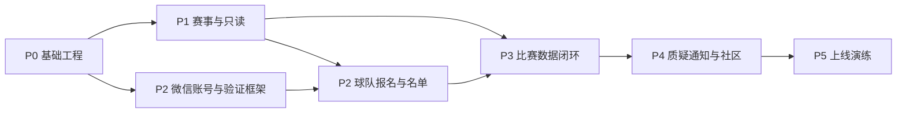

# 晓球方案 A 详细实施方案

> 文档版本：V0.1  
> 编制日期：2026-06-10  
> 架构基线：《晓球更新架构方案 A：赛事落地型模块化单体》  
> 实施目标：以一届真实校园足球杯赛为验收场景，完成从赛事建立、报名名单、赛程发布、比赛录入、榜单晋级、质疑修正到消息社区的完整闭环。  
> 预计周期：单人主开发约 20-24 周；2-3 人稳定协作约 14-18 周。

## 一、实施结论

本项目按以下技术与产品方向执行：

```text
微信小程序：Taro + React + TypeScript
公开 H5：首期复用 Taro H5 能力
管理后台：React + TypeScript + react-admin
服务端：NestJS + TypeScript
数据库：PostgreSQL
数据访问：Prisma，复杂并发写入允许使用显式 SQL
异步任务：PostgreSQL Transactional Outbox + NestJS Worker
对象存储：S3 兼容托管对象存储
接口契约：OpenAPI
错误追踪：Sentry
部署：Docker + GitHub Actions + Coolify
```

身份验证暂不选择唯一方案，但立即确定两项稳定原则：

1. **平台注册与身份验证解耦。**
2. **账号可以先建立，敏感业务操作根据验证等级授权。**

因此，身份方案未定不会阻塞赛事只读端、微信登录、球队邀请、比赛数据和管理后台开发。

## 二、范围、边界与验收目标

### 1. 首发必须完成

- 微信小程序和轻量 Web 管理后台。
- 微信登录、平台账号、会话管理和退出登录。
- 可替换的身份验证框架。
- 赛事、规则版本、阶段、分组、轮次和赛程。
- 球队报名、赛事名单、提交、审核、锁定和快照。
- 场地、现场负责人或裁判、赛程发布和变更记录。
- 快速比赛报告和完整比赛事件。
- 比分、积分榜、射手榜、助攻榜和淘汰赛。
- 并发保护、幂等、修订、审计和管理员修正。
- 数据完整度工作台。
- 对象级质疑、聚合工单和处理结果。
- 站内消息。
- 基础动态、评论、点赞和举报。
- CSV/XLSX 导入导出。
- 自动化测试、错误监控、备份和恢复演练。

### 2. 首发明确不做

- 微服务和 Kubernetes。
- 即时聊天。
- 独立搜索引擎。
- 全站持续 WebSocket。
- 视频转码和视频 AI。
- 复杂球员评分、热力图和预期进球。
- 独立 Android/iOS 安装包。
- 面向第三方的开放写 API。

### 3. 首发验收场景

使用一套固定的“16 支球队校园杯赛”完成端到端验收：

- 4 个小组，每组 4 队。
- 小组单循环。
- 每组前 2 名晋级 8 强。
- 单败淘汰，包含点球大战和三四名决赛。
- 至少包含一场弃权、一场延期、一场比分修正。
- 至少包含一次名单退回、一次名单重新开放。
- 至少包含一次并发录入冲突。
- 至少包含一次对象级质疑和管理员修正。
- 最终生成冠军、积分榜、射手榜和球员赛季数据。

## 三、项目组织与代码结构

### 1. Monorepo

建议使用 `pnpm workspace` 管理单一仓库：

```text
apps/
  mini-program/       Taro 微信小程序与 H5
  admin-web/          React 管理后台
  api/                NestJS REST API
  worker/             NestJS Outbox Worker
packages/
  api-client/         OpenAPI 生成或封装的客户端
  contracts/          DTO、枚举、错误码和事件类型
  domain-utils/       无平台依赖的业务辅助函数
  design-tokens/      色彩、间距、字号和状态样式
  eslint-config/
  tsconfig/
prisma/
  schema.prisma
  migrations/
  seed/
docs/
  decisions/
  api/
  operations/
infra/
  docker/
  coolify/
  scripts/
```

### 2. 分支与环境

```text
main            可部署生产
develop         日常集成，可选
feature/*       功能开发
fix/*           缺陷修复
release/*       比赛周稳定版本，可选
```

环境：

| 环境 | 用途 | 数据 |
| --- | --- | --- |
| Local | 单人开发 | 自动 seed |
| Test | CI 集成测试 | 每次重建 |
| Staging | 产品验收和演练 | 脱敏仿真数据 |
| Production | 正式比赛 | 真实数据 |

### 3. 团队职责建议

若 3 人协作：

| 角色 | 主要职责 |
| --- | --- |
| 后端/架构 | NestJS、数据库、权限、Outbox、排名和部署 |
| 小程序前端 | Taro 页面、录入体验、账号与消息 |
| 后台/测试 | 管理后台、导入导出、E2E、运营演练 |

若单人开发，仍按这三个责任域组织任务，避免同时展开过多模块。

## 四、固定技术决策

### 1. 小程序与 H5

采用：

```text
Taro
React
TypeScript
TDesign MiniProgram 或经过验证的 Taro 兼容组件
TanStack Query
Zustand
```

职责划分：

- TanStack Query 管理服务端数据、缓存和失效。
- Zustand 只保存登录态、当前组织、界面偏好等少量客户端状态。
- 表单校验规则优先放在共享 schema 或 API 契约中。
- 微信登录、订阅消息、分享等能力封装为平台适配器。

### 2. 管理后台

采用：

```text
React
TypeScript
Vite
react-admin
FullCalendar
Apache ECharts
```

使用原则：

- 常规列表、筛选、详情和表单使用 `react-admin`。
- 赛程排期、版本对比、淘汰赛预览和工作台使用自定义页面。
- 管理后台桌面优先，同时保证平板可操作。

### 3. 服务端

采用 NestJS，模块结构：

```text
auth
identity
organization
competition
scheduling
team-roster
match-reporting
ranking
dispute
community
notification
media
admin-operations
audit
outbox
```

每个业务模块包含：

```text
application/    用例和命令
domain/         状态机与业务规则
infrastructure/ Prisma repository 和外部适配器
http/           Controller、DTO 和权限声明
```

首发不要求实现完整 DDD 框架，但必须避免控制器直接拼接复杂数据库写入。

### 4. 数据库

采用 PostgreSQL。数据库原则：

- 数据库是最终事实源。
- 关键唯一性由数据库约束保证。
- 高风险更新使用事务和条件更新。
- 所有时间保存为 UTC。
- 所有核心业务表使用不可变 UUID。
- 历史赛事和审计数据不物理删除。

### 5. 接口

- REST API。
- OpenAPI 生成接口文档和 TypeScript Client。
- 统一错误响应。
- 写接口支持幂等键。
- 高风险资源使用 `expected_version`。
- 列表优先使用游标分页。

统一错误结构：

```json
{
  "code": "MATCH_VERSION_CONFLICT",
  "message": "比赛数据已被其他人员更新",
  "requestId": "req_xxx",
  "details": {}
}
```

## 五、身份验证的预留实施

### 1. 立即固定的数据模型

无论最终采用哪种验证方式，都先实现以下稳定对象：

```text
User
Credential
WechatIdentity
UserSession
OrganizationMembership
IdentityVerification
VerificationEvidence
RoleAssignment
PlayerProfile
PlayerClaim
TeamInvitation
```

其中：

- `User`：平台账号。
- `WechatIdentity`：微信身份与账号的绑定。
- `OrganizationMembership`：用户与学校、院系或组织的关系。
- `IdentityVerification`：一次身份验证申请及结果。
- `PlayerProfile`：长期体育档案。
- `PlayerClaim`：账号认领球员档案的流程。

不得把学号作为 `User` 的必填主身份字段。

### 2. 账号基础流程

首发基础流程固定为：

```text
微信登录
→ 服务端获取微信身份
→ 已绑定则恢复会话
→ 未绑定则创建 UNVERIFIED 用户
→ 用户可以浏览、关注和使用低风险功能
→ 触发敏感操作时进入身份验证或管理员审批
```

敏感操作包括：

- 认领正式球员档案。
- 进入赛事正式名单。
- 成为队长、信息员、裁判或管理员。
- 修改比赛数据。
- 查看受限个人信息。

### 3. 身份验证候选适配器

保留以下候选，不在本阶段确定唯一方案：

| 方案 | 适用场景 | 系统适配器 |
| --- | --- | --- |
| 全校或年级白名单 | 能稳定获得学校数据 | `RosterWhitelistVerifier` |
| 按赛事导入名单 | 只获得参赛人员信息 | `TournamentRosterVerifier` |
| 队长邀请与管理员确认 | 小规模赛事 | `TeamInvitationVerifier` |
| 校园邮箱验证码 | 学校邮箱可用 | `CampusEmailVerifier` |
| 学生证/校园卡人工审核 | 兜底 | `ManualEvidenceVerifier` |
| CAS/OAuth | 学校开放统一认证 | `ExternalSsoVerifier` |

所有适配器输出统一结果：

```text
APPROVED
REJECTED
REQUIRES_REVIEW
EXPIRED
```

### 4. 验证等级

```text
UNVERIFIED
CONTACT_VERIFIED
STUDENT_VERIFIED
PLAYER_CONFIRMED
STAFF_VERIFIED
```

验证等级不是单个永久角色：

- 可以有有效期。
- 可以限定组织。
- 可以记录验证来源。
- 管理员可以撤销。
- 历史赛事仍引用当时的名单快照。

### 5. 身份决策门

在阶段 P2 开始前完成一次身份方案评审：

需要回答：

1. 能否获得参赛人员名单？
2. 是否能使用校园邮箱？
3. 是否存在学校统一认证？
4. 管理员每届赛事能承担多少人工审核？
5. 是否允许保存完整学号，保存多久？
6. 参赛资格最终由谁负责确认？

如果届时仍无法确定，默认启用：

```text
微信账号
+ 按赛事导入参赛名单
+ 队长邀请
+ 管理员最终确认
+ 人工材料兜底
```

该默认方案不需要全校名单。

## 六、核心数据模型实施顺序

### 1. 第一批：平台基础

```text
Organization
User
Credential
WechatIdentity
UserSession
RoleAssignment
AuditLog
IdempotencyRecord
OutboxJob
```

### 2. 第二批：赛事结构

```text
Season
Tournament
CompetitionRuleVersion
RankingRule
EligibilityRule
SuspensionRule
Stage
Group
Round
BracketSlot
AdvancementRule
```

### 3. 第三批：球队、名单与排期

```text
Team
PlayerProfile
TeamMember
TeamRegistration
RosterSubmission
RosterEntry
RosterSnapshot
Venue
Pitch
OfficialProfile
SchedulePlan
ScheduleRevision
Match
MatchOfficialAssignment
```

### 4. 第四批：比赛数据与投影

```text
MatchResult
MatchReport
MatchLineup
MatchLineupEntry
MatchEvent
MatchEventParticipant
MatchRevision
FieldRevision
DataCompleteness
StandingsSnapshot
StandingsRow
PlayerStatSnapshot
PlayerStatRow
ProgressionProposal
ProjectionRun
```

### 5. 第五批：治理、消息和社区

```text
Dispute
DisputeEvidence
DisputeAggregation
DisputeDecision
ReputationLedger
Notification
NotificationRecipient
NotificationAggregation
Post
Comment
Reaction
ContentReport
MediaAsset
```

## 七、工作分解结构

任务编号规则：

```text
P0 基础工程
P1 赛事只读与管理
P2 账号、身份与名单
P3 比赛数据闭环
P4 治理、通知与社区
P5 上线演练
```

## 八、P0 基础工程

> 目标周期：2-3 周  
> 退出条件：四个应用可以本地运行，数据库可以迁移和 seed，CI 可以执行，预发布环境可访问。

### P0-01 建立 Monorepo

任务：

- 初始化 `pnpm workspace`。
- 创建 `mini-program`、`admin-web`、`api`、`worker`。
- 建立共享 TypeScript、ESLint 和格式化配置。
- 建立环境变量模板。

交付物：

- 一条命令安装依赖。
- 一条命令启动本地开发环境。
- README 包含本地运行步骤。

验收：

- 新环境可在 30 分钟内完成启动。
- 各应用通过类型检查。

### P0-02 建立数据库与迁移

任务：

- Docker 启动 PostgreSQL。
- 初始化 Prisma。
- 建立第一批平台基础表。
- 建立迁移命名和回滚规范。
- 建立 seed 命令。

验收：

- 空数据库可以从零迁移。
- seed 后存在默认组织、管理员和示例用户。
- 重复执行 seed 不产生重复数据。

### P0-03 建立 NestJS 公共基础

任务：

- 请求 ID。
- 全局异常过滤器。
- 参数校验。
- OpenAPI。
- 结构化日志。
- 健康检查。
- 统一分页和错误码。

验收：

- 每个响应带可追踪的 request ID。
- 非法参数返回统一错误结构。
- `/health` 可以检查应用和数据库。

### P0-04 建立鉴权骨架

任务：

- 微信登录适配接口。
- 本地开发虚拟登录。
- Access Token 与可撤销 Session。
- `auth_version`。
- 路由身份获取和作用域权限装饰器。

验收：

- 可以使用开发账号登录。
- 退出后旧会话失效。
- 无权限请求返回 `403`，而不是隐藏失败。

### P0-05 建立 Outbox Worker

任务：

- `OutboxJob` 表。
- 任务领取、锁定、重试和失败记录。
- 去重键。
- Worker 健康检查。
- 后台任务查看接口。

验收：

- API 事务写入任务后 Worker 能处理。
- Worker 中断后恢复可继续处理。
- 同一去重键不会创建重复任务。

### P0-06 建立监控与 CI/CD

任务：

- API、Worker、管理后台接入 Sentry。
- GitHub Actions 执行 lint、typecheck、test、build。
- 构建 Docker 镜像。
- 部署预发布。

验收：

- 主分支失败测试不能部署。
- 预发布可查看版本号和 commit。
- 人工制造错误能在 Sentry 中定位。

### P0-07 建立测试夹具

任务：

- 16 队杯赛基础 fixture。
- 用户、球队、球员和场地 fixture。
- 测试数据库重置工具。
- API 测试认证辅助工具。

验收：

- 集成测试可以独立创建所需数据。
- fixture 不依赖手工数据库状态。

## 九、P1 赛事管理与只读产品

> 目标周期：3-4 周  
> 前置：P0 完成  
> 退出条件：管理员可以建立并发布一项赛事，普通用户可以查看赛程、球队、积分榜占位和淘汰赛结构。

### P1-01 赛事与规则版本

后端：

- `Season`、`Tournament`、`CompetitionRuleVersion`。
- 排名、资格和停赛规则的 JSON/结构化字段。
- 赛事绑定规则版本。
- 规则发布后只读。

后台：

- 赛季列表。
- 赛事创建向导。
- 规则模板复制。
- 规则版本详情。

验收：

- 已开始赛事不能静默切换规则。
- 新规则版本不改变旧赛事。

### P1-02 阶段、分组和轮次

任务：

- 建立 `Stage/Group/Round`。
- 支持小组赛和单败淘汰。
- 建立赛制校验。
- 定义内部 `BracketEngine` 接口。
- 对 `brackets-manager.js` 做技术验证。

验收：

- 可以生成 4 组单循环。
- 可以生成 8 队淘汰赛。
- 轮空、点球和三四名比赛有测试。

### P1-03 球队与球员基础档案

任务：

- 球队 CRUD。
- 球员档案 CRUD。
- 队徽和头像上传。
- 公开字段与管理字段分离。

验收：

- 公开接口不返回学号、联系方式等受限字段。
- 重名球员可通过不可变 ID 区分。

### P1-04 场地、工作人员与比赛骨架

任务：

- `Venue/Pitch/OfficialProfile`。
- 创建比赛。
- 分配时间、场地、对阵和工作人员。
- 冲突检查服务。

冲突至少包括：

- 同一球队时间重叠。
- 同一球场时间重叠。
- 同一工作人员时间重叠。

### P1-05 赛程草案与发布

任务：

- `SchedulePlan` 状态机。
- 草案预览。
- 冲突列表。
- 发布 `ScheduleRevision`。
- 发布后修改生成新版本。

验收：

- 草案对普通用户不可见。
- 发布后前台读取固定版本。
- 修改时间或场地时可查看前后差异。

### P1-06 小程序只读页面

页面：

```text
首页
赛事列表
赛事主页
按日期赛程
比赛详情占位
球队详情
球员详情
数据页
淘汰赛简版
```

要求：

- 空状态、加载状态、失败状态完整。
- 赛事、阶段和球队可筛选。
- 数据完整度位置提前预留。
- 页面不直接依赖数据库字段命名。

### P1-07 Web/H5 淘汰赛展示

任务：

- 验证 `brackets-viewer.js`。
- 建立内部 `BracketViewModel`。
- Web/H5 显示完整淘汰赛图。
- 小程序显示简化轮次卡片并可跳转 H5。

验收：

- 16 队结构可读。
- 手机横屏或横向滚动可用。
- 第三方组件不持有官方赛事状态。

## 十、P2 账号、身份与名单

> 目标周期：3-4 周  
> 前置：P1 球队和赛事结构完成  
> 退出条件：用户可以通过微信建立账号，球队可以邀请成员，赛事名单可以提交、审核、锁定和形成历史快照。

### P2-01 微信账号闭环

任务：

- 小程序 `wx.login` 流程。
- 服务端微信身份交换适配器。
- 首次创建 `UNVERIFIED` 用户。
- 自动登录、主动退出和重新绑定。
- 昵称、头像和基础资料。

验收：

- 关闭小程序后再次进入可以恢复会话。
- 主动退出后不能直接恢复旧会话。
- 微信身份改绑产生审计记录。

### P2-02 身份验证框架

任务：

- `IdentityVerification` 状态机。
- 验证适配器接口。
- 管理员审核页。
- 证据上传和到期删除机制。
- 验证等级授权。

本阶段至少实现：

- `ManualEvidenceVerifier`。
- `TournamentRosterVerifier` 的接口和模拟实现。

最终实际启用方案由身份决策门决定。

### P2-03 球员认领

任务：

- 搜索或通过名单找到球员档案。
- 提交 `PlayerClaim`。
- 队长或管理员确认。
- 一个球员档案只能绑定一个有效账号。
- 争议时可以冻结认领关系。

验收：

- 用户无法自行直接占用任意球员档案。
- 认领历史可查。

### P2-04 球队邀请和成员关系

任务：

- 队长生成邀请链接或二维码。
- 用户申请加入球队。
- 队长审核。
- 管理员可以撤销错误成员关系。

注意：

- 加入球队不等于获得赛事资格。
- 队长确认不等于完成学生身份验证。

### P2-05 赛事报名

任务：

- `TeamRegistration`。
- 报名状态和截止时间。
- 管理员批准或退回。
- 球队报名后创建名单草稿。

### P2-06 名单提交与锁定

任务：

- `RosterSubmission/RosterEntry`。
- 自动资格预检。
- 队长提交。
- 管理员退回或批准。
- 截止时间锁定。
- 生成 `RosterSnapshot`。
- 管理员重新开放。

验收：

- 锁定后普通用户不可修改。
- 重新开放必须填写原因。
- 历史比赛继续引用旧快照。

### P2-07 批量导入

支持：

- 球队。
- 球员。
- 赛事参赛名单。
- 可选身份验证记录。

流程：

```text
上传文件
→ 列映射
→ 预检
→ 展示错误行
→ 用户确认
→ 事务导入
→ 生成批次报告
```

不得静默跳过错误行。

## 十一、P3 比赛数据闭环

> 目标周期：4-5 周  
> 前置：P1 赛事结构、P2 名单快照  
> 退出条件：比赛可以从现场快速提交到正式确认，榜单和晋级可靠更新，并能处理并发与修正。

### P3-01 比赛事实状态

实现：

```text
SCHEDULED
CHECK_IN
LIVE
FINISHED
CONFIRMED
CANCELLED
ABANDONED
```

要求：

- 状态转换走明确命令。
- 取消和中止必须填写原因。
- 普通信息员不能随意回退状态。

### P3-02 比赛报告状态

实现：

```text
DRAFT
SUBMITTED
CONFIRMED
DISPUTED
CORRECTED
REOPENED
```

比赛状态与报告状态分开保存。

验收：

- 比赛结束但报告未确认可以正确表达。
- 报告修正不会伪造比赛重新进行。

### P3-03 快速比赛报告

小程序提供现场快速入口：

- 最终比分。
- 点球比分。
- 弃权或中止。
- 红牌数量。
- 简短备注。

交互要求：

- 大尺寸控件。
- 防止误触退出。
- 离线或弱网时保留本地草稿。
- 正式提交必须等待服务端确认。

### P3-04 完整比赛事件

支持：

- 进球。
- 助攻。
- 乌龙球。
- 黄牌。
- 红牌。
- 换人可暂缓，数据模型预留。

每个事件：

- 独立 ID。
- 客户端幂等键。
- 比赛阶段和时间。
- 参与球员。
- 创建人和来源。

### P3-05 单场阵容和签到

首发最小实现：

- 从赛事名单选择本场球员。
- 标记首发、替补、未出场。
- 记录实际出场。

作用：

- 限制事件球员选择范围。
- 支持出场数据。
- 支持淘汰赛资格判断。

### P3-06 并发与字段级修订

任务：

- `version` 和 `expected_version`。
- 比分条件更新。
- 事件唯一键。
- `MatchRevision/FieldRevision`。
- 409 冲突响应。
- 小程序冲突对比页面。
- 一键转为质疑。

必须测试：

- 两人同时填写空白比分。
- 两人同时新增相同事件。
- 一人确认报告时另一人补录。

### P3-07 数据完整度

计算：

```text
EMPTY
PARTIAL
COMPLETE
REVIEW_REQUIRED
```

前台展示：

- 比赛详情。
- 射手榜。
- 球员数据页。

后台展示：

- 只有比分无事件。
- 进球事件数量不匹配。
- 缺少球员。
- 缺少阵容。
- 已确认但存在冲突。

### P3-08 积分榜和球员榜单

任务：

- 排名规则纯函数。
- `StandingsSnapshot`。
- `PlayerStatSnapshot`。
- Outbox 触发重算。
- 重算输入、输出和耗时记录。
- 排名解释。

验收：

- 每一种同分规则有测试。
- 修正比分后旧投影不被当作最新数据。
- 重算失败时展示上一成功版本和“更新中”。

### P3-09 晋级预览与确认

流程：

```text
检查阶段完整性
→ 生成排名和晋级候选
→ 展示未决质疑
→ 管理员预览
→ 管理员确认
→ 写入 StageProgression
→ 填充下一阶段席位
→ 创建赛程草案
```

验收：

- 比分变化不会自动不可逆修改下一轮。
- 下轮已开赛时，上轮修正产生高优先级工单。

### P3-10 比分刷新

首发采用短轮询：

- LIVE 比赛详情每 5-10 秒请求版本。
- 赛程列表每 15-30 秒刷新焦点比赛。
- 使用 ETag 或版本号减少数据量。
- 应用进入后台后停止轮询。

接口预留未来实时网关，但本阶段不依赖 Socket.IO。

## 十二、P4 质疑、通知与社区

> 目标周期：3-4 周  
> 前置：P3 比赛数据稳定  
> 退出条件：错误数据可以被用户指出、管理员仲裁并可靠通知；社区具备首发基础能力。

### P4-01 对象级质疑

可质疑：

- 比分字段。
- 比赛事件。
- 进球者或助攻者。
- 比赛时间。
- 名单或球员归属。

任务：

- 明确目标类型和目标 ID。
- 提交建议值、理由和证据。
- 保存目标数据版本。
- 防止同一用户重复计数。

### P4-02 聚合工单

聚合键：

```text
target_type + target_id + dispute_type
```

后台显示：

- 独立质疑人数。
- 目标当前版本。
- 建议值分布。
- 证据。
- 相关修改历史。

### P4-03 管理员决定与正式修正

操作：

- 驳回。
- 接受并修正。
- 临时隐藏具体事件。
- 要求重新补录。
- 恢复历史版本。

要求：

- 必须填写结论。
- 修正必须调用目标模块应用服务。
- 触发榜单、晋级候选、缓存和通知更新。

### P4-04 信誉流水

仅根据已确认处理结果写入：

```text
ReputationLedger
```

首发不自动根据质疑数量扣分。信誉只用于后台参考，不做复杂公开评分。

### P4-05 站内通知

类型：

- 互动。
- 业务审批。
- 数据补录与冲突。
- 质疑进展。
- 赛程变化。
- 账号安全。

任务：

- Outbox 触发通知。
- 聚合窗口。
- 未读数量。
- 全部已读。
- 点击跳转业务对象。

### P4-06 微信订阅消息适配

首发可以只完成接口和一至两个高价值场景：

- 比赛时间或地点变化。
- 质疑处理结果。

微信发送失败不影响站内通知。

### P4-07 社区基础

支持：

- 发布文字和图片动态。
- 评论。
- 点赞。
- 举报。
- 关联比赛、球队和球员。

约束：

- 不做私聊。
- 不做复杂推荐。
- 官方赛果可生成结构化草稿，但发布需要明确规则。

### P4-08 搜索

使用 PostgreSQL 实现：

- 球员。
- 球队。
- 比赛。
- 动态。

首发支持规范化精确匹配和前缀匹配，不追求复杂模糊搜索。

## 十三、P5 上线准备与真实赛事演练

> 目标周期：2 周  
> 前置：P0-P4 的首发项完成  
> 退出条件：通过全流程演练、备份恢复和比赛日故障演练。

### P5-01 全流程演练

从空数据库执行：

1. 创建组织和赛事。
2. 导入球队与球员。
3. 提交和锁定名单。
4. 生成并发布赛程。
5. 完成小组赛录入。
6. 处理一次延期和一次弃权。
7. 处理一次质疑修正。
8. 确认晋级。
9. 完成淘汰赛和点球大战。
10. 生成最终榜单。

### P5-02 并发和压力演练

重点：

- 同场多人录入。
- 热门比赛详情读取。
- 榜单连续重算。
- 批量通知。
- Worker 暂停和恢复。

目标不是模拟大型互联网流量，而是验证比赛日峰值下系统不会静默错乱。

### P5-03 备份恢复

演练：

- 恢复最近数据库备份。
- 验证对象存储文件。
- 检查迁移版本。
- 重新处理未完成 Outbox。
- 验证恢复后的榜单与审计。

### P5-04 安全检查

- 登录和注册限速。
- 管理后台权限。
- 跨组织访问。
- 学号和联系方式泄露。
- 上传文件类型与大小。
- 日志敏感信息。
- 失效会话。

### P5-05 比赛日手册

内容：

- 系统健康检查。
- 信息员账号和权限检查。
- 紧急修改流程。
- Worker 堆积处理。
- 榜单重算。
- 服务回滚。
- 数据库恢复联系人和步骤。
- 比赛结束后的数据核对。

### P5-06 版本冻结

- 比赛前 7 天停止大功能合并。
- 比赛前 3 天完成正式演练。
- 比赛前 1 天只允许阻断性缺陷修复。
- 创建稳定 tag 和数据库备份点。

## 十四、阶段排期

### 1. 2-3 人团队建议排期

| 周期 | 阶段 | 主要结果 |
| --- | --- | --- |
| 第 1-2 周 | P0 | 工程骨架、数据库、鉴权、CI、预发布 |
| 第 3-5 周 | P1 | 赛事、赛程、只读小程序和后台 |
| 第 6-8 周 | P2 | 微信账号、验证框架、报名和名单 |
| 第 9-12 周 | P3 | 比赛报告、事件、榜单和晋级 |
| 第 13-15 周 | P4 | 质疑、通知、社区和搜索 |
| 第 16-17 周 | P5 | 演练、修复、备份恢复和上线 |

该排期假设：

- 每周有稳定开发时间。
- 视觉设计不过度定制。
- 身份验证不接复杂校方系统。
- 视频和独立 App 不进入首发。

### 2. 单人开发建议

单人开发不要简单把所有任务并行展开。建议：

```text
先后端骨架
→ 管理后台建立赛事
→ 小程序只读
→ 账号和名单
→ 比赛录入
→ 榜单和晋级
→ 质疑通知
→ 社区
```

预计 20-24 周，并建议将社区放在最后，必要时压缩为只读官方动态。

## 十五、依赖关系



关键路径：

```text
数据库和 API 骨架
→ 赛事结构
→ 名单快照
→ 比赛报告
→ 榜单晋级
→ 质疑修正
→ 全流程演练
```

身份验证的具体渠道不在关键路径上，验证框架和管理员确认能力才在关键路径上。

## 十六、API 首批清单

### 1. 账号

```text
POST   /auth/wechat/login
POST   /auth/session/refresh
POST   /auth/logout
GET    /me
PATCH  /me/profile
GET    /me/permissions
```

### 2. 身份与认领

```text
POST   /identity-verifications
GET    /identity-verifications/{id}
POST   /identity-verifications/{id}/approve
POST   /identity-verifications/{id}/reject
POST   /player-claims
POST   /player-claims/{id}/approve
POST   /player-claims/{id}/reject
```

### 3. 赛事

```text
GET    /tournaments
POST   /tournaments
GET    /tournaments/{id}
POST   /tournaments/{id}/rule-versions
POST   /tournaments/{id}/stages
POST   /stages/{id}/groups
POST   /stages/{id}/rounds
```

### 4. 球队和名单

```text
POST   /teams
POST   /teams/{id}/invitations
POST   /team-registrations
POST   /roster-submissions/{id}/entries
POST   /roster-submissions/{id}/submit
POST   /roster-submissions/{id}/approve
POST   /roster-submissions/{id}/return
POST   /roster-submissions/{id}/lock
POST   /roster-submissions/{id}/reopen
```

### 5. 赛程

```text
POST   /schedule-plans
POST   /schedule-plans/{id}/matches
POST   /schedule-plans/{id}/validate
POST   /schedule-plans/{id}/publish
GET    /schedule-revisions/{id}
```

### 6. 比赛

```text
GET    /matches/{id}
GET    /matches/{id}/version
POST   /matches/{id}/quick-report
POST   /matches/{id}/events
PATCH  /match-events/{id}
DELETE /match-events/{id}
POST   /match-reports/{id}/submit
POST   /match-reports/{id}/confirm
POST   /match-reports/{id}/reopen
```

删除比赛事件是受控软删除命令，必须产生修订记录。

### 7. 排名和晋级

```text
GET    /tournaments/{id}/standings
GET    /tournaments/{id}/player-stats
POST   /stages/{id}/progression/preview
POST   /stages/{id}/progression/confirm
POST   /admin/projections/rebuild
```

### 8. 质疑与通知

```text
POST   /disputes
GET    /disputes/{id}
POST   /disputes/{id}/evidence
POST   /disputes/{id}/accept
POST   /disputes/{id}/reject
GET    /notifications
POST   /notifications/read-all
```

## 十七、页面清单

### 1. 小程序

公开与普通用户：

```text
启动与微信登录
首页
赛事列表
赛事主页
赛程
比赛详情
数据与榜单
球队详情
球员详情
淘汰赛
搜索
动态列表
动态详情
发布动态
收件箱
我的
身份验证
球员认领
加入球队
```

队长：

```text
球队管理
邀请成员
报名状态
赛事名单编辑
名单提交结果
```

信息员/现场人员：

```text
工作台
快速比赛报告
完整事件编辑
单场阵容
冲突对比
待补录列表
```

### 2. 管理后台

```text
登录
运营工作台
组织与账号
身份审核
赛季与赛事
规则版本
球队与球员
报名与名单
场地与工作人员
赛程日历
发布版本
比赛报告
数据完整度
积分与榜单
晋级预览
质疑工单
账号申诉
通知与公告
社区举报
导入导出
任务与失败重试
审计日志
系统健康
```

## 十八、测试实施

### 1. 单元测试

优先覆盖：

- 排名规则。
- 晋级规则。
- 名单状态机。
- 比赛报告状态机。
- 数据完整度。
- 权限判断。
- 通知聚合。

### 2. 数据库集成测试

必须使用真实 PostgreSQL，覆盖：

- 唯一约束。
- 事务回滚。
- 乐观锁。
- 并发条件更新。
- Outbox 原子写入。
- Worker 任务领取。

### 3. API 测试

覆盖：

- 未登录、无权限、跨作用域。
- 幂等重复请求。
- 版本冲突。
- 非法状态转换。
- 管理员修正副作用。

### 4. 前端测试

- 共享业务函数单元测试。
- 管理后台关键流程组件测试。
- Playwright 覆盖管理后台和 H5。
- 小程序关键流程进行自动化或稳定的人工回归清单。

### 5. 每阶段质量门

进入下一阶段前必须满足：

- 类型检查通过。
- 单元与集成测试通过。
- 数据库可以从零迁移。
- OpenAPI 更新。
- 关键手工验收通过。
- 无未记录的高风险缺陷。

## 十九、数据导入与历史数据

### 1. 模板

至少提供：

- 球队导入模板。
- 球员导入模板。
- 赛事名单模板。
- 赛程导入模板。
- 历史比赛结果模板。

### 2. 导入安全

- 上传后先预检，不直接写入。
- 保存原始文件的受控副本和哈希。
- 展示将创建、更新和拒绝的数量。
- 导入使用批次 ID。
- 支持查看每行错误。
- 不使用姓名作为唯一匹配依据。

### 3. 历史数据策略

首发不要求导入所有历史赛事。优先：

1. 当前赛季。
2. 最近一届赛事。
3. 有可靠名单和赛果的数据。

来源不完整的历史数据要标记可信度，不伪装成完整官方记录。

## 二十、隐私与合规实施

### 1. 最小收集

- 未确定身份方案前，不批量收集全校学生信息。
- 按赛事收集时只保存必要字段。
- 联系方式默认不公开。
- 学号不得进入公开 API 和搜索。

### 2. 证明材料

- 使用受限对象存储路径。
- 只有指定审核人员可访问。
- 审核结束后按策略删除原始材料。
- 长期保留审核结论，不长期保留不必要图片。

### 3. 日志

不得记录：

- 密码。
- 访问令牌。
- 完整学号。
- 完整联系方式。
- 身份证明图片 URL。

### 4. 用户操作

首发至少提供：

- 修改公开资料。
- 退出登录。
- 撤销当前会话。
- 举报内容。
- 申请修正错误个人资料。

## 二十一、上线与运维

### 1. 容器

```text
api
worker
admin-web
postgres
```

生产 PostgreSQL 可以使用托管服务或独立部署，不建议与开发环境共用。

### 2. 配置

环境变量至少分为：

- 数据库。
- Token 与加密。
- 微信小程序。
- 对象存储。
- Sentry。
- 邮件或订阅消息。
- 功能开关。

密钥不进入 Git。

### 3. 备份

- 每日全量备份。
- 比赛周增加备份频率或启用 PITR。
- 每月恢复演练。
- 迁移前单独备份。
- 对象存储关键文件开启版本化。

### 4. 告警

首发告警：

- API 连续 5xx。
- 数据库不可用。
- Worker 最老任务超过阈值。
- 榜单投影连续失败。
- 登录失败率异常。
- 对象存储上传失败。

## 二十二、风险登记

| 风险 | 概率 | 影响 | 应对 |
| --- | --- | --- | --- |
| 身份数据迟迟无法获得 | 高 | 中 | 账号与验证解耦，默认使用赛事名单 + 邀请 + 人工确认 |
| 赛制规则临时变化 | 中 | 高 | 规则版本、管理员兜底和规则测试 |
| Taro 特定组件兼容问题 | 中 | 中 | P0 建立原型验证，平台能力使用适配器 |
| 第三方 bracket 组件不适合小程序 | 高 | 低 | Web/H5 使用组件，小程序自建简版 |
| 单人开发周期过长 | 高 | 高 | 社区后置，先完成赛事闭环 |
| 比赛日多人录入冲突 | 中 | 高 | 乐观锁、字段级提交和冲突对比 |
| 榜单计算错误 | 中 | 高 | 纯函数、固定 fixture、解释链和人工复核 |
| Worker 失败 | 中 | 中 | Outbox 重试、失败工作台和手动重放 |
| 管理员操作不可追踪 | 低 | 高 | 强制使用后台命令、审计和生产库限权 |
| 个人信息泄露 | 低 | 高 | 最小收集、字段级可见性、日志脱敏和安全测试 |

## 二十三、决策记录

实施中所有重要取舍写入 `docs/decisions/ADR-xxxx.md`。

首批 ADR：

```text
ADR-0001 采用方案 A 模块化单体
ADR-0002 采用 Taro + React + TypeScript
ADR-0003 账号与身份验证解耦
ADR-0004 采用 PostgreSQL Transactional Outbox
ADR-0005 比赛状态与报告状态分离
ADR-0006 名单锁定生成不可变快照
ADR-0007 阶段晋级必须人工确认
ADR-0008 首发实时比分采用短轮询
```

身份验证方案确定后新增 ADR，不修改历史决策描述。

## 二十四、项目完成定义

一个功能只有同时满足以下条件才算完成：

- 业务规则已明确。
- 数据迁移已提交。
- 后端权限和校验已实现。
- 前端包含加载、空、错误和无权限状态。
- 关键日志和审计存在。
- 单元或集成测试覆盖关键风险。
- OpenAPI 已更新。
- 预发布完成验收。
- 不泄露受限个人信息。
- 运维人员知道失败后如何处理。

## 二十五、第一批立即执行任务

建议从以下任务开始，不等待身份方案最终确定：

1. 创建 Monorepo 和四个应用骨架。
2. 建立 PostgreSQL、Prisma、迁移和 seed。
3. 建立统一错误码、请求 ID、OpenAPI 和日志。
4. 建立开发环境虚拟登录与微信登录适配接口。
5. 建立 `User/WechatIdentity/UserSession/RoleAssignment`。
6. 建立 `Organization/Season/Tournament/CompetitionRuleVersion`。
7. 建立 Outbox 表和 Worker。
8. 建立 CI、预发布和 Sentry。
9. 创建 16 队赛事 fixture。
10. 制作赛事创建与只读赛程的第一个纵向切片。

第一个纵向切片的验收结果应是：

```text
管理员登录后台
→ 创建赛事
→ 创建球队和比赛
→ 发布赛程
→ 小程序看到该赛事和比赛
```

完成该切片后，再进入名单、比赛报告和榜单等复杂模块。这样可以尽早验证前端、接口、数据库和部署链路是否真正连通。
