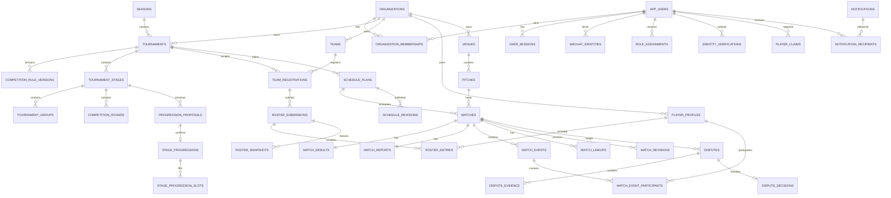

# 晓球方案 A 详细实施方案

> 文档版本：V0.2  
> 编制日期：2026-06-10  
> 架构基线：《晓球更新架构方案 A：赛事落地型模块化单体》  
> 上一版本：《晓球方案 A 详细实施方案 V0.1》  
> 实施目标：以一届真实校园足球杯赛为验收场景，完成从赛事建立、报名名单、赛程发布、比赛录入、榜单晋级、质疑修正到消息社区的完整闭环。

## 一、V0.2 修订摘要

V0.2 不扩大首发功能范围，重点把 V0.1 从“工作分解方案”补强为“可直接指导建库、开发、测试和上线的工程规格”。

本次新增或明确：

1. 人力投入假设、阶段风险缓冲和排期不包含项。
2. 核心 ERD、物理表命名、组织隔离、唯一约束、索引和不可变规则。
3. `ProgressionProposal`、`StageProgression`、`StageProgressionSlot` 的统一语义。
4. Match、MatchReport、名单、赛程、质疑、Outbox 等状态转换矩阵。
5. 角色权限矩阵、字段可见性矩阵和三层权限执行位置。
6. API 以 NestJS DTO 为契约源，OpenAPI 和前端 Client 自动生成。
7. 错误码注册表、幂等键、版本冲突、分页、排序和过滤规范。
8. Taro、淘汰赛组件、Prisma 并发和 Outbox 四项技术 Spike。
9. Outbox 至少一次投递、Handler 幂等、重试、死信和通知聚合规则。
10. 榜单快照、投影版本和正式晋级事实的版本语义。
11. 导入匹配、错误行、批次事务和重复导入规则。
12. 小程序弱网草稿、冲突对比和 LIVE 轮询策略。
13. 排名、并发、隐私、导入、权限和恢复的测试用例矩阵。
14. 数据分级、证明材料保留和上传安全控制。
15. 数据库恢复、Worker 堆积和版本回滚 Runbook。
16. 业务指标、比赛日 Dashboard、性能、容量、RPO 和 RTO。
17. AuditLog 精确结构和不同 Actor 类型。
18. ADR 模板、必须记录 ADR 的场景和重新评审机制。
19. Monorepo 共享包边界。
20. 第一批 Sprint Backlog 的负责人、工期、依赖、完成标准和风险。

## 二、实施结论与固定技术路线

```text
微信小程序：Taro + React + TypeScript
公开 H5：首期复用 Taro H5，完整淘汰赛图使用 Web/H5
管理后台：React + TypeScript + Vite + react-admin
服务端：NestJS + TypeScript
数据库：PostgreSQL
数据访问：Prisma，关键并发写入允许使用显式 SQL
异步任务：PostgreSQL Transactional Outbox + NestJS Worker
对象存储：S3 兼容托管对象存储
API 契约：NestJS DTO 为源，生成 OpenAPI 和 TypeScript Client
错误追踪：Sentry
业务监控：结构化日志 + 后台健康页，条件允许时接 Prometheus/Grafana
部署：Docker + GitHub Actions + Coolify
```

身份验证继续保留多个候选方案，但固定以下原则：

- 平台账号与学生身份验证解耦。
- 未验证账号可以浏览和使用低风险功能。
- 球员认领、赛事名单、队长、信息员、裁判和管理员等敏感能力需要相应验证或人工确认。
- 身份验证通过统一适配器输出，不让具体渠道侵入账号、赛事和比赛模块。
- 如果正式开发时仍无法获得全校名单，默认使用“赛事名单导入 + 队长邀请 + 管理员确认 + 人工材料兜底”。

## 三、范围与首发验收

### 1. 首发必须完成

- 微信小程序和 Web 管理后台。
- 微信登录、平台账号、会话撤销和作用域权限。
- 可替换身份验证框架。
- 赛事、规则版本、阶段、分组、轮次和赛程。
- 球队报名、赛事名单、提交、审核、锁定和不可变快照。
- 场地、裁判或现场负责人、赛程发布版本和变更记录。
- 快速比赛报告、完整比赛事件和单场阵容。
- 比分、积分榜、射手榜、助攻榜和淘汰赛。
- 并发保护、幂等、修订、审计和管理员修正。
- 数据完整度工作台。
- 对象级质疑、聚合工单和处理结果。
- 站内消息和少量微信订阅消息场景。
- 基础动态、评论、点赞和举报。
- CSV/XLSX 导入导出。
- 自动化测试、错误监控、备份和恢复演练。

### 2. 首发明确不做

- 微服务和 Kubernetes。
- 即时聊天。
- 独立搜索引擎。
- 全站持续 WebSocket。
- 视频转码和视频 AI。
- 复杂球员评分、热力图和预期进球。
- 独立 Android/iOS 安装包。
- 面向第三方的开放写 API。

### 3. 端到端验收赛事

固定使用一套“16 支球队校园杯赛”作为 Golden Fixture：

- 4 个小组，每组 4 队。
- 小组单循环。
- 每组前 2 名晋级 8 强。
- 单败淘汰，包含点球大战和三四名决赛。
- 至少一场弃权、一场延期、一场取消、一场比分修正。
- 至少一次名单退回和一次名单重新开放。
- 至少一次多人比分录入冲突。
- 至少一次对象级质疑和管理员修正。
- 至少一次 Worker 中断恢复和榜单重建。
- 最终生成冠军、积分榜、射手榜、助攻榜和球员赛季数据。

## 四、人力假设、估算方法与缓冲

### 1. 估算单位

- 一个“完整开发日”按 6 小时以上不被会议或课程打断的有效开发时间计算。
- 排期包含编码、代码评审、自测和基础文档。
- 风险缓冲单独列出，不把缓冲隐含在功能工期中。
- 若每周只能投入 2-3 个零散晚上，不应直接套用本方案周数，应按有效开发日重新折算。

### 2. 2-3 人稳定协作假设

- 每人每周至少投入 4 个完整开发日。
- 后端、小程序、管理后台/测试三条线可以并行。
- 至少一人对数据库、部署和线上故障负责到底。
- UI 使用组件库和统一设计 Token，不做大量定制视觉。
- 不接复杂校方 SSO。
- 不做视频、聊天、独立 App 和复杂推荐。
- 产品规则在每阶段开始前基本稳定。
- 每阶段预留 15%-25% 联调、缺陷修复和补测试时间。
- 比赛前最后两周不安排新的大型功能。

在这些假设下，内部计划工期为 14-18 周。考虑阶段并行、风险缓冲不能简单逐项相加，对外承诺窗口建议为 17-21 周。若团队成员是兼职且每周投入低于上述水平，应按有效开发日重新估算，不继续沿用 14-18 周。

### 3. 单人开发假设

- 每周至少投入 5 个完整开发日。
- 同一时间最多推进一个主链路。
- 先完成管理后台到小程序的纵向切片，再扩展功能。
- 社区、搜索、微信订阅消息最后集成。
- 每阶段结束前预留 3-5 个完整开发日修复和补测试。
- 若比赛日期固定，允许将社区降级为官方只读动态。

在这些假设下，内部计划工期为 20-24 周，对外承诺窗口建议为 23-29 周，其中包含 3-5 周综合风险缓冲。

### 4. 阶段工期与风险缓冲

| 阶段 | 计划周期 | 风险缓冲 | 排期不包含 |
| --- | --- | --- | --- |
| P0 基础工程与 Spike | 2-3 周 | +1 周 | 不要求完整生产身份方案，只完成账号、权限和验证框架 |
| P1 赛事管理与只读产品 | 3-4 周 | +1 周 | 不做自动最优排期，不做小程序复杂淘汰赛绘制 |
| P2 账号、身份与名单 | 3-4 周 | +1 周 | 不接复杂校方 SSO，不批量维护全校身份库 |
| P3 比赛数据闭环 | 4-5 周 | +1-2 周 | 不做全站实时通信，LIVE 使用短轮询 |
| P4 质疑、通知与社区 | 3-4 周 | +1 周 | 不做即时聊天和复杂内容推荐 |
| P5 上线演练 | 2 周 | +1 周 | 不增加功能，只修复阻断问题 |

阶段缓冲不全部串行相加。2-3 人团队中，P2 的账号与身份框架可在 P1 后半段并行，P4 的通知基础也可在 P3 后半段开始；任何并行都不得绕过前置数据模型和接口契约。

### 5. 2-3 人团队参考日历

| 周次 | 主线 | 可并行支线 |
| --- | --- | --- |
| 第 1-3 周 | P0 工程骨架和 Spike | Golden Fixture、设计 Token |
| 第 3-6 周 | P1 赛事、赛程和只读端 | P2 微信账号与验证框架 |
| 第 6-9 周 | P2 名单、快照和导入 | P3 报告交互原型 |
| 第 9-13 周 | P3 比赛报告、并发、榜单和晋级 | P4 通知基础 |
| 第 13-16 周 | P4 质疑、通知和基础社区 | P5 Runbook 草稿 |
| 第 16-18 周 | P5 全流程演练和修复 | 无新增功能 |
| 第 19-21 周 | 综合风险缓冲 | 仅在需要时使用 |

### 6. 延期归因

每次阶段延期必须归入以下一种或多种原因：

```text
SCOPE_CHANGE       范围增加或需求改变
RESOURCE_SHORTAGE  人力投入低于假设
TECH_RISK          Spike 未通过或第三方组件不适用
QUALITY_GAP        测试、性能、安全或数据质量未达标
EXTERNAL_BLOCKER   微信、学校、对象存储或部署环境阻塞
DEFECT_REWORK      缺陷修复或返工
ESTIMATION_ERROR   原估算不足
```

阶段复盘记录各类延期占用的开发日，后续估算以实际数据校准。

## 五、项目结构与共享包边界

### 1. Monorepo

```text
apps/
  mini-program/
  admin-web/
  api/
  worker/
packages/
  api-client/
  contracts/
  domain-utils/
  design-tokens/
  eslint-config/
  tsconfig/
prisma/
  schema.prisma
  migrations/
  seed/
docs/
  decisions/
  api/
  operations/
  test-cases/
infra/
  docker/
  coolify/
  scripts/
```

### 2. 共享包约束

`packages/contracts` 只允许包含：

- DTO 的共享输出类型。
- 枚举。
- 错误码。
- 领域事件类型。
- 无运行时副作用的 schema 类型。

不得包含：

- Prisma Client。
- 数据库访问。
- NestJS Controller 或 Service。
- React/Taro 组件。
- 跨模块业务流程。

`packages/domain-utils` 只允许包含：

- 纯函数。
- 排名和资格计算。
- 数据规范化。
- 时间、比分和状态辅助函数。

不得依赖：

- NestJS。
- Prisma。
- Taro。
- React。
- 网络请求。
- 全局可变状态。

`packages/api-client`：

- 由 OpenAPI 自动生成。
- 不手写业务逻辑。
- 不直接修改生成代码。
- 需要扩展时在应用侧建立 wrapper。

`packages/design-tokens`：

- 保存颜色、间距、字号和状态语义。
- 不尝试强制小程序与 Web 共享全部 UI 组件。

### 3. 服务端模块边界

```text
auth
identity
organization
competition
scheduling
team-roster
match-reporting
ranking
dispute
community
notification
media
admin-operations
audit
outbox
```

模块规则：

- Controller 只负责协议转换和调用应用服务。
- 应用服务负责权限关系、事务和业务流程。
- Domain 负责状态机和纯规则。
- Repository 只由本模块调用。
- 跨模块写操作通过公开应用服务或 Outbox 事件。
- 禁止在共享包中放置“确认晋级并写数据库”等跨模块流程。

## 六、身份验证预留设计

### 1. 稳定对象

```text
User
Credential
WechatIdentity
UserSession
OrganizationMembership
IdentityVerification
VerificationEvidence
RoleAssignment
PlayerProfile
PlayerClaim
TeamInvitation
```

语义：

- `User`：平台账号，不要求学号。
- `OrganizationMembership`：账号与学校、院系或组织的关系。
- `IdentityVerification`：一次验证申请和结果。
- `PlayerProfile`：可跨赛季保留的体育档案。
- `PlayerClaim`：账号认领球员档案的流程。

### 2. 账号基础流程

```text
微信登录
→ 已绑定账号则恢复会话
→ 未绑定则创建 UNVERIFIED 账号
→ 允许浏览、关注和低风险互动
→ 敏感操作触发验证、邀请或管理员审批
```

### 3. 候选验证适配器

| 适配器 | 数据来源 | 适用情况 |
| --- | --- | --- |
| `RosterWhitelistVerifier` | 全校或年级名单 | 能稳定、合法获得名单 |
| `TournamentRosterVerifier` | 当届参赛名单 | 默认主方案 |
| `TeamInvitationVerifier` | 队长邀请 | 小规模赛事辅助 |
| `CampusEmailVerifier` | 校园邮箱 | 学校邮箱稳定可用 |
| `ManualEvidenceVerifier` | 学生证/校园卡等 | 兜底 |
| `ExternalSsoVerifier` | CAS/OAuth | 学校正式开放 |

统一输出：

```text
APPROVED
REJECTED
REQUIRES_REVIEW
EXPIRED
```

### 4. 验证等级

```text
UNVERIFIED
CONTACT_VERIFIED
STUDENT_VERIFIED
PLAYER_CONFIRMED
STAFF_VERIFIED
```

验证结果必须带：

- `organization_id`
- 验证来源。
- 生效时间。
- 可选失效时间。
- 审核人。
- 撤销原因。

### 5. 身份决策门

P2 开始前回答：

1. 能否获得当届参赛名单？
2. 是否能使用校园邮箱？
3. 是否存在统一认证？
4. 管理员能承担多少人工审核？
5. 是否保存完整学号，保存期限多久？
6. 谁对参赛资格做最终确认？

决策输出为 ADR，不修改账号、球员和名单的核心模型。

## 七、核心 ERD

### 1. 主要关系



### 2. 物理表命名

领域名可以保持单数 PascalCase，PostgreSQL 物理表统一使用复数 snake_case：

| 领域名 | 物理表 |
| --- | --- |
| User | `app_users` |
| Group | `tournament_groups` |
| Round | `competition_rounds` |
| Organization | `organizations` |
| Match | `matches` |
| MatchEvent | `match_events` |
| RoleAssignment | `role_assignments` |
| OutboxJob | `outbox_jobs` |

Prisma 使用 `@@map` / `@map` 映射，避免 `user`、`group`、`round` 等高风险通用词直接成为物理表名。

### 3. 组织隔离

所有业务主表必须直接或间接归属组织。以下表必须显式包含 `organization_id`：

```text
organization_memberships
identity_verifications
role_assignments
seasons
tournaments
teams
player_profiles
venues
official_profiles
schedule_plans
matches
audit_logs
notifications
posts
media_assets
import_batches
```

要求：

- Repository 默认接收 `organization_id`。
- 后台查询不得仅凭资源 ID 读取。
- 平台管理员跨组织操作必须走独立用例并填写原因。
- 缓存键、对象存储 Key 和导出文件名包含组织命名空间。

### 4. 核心唯一约束

#### 组织与赛事

```text
organizations.slug                                      UNIQUE
seasons(organization_id, season_code)                  UNIQUE
tournaments(organization_id, tournament_code)         UNIQUE
competition_rule_versions(tournament_id, version)      UNIQUE
tournament_stages(tournament_id, stage_code)           UNIQUE
tournament_groups(stage_id, group_code)                UNIQUE
competition_rounds(stage_id, round_number)             UNIQUE
```

#### 账号与身份

```text
app_users.login_name_normalized                         UNIQUE WHERE NOT NULL
wechat_identities(provider, openid)                    UNIQUE
user_sessions.refresh_token_hash                       UNIQUE
organization_memberships(organization_id, user_id)     UNIQUE
role_assignments(user_id, role, scope_type, scope_id)  UNIQUE
```

#### 球队与球员

```text
teams(organization_id, normalized_name)                UNIQUE
player_profiles(organization_id, source_type, source_key)
                                                        UNIQUE WHERE source_key IS NOT NULL
```

姓名不得作为球员唯一键。若同一组织允许同名球队，应将球队唯一规则调整为稳定 `team_code`，并通过 ADR 记录。

`PlayerClaim`：

- 同一 `player_profile_id` 最多存在一个 `APPROVED` 认领。
- 使用 PostgreSQL 部分唯一索引实现。

#### 名单

```text
roster_entries(roster_submission_id, player_profile_id) UNIQUE
roster_snapshots(tournament_id, team_id, snapshot_version) UNIQUE
```

`RosterSnapshot` 创建后禁止更新成员内容，只能新建更高版本快照。

#### 比赛事件

```text
match_events(match_id, client_idempotency_key)         UNIQUE
match_events(match_id, source, source_event_key)       UNIQUE WHERE source_event_key IS NOT NULL
```

#### Outbox 与幂等

```text
outbox_jobs(deduplication_key)                          UNIQUE WHERE deduplication_key IS NOT NULL
idempotency_records(user_id, route, idempotency_key)   UNIQUE
notification_recipients(notification_id, user_id)      UNIQUE
```

### 5. 关键索引

```text
matches(organization_id, scheduled_start_at)
matches(tournament_id, status, scheduled_start_at)
matches(stage_id, round_id)
match_events(match_id, occurred_minute, created_at)
match_reports(match_id, status)
roster_submissions(tournament_id, team_id, status)
roster_entries(player_profile_id, roster_submission_id)
disputes(organization_id, status, priority, created_at)
notifications(organization_id, created_at)
notification_recipients(user_id, read_at, created_at)
outbox_jobs(status, available_at)
outbox_jobs(locked_until)
projection_runs(target_type, target_id, status, created_at)
audit_logs(organization_id, target_type, target_id, created_at)
posts(organization_id, status, created_at)
```

索引必须根据实际查询和 `EXPLAIN ANALYZE` 校准，不因“可能用到”无限增加。

### 6. 不可变、软删与可修改规则

| 对象 | 规则 |
| --- | --- |
| `CompetitionRuleVersion` | 发布后不可修改，只能新建版本 |
| `RosterSnapshot` | 创建后内容不可修改 |
| `StageProgression` | 确认后不可静默覆盖，只能通过修正流程产生新记录 |
| `MatchRevision` | 永久追加，不更新历史版本 |
| `AuditLog` | 永久追加，不允许普通业务删除 |
| `ReputationLedger` | 永久追加，不直接覆盖总分 |
| `OutboxJob` | payload 创建后不修改，重试只改执行状态 |
| `Post/Comment/MediaAsset` | 使用软删除和下架状态 |
| `Team/PlayerProfile` | 可软删除，但历史赛事引用保持有效 |

历史比赛必须保存或引用当时的 `roster_snapshot_id`，不能根据当前球队成员反推历史参赛名单。

### 7. 晋级对象统一语义

```text
ProgressionProposal
- 一次晋级预览
- 可以重复生成
- 保存输入榜单快照与规则版本
- 不代表正式结果

StageProgression
- 管理员确认后的正式晋级事实
- 引用被确认的 ProgressionProposal
- 确认后不可静默覆盖

StageProgressionSlot
- 正式进入下一阶段的席位记录
- 保存 source_team_id、target_stage_id、target_slot
- 下一阶段比赛引用该席位来源
```

后续比赛已开始时，上游比分修正不得自动修改 `StageProgressionSlot`。

## 八、核心状态机转换矩阵

状态改变必须由命令完成，禁止通过通用 PATCH 任意修改 `status`。

### 1. Match

| 从 | 到 | 命令 | 允许角色 | 前置条件 | 原因 | 审计/Outbox |
| --- | --- | --- | --- | --- | --- | --- |
| `SCHEDULED` | `CHECK_IN` | `startCheckIn` | Official、TournamentAdmin | 已发布且未取消 | 否 | 审计；可通知双方球队 |
| `CHECK_IN` | `LIVE` | `startMatch` | Official、TournamentAdmin | 比赛未中止；签到要求满足或被豁免 | 可选 | 审计；发布比赛开始事件 |
| `LIVE` | `FINISHED` | `finishMatch` | Official、TournamentAdmin | 有比分、弃权或中止结果 | 否 | 审计；创建/更新报告草稿 |
| `FINISHED` | `CONFIRMED` | `confirmMatch`（内部） | TournamentAdmin | 报告在同一命令中确认；完整度不是 `REVIEW_REQUIRED` | 否 | 审计；触发一次榜单、统计和晋级候选 |
| `SCHEDULED/CHECK_IN` | `CANCELLED` | `cancelMatch` | TournamentAdmin | 未正式完成 | 必填 | 审计；通知相关人员 |
| `CHECK_IN/LIVE` | `ABANDONED` | `abandonMatch` | Official、TournamentAdmin | 比赛无法继续 | 必填 | 审计；触发规则判定待办 |
| `CANCELLED` | `SCHEDULED` | `restoreMatch` | TournamentAdmin | 未生成冲突后续事实 | 必填 | 高风险审计；新赛程版本 |

禁止普通信息员直接将 `CONFIRMED` 回退。确认后的修正通过 MatchReport 修正流程完成。

### 2. MatchReport

| 从 | 到 | 命令 | 允许角色 | 可改比分 | 可改事件 | Revision | 排名副作用 |
| --- | --- | --- | --- | --- | --- | --- | --- |
| `DRAFT` | `SUBMITTED` | `submitReport` | MatchReporter、Official | 是 | 是 | 是 | 否 |
| `SUBMITTED` | `DRAFT` | `returnReport` | TournamentAdmin | 返回后可改 | 返回后可改 | 是 | 否 |
| `SUBMITTED` | `CONFIRMED` | `confirmMatchReport` | TournamentAdmin | 否 | 否 | 是 | 同一事务确认 Match，并只触发一次正式重算 |
| `CONFIRMED` | `DISPUTED` | `markDisputed` | 系统/Dispute Service | 否 | 仅补证据 | 是 | 不立即回滚 |
| `DISPUTED` | `CONFIRMED` | `rejectDispute` | TournamentAdmin | 否 | 否 | 是 | 无 |
| `DISPUTED` | `CORRECTED` | `applyCorrection` | TournamentAdmin | 通过修正命令 | 通过修正命令 | 必须 | 触发重算 |
| `CORRECTED` | `CONFIRMED` | `confirmCorrectedReport` | TournamentAdmin | 否 | 否 | 是 | 确认最新投影 |
| `CONFIRMED` | `REOPENED` | `reopenReport` | TournamentAdmin | 可按授权修改 | 可按授权修改 | 必须 | 标记数据更新中 |
| `REOPENED` | `SUBMITTED` | `resubmitReport` | MatchReporter、Official | 是 | 是 | 是 | 否 |

所有管理员修正必须填写 `reason`，并记录 before/after。

对外只暴露 `confirmMatchReport`。该应用命令在一个事务中把 `MatchReport` 转为 `CONFIRMED`，并把符合条件的 `Match` 从 `FINISHED` 转为 `CONFIRMED`，然后创建唯一去重的 `match.confirmed` Outbox。`confirmMatch` 仅表示该命令内部的 Match 状态转换，不单独对客户端开放。

### 3. TeamRegistration

| 从 | 到 | 命令 | 角色 | 前置条件 |
| --- | --- | --- | --- | --- |
| `DRAFT` | `SUBMITTED` | `submitRegistration` | TeamCaptain | 报名开放、基本资料完整 |
| `SUBMITTED` | `APPROVED` | `approveRegistration` | TournamentAdmin | 资格初审通过 |
| `SUBMITTED` | `RETURNED` | `returnRegistration` | TournamentAdmin | 必填退回原因 |
| `RETURNED` | `SUBMITTED` | `resubmitRegistration` | TeamCaptain | 已修正 |
| `APPROVED` | `WITHDRAWN` | `withdrawRegistration` | TeamCaptain、TournamentAdmin | 赛事规则允许；必填原因 |
| `APPROVED` | `SUSPENDED` | `suspendRegistration` | TournamentAdmin | 发现资格问题；必填原因 |

### 4. RosterSubmission

| 从 | 到 | 命令 | 角色 | 前置条件 | 副作用 |
| --- | --- | --- | --- | --- | --- |
| `DRAFT` | `SUBMITTED` | `submitRoster` | TeamCaptain | 资格预检通过 | 锁定队长编辑 |
| `SUBMITTED` | `RETURNED` | `returnRoster` | TournamentAdmin | 必填原因 | 通知队长 |
| `RETURNED` | `SUBMITTED` | `resubmitRoster` | TeamCaptain | 已修正 | 新版本 |
| `SUBMITTED` | `APPROVED` | `approveRoster` | TournamentAdmin | 人工审核通过 | 待截止锁定 |
| `APPROVED` | `LOCKED` | `lockRoster` | TournamentAdmin/定时任务 | 到达截止或手动锁定 | 创建不可变快照 |
| `LOCKED` | `REOPENED` | `reopenRoster` | TournamentAdmin | 必填原因 | 保留旧快照 |
| `REOPENED` | `SUBMITTED` | `resubmitReopenedRoster` | TeamCaptain | 修改完成 | 增加提交版本 |
| 任意非锁定 | `WITHDRAWN` | `withdrawRoster` | TeamCaptain、TournamentAdmin | 规则允许 | 审计 |

### 5. SchedulePlan

| 从 | 到 | 命令 | 角色 | 条件 |
| --- | --- | --- | --- | --- |
| `DRAFT` | `VALIDATING` | `validateSchedule` | TournamentAdmin | 至少一场比赛 |
| `VALIDATING` | `DRAFT` | `validationFailed` | 系统 | 存在阻断冲突 |
| `VALIDATING` | `READY` | `validationPassed` | 系统 | 无阻断冲突 |
| `READY` | `PUBLISHED` | `publishSchedule` | TournamentAdmin | expected_version 匹配 | 
| `PUBLISHED` | `SUPERSEDED` | `publishReplacement` | TournamentAdmin | 创建并发布新版本 |
| `DRAFT/READY` | `CANCELLED` | `cancelSchedulePlan` | TournamentAdmin | 必填原因 |

已发布赛程不能原地修改；任何时间、场地或对手变化都产生新 `ScheduleRevision`。

### 6. IdentityVerification

| 从 | 到 | 命令 | 角色 |
| --- | --- | --- | --- |
| `DRAFT` | `SUBMITTED` | `submitVerification` | 本人 |
| `SUBMITTED` | `IN_REVIEW` | `startReview` | 指定审核员 |
| `IN_REVIEW` | `APPROVED` | `approveVerification` | 指定审核员 |
| `IN_REVIEW` | `REJECTED` | `rejectVerification` | 指定审核员 |
| `SUBMITTED/IN_REVIEW` | `MORE_INFO_REQUIRED` | `requestMoreInfo` | 指定审核员 |
| `MORE_INFO_REQUIRED` | `SUBMITTED` | `resubmitVerification` | 本人 |
| `APPROVED` | `EXPIRED` | `expireVerification` | 系统/管理员 |
| `APPROVED` | `REVOKED` | `revokeVerification` | OrganizationAdmin | 必填原因 |

### 7. PlayerClaim

```text
PENDING -> APPROVED
PENDING -> REJECTED
PENDING -> CANCELLED
APPROVED -> FROZEN
FROZEN -> APPROVED
FROZEN -> REVOKED
```

同一球员档案最多一个有效 `APPROVED` 认领。冻结和撤销必须记录原因。

### 8. Dispute

| 从 | 到 | 命令 | 角色 | 副作用 |
| --- | --- | --- | --- | --- |
| `OPEN` | `TRIAGED` | `triageDispute` | TournamentAdmin | 设置优先级 |
| `TRIAGED` | `INVESTIGATING` | `startInvestigation` | TournamentAdmin | 锁定处理人 |
| `INVESTIGATING` | `ACCEPTED` | `acceptDispute` | TournamentAdmin | 调用正式修正命令 |
| `INVESTIGATING` | `REJECTED` | `rejectDispute` | TournamentAdmin | 记录结论 |
| `INVESTIGATING` | `MORE_EVIDENCE_REQUIRED` | `requestEvidence` | TournamentAdmin | 通知提交人 |
| `MORE_EVIDENCE_REQUIRED` | `INVESTIGATING` | `submitEvidence` | 提交人 | 追加证据 |
| `ACCEPTED/REJECTED` | `CLOSED` | `closeDispute` | 系统/管理员 | 发送结果通知 |

### 9. OutboxJob

```text
PENDING
PROCESSING
SUCCEEDED
FAILED_RETRYABLE
FAILED_PERMANENT
CANCELLED
```

转换：

- `PENDING/FAILED_RETRYABLE -> PROCESSING`：Worker 获得租约。
- `PROCESSING -> SUCCEEDED`：Handler 成功。
- `PROCESSING -> FAILED_RETRYABLE`：可重试错误且未超次数。
- `PROCESSING -> FAILED_PERMANENT`：不可重试或达到最大次数。
- `PROCESSING -> PENDING`：租约超时被回收。
- 未处理任务可由管理员取消，但必须填写原因。

### 10. NotificationRecipient

```text
UNREAD -> READ
UNREAD -> ARCHIVED
READ -> ARCHIVED
```

通知正文事实不可修改；聚合更新只改变聚合数量、最新时间和摘要。

## 九、权限矩阵与字段可见性

### 1. 角色

```text
Anonymous
LoggedInUser
VerifiedStudent
Player
TeamCaptain
TeamManager
MatchReporter
Official
TournamentAdmin
OrganizationAdmin
PlatformAdmin
ContentModerator
IdentityReviewer
```

一个用户可同时持有多个作用域角色。

### 2. 核心功能权限

| 功能 | 未登录 | 登录未验证 | 已验证学生 | 队长 | 信息员/裁判 | 赛事管理员 | 组织管理员 |
| --- | --- | --- | --- | --- | --- | --- | --- |
| 查看公开赛事 | 是 | 是 | 是 | 是 | 是 | 是 | 是 |
| 关注赛事/球队 | 否 | 是 | 是 | 是 | 是 | 是 | 是 |
| 发布普通动态 | 否 | 按组织策略 | 是 | 是 | 是 | 是 | 是 |
| 申请加入球队 | 否 | 可申请但需验证 | 是 | 不适用 | 可 | 是 | 是 |
| 邀请球队成员 | 否 | 否 | 否 | 本队 | 否 | 可代管 | 是 |
| 编辑赛事名单 | 否 | 否 | 否 | 本队草稿 | 否 | 可代管 | 是 |
| 提交赛事名单 | 否 | 否 | 否 | 本队 | 否 | 是 | 是 |
| 审核/锁定名单 | 否 | 否 | 否 | 否 | 否 | 本赛事 | 是 |
| 创建赛程草案 | 否 | 否 | 否 | 否 | 否 | 本赛事 | 是 |
| 发布赛程 | 否 | 否 | 否 | 否 | 否 | 本赛事 | 是 |
| 快速录入比分 | 否 | 否 | 否 | 否 | 授权比赛 | 本赛事 | 是 |
| 补录比赛事件 | 否 | 否 | 否 | 否 | 授权比赛 | 本赛事 | 是 |
| 确认比赛报告 | 否 | 否 | 否 | 否 | 否 | 本赛事 | 是 |
| 管理员修正数据 | 否 | 否 | 否 | 否 | 否 | 本赛事 | 是 |
| 提交质疑 | 否 | 是 | 是 | 是 | 是 | 是 | 是 |
| 处理质疑 | 否 | 否 | 否 | 否 | 否 | 本赛事 | 是 |
| 查看身份材料 | 否 | 本人有限 | 本人有限 | 否 | 否 | 仅被授权审核员 | 指定职责 |
| 查看审计日志 | 否 | 否 | 否 | 本队有限记录 | 本人操作 | 本赛事 | 本组织 |

### 3. PlayerProfile 字段可见性

| 字段 | 公开用户 | 本人 | 队长 | 赛事管理员 | 平台管理员 |
| --- | --- | --- | --- | --- | --- |
| `display_name` | 是 | 是 | 是 | 是 | 是 |
| `avatar` | 是 | 是 | 是 | 是 | 是 |
| `shirt_number` | 按赛事配置 | 是 | 是 | 是 | 是 |
| `position` | 按赛事配置 | 是 | 是 | 是 | 是 |
| `student_id` | 否 | 脱敏 | 默认否 | 按职责可见 | 是 |
| `phone` | 否 | 是 | 本队按策略 | 按职责可见 | 是 |
| `verification_status` | 否 | 是 | 只见是否满足资格 | 是 | 是 |
| `verification_source` | 否 | 是 | 否 | 按职责可见 | 是 |

### 4. IdentityVerification 字段可见性

| 字段 | 本人 | IdentityReviewer | TournamentAdmin | 普通组织管理员 |
| --- | --- | --- | --- | --- |
| `status` | 是 | 是 | 资格相关摘要 | 按职责 |
| `verification_type` | 是 | 是 | 可见 | 按职责 |
| `evidence_url` | 默认否，仅短期预览 | 是，签名 URL | 默认否 | 默认否 |
| `rejection_reason` | 是 | 是 | 可见摘要 | 按职责 |
| `review_notes` | 否 | 是 | 默认否 | 按职责 |
| `student_id` | 脱敏 | 按职责 | 按职责 | 按职责 |

### 5. 权限检查三层

1. **Route Guard**
   - 是否登录。
   - 是否具备基础角色。
   - 组织和作用域是否匹配。

2. **Application Service**
   - 是否确实为该队队长。
   - 是否被授权该场比赛。
   - 当前资源状态是否允许操作。
   - 是否满足验证等级和赛事规则。

3. **Repository Query Scope**
   - 强制附加 `organization_id`。
   - 后台私有资源附加 `tournament_id` 或作用域条件。
   - 禁止仅凭资源 ID 跨组织读取。

前端隐藏按钮只改善体验，不承担安全职责。

## 十、API 契约、错误码与横向规范

### 1. 契约源头

采用 NestJS DTO 为源：

```text
NestJS DTO
+ class-validator
+ Swagger decorators
→ 生成 OpenAPI
→ 生成 packages/api-client
→ 小程序和管理后台使用生成 Client
```

质量门：

- CI 保存并比较 OpenAPI diff。
- 接口变更必须重新生成 Client。
- 前端不得手写重复请求 DTO。
- 破坏性变更必须更新 API 版本或经过兼容迁移。
- `packages/contracts` 不与生成 Client 重复定义请求响应类型。

该决策记录为 ADR。

### 2. 命令式接口

所有状态转换统一使用：

```text
POST /resources/{id}/{command}
```

示例：

```text
POST /roster-submissions/{id}/submit
POST /roster-submissions/{id}/lock
POST /match-reports/{id}/confirm
POST /schedule-plans/{id}/publish
POST /stages/{id}/progression/confirm
```

要求：

- 命令进入 Application Service。
- 高风险命令携带 `expected_version`。
- 管理员命令携带 `reason`。
- 所有命令产生 AuditLog。
- 需要异步副作用时在同一事务写 Outbox。

### 3. 幂等键

请求 Header：

```text
Idempotency-Key: <client-generated-uuid>
```

适用：

- 快速比赛报告。
- 新增比赛事件。
- 提交名单。
- 确认导入。
- 提交质疑。
- 上传确认。
- 未来可能的支付或报名缴费。

`IdempotencyRecord`：

```text
id
organization_id
user_id
route
idempotency_key
request_hash
response_status
response_body_digest
resource_type
resource_id
expires_at
created_at
```

同一 Key 与相同请求体返回原结果；同一 Key 与不同请求体返回：

```text
409 IDEMPOTENCY_KEY_REUSED_WITH_DIFFERENT_PAYLOAD
```

### 4. 版本冲突

高风险命令 Body 统一使用：

```json
{
  "expectedVersion": 3
}
```

冲突响应：

```json
{
  "code": "MATCH_VERSION_CONFLICT",
  "message": "比赛数据已被其他人员更新",
  "requestId": "req_xxx",
  "details": {
    "expectedVersion": 3,
    "currentVersion": 4,
    "changedFields": ["homeScore", "awayScore"]
  }
}
```

### 5. 分页、排序与过滤

请求：

```text
GET /matches?cursor=xxx&limit=30&sort=scheduledStartAt:asc&status=LIVE
```

响应：

```json
{
  "items": [],
  "pageInfo": {
    "nextCursor": "opaque-cursor",
    "hasNextPage": true
  }
}
```

规范：

- `limit` 默认 30，最大 100。
- Cursor 必须是不透明字符串。
- 排序字段使用 API 字段名，不暴露数据库列名。
- 过滤参数必须有白名单，禁止任意表达式。

### 6. 错误码注册表

| 错误码 | HTTP | 可重试 | 前端处理 | Sentry |
| --- | --- | --- | --- | --- |
| `MATCH_VERSION_CONFLICT` | 409 | 用户处理后可重试 | 打开冲突对比 | 否 |
| `ROSTER_LOCKED` | 409 | 否 | 提示联系管理员 | 否 |
| `ROSTER_ENTRY_DUPLICATED` | 409 | 否 | 高亮重复球员 | 否 |
| `PLAYER_ALREADY_CLAIMED` | 409 | 否 | 进入申诉/冻结流程 | 否 |
| `TOURNAMENT_RULE_VERSION_LOCKED` | 409 | 否 | 提示创建新版本 | 否 |
| `SCHEDULE_CONFLICT` | 422 | 修正后可重试 | 展示冲突列表 | 否 |
| `DISPUTE_TARGET_VERSION_CHANGED` | 409 | 可 | 刷新目标并重新确认 | 否 |
| `IMPORT_ROW_VALIDATION_FAILED` | 422 | 修正文件后可 | 下载错误报告 | 否 |
| `FORBIDDEN_CROSS_ORGANIZATION` | 403 | 否 | 无权限页面 | 是，安全事件 |
| `IDEMPOTENCY_KEY_REUSED_WITH_DIFFERENT_PAYLOAD` | 409 | 使用新 Key | 提示刷新 | 是 |
| `OUTBOX_HANDLER_FAILED` | 500 | 系统重试 | 不直接展示用户 | 是 |
| `PROJECTION_NOT_READY` | 202 | 自动重试 | 展示“数据更新中” | 否 |
| `IDENTITY_VERIFICATION_REQUIRED` | 403 | 完成验证后 | 跳转验证页 | 否 |
| `RESOURCE_STATE_TRANSITION_INVALID` | 409 | 否 | 刷新当前状态 | 否 |

错误码必须集中注册，禁止同一错误在不同模块使用不同字符串。

## 十一、技术 Spike 清单

Spike 是有时间盒、结论和退出标准的技术验证，不等同于正式功能开发。若 Spike 失败，必须执行预先定义的替代方案。

### Spike-01：Taro 复杂表单与弱网草稿

时间盒：3-5 个开发日。

验证：

- Taro + React + TypeScript 基础工程。
- TDesign MiniProgram 或备选组件的兼容性。
- 动态球员选择。
- 长表单滚动和底部操作区。
- TanStack Query 在微信小程序端的缓存和失效。
- 图片上传。
- 防误触返回。
- 本地草稿保存、恢复和提交。
- 网络失败后的状态提示。

验收：

- 可以完成一次快速比赛报告的编辑、自动保存、退出、恢复和提交。
- 提交成功后本地草稿被清除。
- 无明显阻塞性组件兼容问题。

失败替代：

- 取消不稳定组件，使用 Taro 原生组件自行封装。
- TanStack Query 若存在阻断问题，保留统一 API Client，改用轻量自建 Query Store。

### Spike-02：赛制引擎与淘汰赛展示

时间盒：4-6 个开发日。

验证：

- 4 组小组赛和 8 强淘汰。
- 轮空。
- 点球比分。
- 三四名决赛。
- 比分修正后的晋级候选。
- `brackets-manager.js` 到内部模型的转换。
- `brackets-viewer.js` 的移动 Web 横向滚动。
- 同一 `BracketViewModel` 驱动 H5 完整图和小程序轮次卡片。

验收：

- 官方数据库模型不依赖第三方库的持久化结构。
- 第三方组件不反向修改比赛事实。
- 小程序和 H5 能消费相同内部 ViewModel。
- Golden Fixture 的赛制结果通过测试。

失败替代：

- 后端使用自有 Round/Match/AdvancementRule 规则。
- H5 使用自建分轮列表，不阻塞首发。

### Spike-03：Prisma 与 PostgreSQL 并发更新

时间盒：3-5 个开发日。

验证：

- `expected_version` 条件更新。
- 两人同时提交比分。
- 两人使用相同幂等键新增事件。
- 两人创建相似但不同事件。
- 事务隔离级别。
- Prisma 事务能力。
- 显式 SQL 和 `FOR UPDATE SKIP LOCKED` 的接入方式。

验收：

- 并发测试可稳定得到一个成功、一个 409。
- 不产生重复事件。
- 比分与修订记录保持一致。
- 找到适用于 Outbox 领取的 SQL 方案。

失败替代：

- 关键并发路径使用参数化显式 SQL。
- Prisma 继续承担普通 CRUD 和迁移。

### Spike-04：Transactional Outbox

时间盒：3-5 个开发日。

验证：

- 业务事务内同时写业务事实和 Outbox。
- Worker 使用租约领取任务。
- `SKIP LOCKED` 并发领取。
- Worker 进程中断和租约恢复。
- 指数退避。
- 最大重试次数。
- 永久失败。
- 去重键。
- Handler 幂等。
- 管理员手动重放。

验收：

- 业务成功时任务不会丢失。
- Worker 重复执行不会产生重复通知或错误最新投影。
- 中断后任务可以自动恢复。
- 后台可查看失败原因和重放。

失败替代：

- 首发继续使用数据库任务表，但减少 Topic 数量和并发 Worker 数量。
- 不以引入 Redis/BullMQ 代替对一致性语义的验证。

### Spike 输出

每项 Spike 输出：

```text
结论：通过 / 有条件通过 / 失败
使用版本
原型代码位置
已验证场景
未覆盖风险
采用方案
替代方案
是否需要 ADR
```

P0 退出前必须完成全部四项 Spike。

## 十二、Outbox、投影与通知投递语义

### 1. OutboxJob 结构

```text
id
organization_id
topic
aggregate_type
aggregate_id
aggregate_version
payload
deduplication_key
status
available_at
locked_by
locked_until
attempt_count
max_attempts
last_error_code
last_error
correlation_id
created_at
processed_at
```

### 2. 投递保证

- Outbox 提供“至少一次”处理，不承诺天然“恰好一次”。
- 所有 Handler 必须幂等。
- Outbox payload 创建后不可修改。
- 业务表写入与 Outbox 创建必须在同一事务中提交。
- 外部服务调用不得位于主业务事务中。

### 3. 任务领取

Worker：

1. 查询 `PENDING` 或到期的 `FAILED_RETRYABLE`。
2. 使用 `FOR UPDATE SKIP LOCKED` 获取任务。
3. 更新为 `PROCESSING`，写入租约。
4. 提交领取事务。
5. 执行 Handler。
6. 独立事务写成功或失败状态。

租约超时后，其他 Worker 可以回收任务。

### 4. 重试

建议：

```text
attempt 1: 立即
attempt 2: 30 秒
attempt 3: 2 分钟
attempt 4: 10 分钟
attempt 5: 30 分钟
```

分类：

- 网络超时、对象存储临时故障：`FAILED_RETRYABLE`。
- 参数错误、资源不存在、权限配置错误：`FAILED_PERMANENT`。
- 微信用户未授权订阅：永久失败，不重试。

### 5. Handler 幂等

通知：

```text
notification_recipients(notification_id, user_id) UNIQUE
```

榜单：

- `ProjectionRun` 代表一次计算。
- 以输入版本和 `input_digest` 判断重复计算。
- 较旧输入完成后不得覆盖较新成功快照。

缓存刷新：

- 删除缓存天然可重复。
- 写缓存携带投影版本，旧版本不得覆盖新版本。

微信发送：

- `DeliveryAttempt` 保存渠道、错误码和尝试次数。
- 使用业务通知 ID 作为渠道侧去重参考。

### 6. 手动重放

管理员可以：

- 重放单个失败任务。
- 重放某一 Topic 的失败任务。
- 取消仍未执行的任务。

限制：

- 不允许直接编辑 payload 后重放。
- 业务数据错误通过补偿命令产生新 Outbox。
- 重放操作写 AuditLog。

### 7. 通知聚合

默认规则：

- 相同接收人。
- 相同通知类型。
- 相同业务对象。
- 10 分钟窗口。

适合聚合：

- 点赞。
- 评论。
- 普通补录提醒。
- 相同对象新增质疑人数。

不聚合或弱聚合：

- 赛程时间和地点变更。
- 质疑最终处理结果。
- 账号安全。
- 权限撤销。
- 名单退回。

未读数以 `NotificationRecipient.read_at IS NULL` 计算，不从通知聚合数量推导。

### 8. 微信订阅消息

- Best-effort。
- 站内通知先持久化。
- 微信发送失败不回滚业务和站内通知。
- 用户未授权、模板失效等错误不重试。
- 网络错误和微信临时故障有限重试。
- 所有尝试保存 `DeliveryAttempt`。

## 十三、榜单、统计与晋级版本语义

### 1. ProjectionRun

```text
id
organization_id
projection_type
target_type
target_id
input_digest
source_match_version_max
status
started_at
finished_at
error_code
error_message
correlation_id
```

状态：

```text
PENDING
BUILDING
SUCCEEDED
FAILED
SUPERSEDED
```

### 2. StandingsSnapshot

```text
id
organization_id
tournament_id
stage_id
group_id nullable
rule_version_id
projection_run_id
input_digest
source_match_version_max
status
is_latest_success
calculated_at
```

读取规则：

- 前台只读取 `is_latest_success = true`。
- 有新 ProjectionRun 执行时展示“数据更新中”。
- 最新重算失败时继续展示上一成功版本。
- 页面展示最后成功更新时间。
- 一个范围内最多一个 `is_latest_success = true`，由事务或唯一约束保护。

### 3. PlayerStatSnapshot

与积分榜使用相同版本语义，至少保存：

- 输入 MatchEvent 最大版本。
- 事件完整度摘要。
- 是否为最新成功版本。
- 计算时间。

射手榜和助攻榜显示：

- 官方比赛结果已确认。
- 明细是否完整。
- 最新计算时间。

### 4. 排名解释结构

每个 `StandingsRow` 保存结构化解释：

```json
{
  "rank": 1,
  "points": 9,
  "tieBreakers": [
    {
      "rule": "HEAD_TO_HEAD_POINTS",
      "value": 3,
      "description": "同分球队之间积分更高"
    },
    {
      "rule": "GOAL_DIFFERENCE",
      "value": 5,
      "description": "总净胜球为 5"
    }
  ]
}
```

解释既供后台复核，也可在前台“排名规则”中展示。

### 5. ProgressionProposal

```text
id
organization_id
source_stage_id
target_stage_id
standings_snapshot_id
rule_version_id
input_digest
status: DRAFT / STALE / CONFIRMED / SUPERSEDED
created_by
created_at
```

- 同一阶段可以生成多个 Proposal。
- 榜单输入变化后，旧 Proposal 标记 `STALE`。
- Proposal 本身不是正式晋级事实。

### 6. StageProgression

```text
id
organization_id
proposal_id
source_stage_id
target_stage_id
confirmed_by
confirmed_at
status: CONFIRMED / CORRECTION_REQUIRED / SUPERSEDED
reason
version
```

确认后：

- 创建 `StageProgressionSlot`。
- 下一阶段席位引用该记录。
- 触发赛程草案和通知。
- 上游比分修正不自动改变席位。

### 7. 晋级修正策略

- 下一阶段未开赛：生成“建议重新确认晋级”高优先级工单。
- 下一阶段已开赛：禁止自动修改，必须进入特殊管理员修正流程。
- 任何修正保留旧 StageProgression，并创建替代记录。
- 修正必须说明赛事方决定和对已发布赛程的影响。

## 十四、导入导出规格

### 1. ImportBatch

```text
id
organization_id
import_type
source_file_id
source_file_hash
status
mapping_json
row_count
valid_row_count
error_row_count
created_by
confirmed_by
created_at
confirmed_at
```

状态：

```text
UPLOADED
MAPPING
VALIDATING
READY
IMPORTING
SUCCEEDED
FAILED
CANCELLED
```

### 2. 模板字段

球员模板示例：

| 字段 | 必填 | 可公开 | 说明 |
| --- | --- | --- | --- |
| 姓名 | 是 | 按赛事配置 | 不能作为唯一匹配依据 |
| 球队代码 | 是 | 是 | 优先使用稳定代码 |
| 球衣号 | 否 | 是 | 同队重复时预警 |
| 位置 | 否 | 是 | 枚举或规范化文本 |
| 学号 | 否 | 否 | Restricted |
| 手机号 | 否 | 否 | Restricted |
| 外部来源 ID | 否 | 否 | 首选稳定匹配键 |

每个模板必须带：

- 必填列。
- 可选列。
- 示例值。
- 枚举说明。
- 错误提示说明。
- 模板版本。

### 3. 匹配优先级

```text
1. external_source_id
2. organization_id + student_id_hash
3. 同一来源历史 ImportBatch 的 stable_key
4. 人工选择匹配
```

禁止仅凭姓名自动覆盖已有 `PlayerProfile`。

### 4. 错误行

```json
{
  "rowNumber": 12,
  "field": "studentId",
  "code": "DUPLICATED_STUDENT_ID",
  "message": "该学号已关联另一个球员档案",
  "severity": "ERROR"
}
```

严重度：

- `ERROR`：阻止导入。
- `WARNING`：允许确认，但必须展示。
- `INFO`：规范化提示。

### 5. 事务边界

- 预检不写业务表，只写 ImportBatch、列映射、错误和原始文件信息。
- 首发默认整批事务导入。
- 任一 `ERROR` 导致整批不允许确认。
- 不启用静默部分成功。
- 若未来支持部分成功，必须通过 ADR，并明确成功行和失败行。

### 6. 重复导入

- 使用文件哈希和模板版本检测完全重复文件。
- 相同文件重复上传时提示已有 ImportBatch。
- 用户可以重新执行预检，但不能无提示重复写业务数据。
- 导入创建的数据记录 `import_batch_id`。

### 7. 导出

导出任务通过 Outbox/Worker 生成：

- 赛程。
- 名单。
- 比赛报告。
- 积分榜。
- 球员数据。
- 质疑处理记录。

受限字段导出必须二次权限检查并写 AuditLog。

## 十五、小程序弱网、草稿与冲突体验

### 1. 本地草稿 Key

```text
draft:{organization_id}:{match_id}:{user_id}:{report_type}
```

### 2. 保存

- 用户修改后 debounce 保存。
- 小程序切后台时保存。
- 页面返回前保存。
- 请求失败时保存。
- 草稿包含服务端 `base_version`、保存时间和字段摘要。

### 3. 恢复

进入页面时：

1. 获取服务端当前版本。
2. 检测本地草稿。
3. 若版本未变化，可直接恢复。
4. 若版本变化，展示草稿与服务端对比。
5. 用户选择恢复无冲突字段、丢弃或转为质疑。

### 4. 删除

- 服务端提交成功后删除。
- 用户主动丢弃后删除。
- 超过 7 天自动清理，天数可配置。
- 登出时不立即删除草稿，但草稿严格绑定 user ID。

### 5. 409 冲突页面

提供：

- 查看我的提交。
- 查看当前服务端数据。
- 高亮冲突字段。
- 只提交未冲突字段。
- 放弃本地修改。
- 转为质疑。
- 管理员可进入受控覆盖修正，必须填写原因。

### 6. LIVE 短轮询

- 页面可见时轮询。
- 比赛详情每 5-10 秒请求轻量版本接口。
- 赛程列表每 15-30 秒刷新焦点比赛。
- 小程序进入后台停止。
- 网络失败指数退避。
- 连续失败显示“数据可能不是最新”。
- 版本未变化不拉取完整详情。
- 恢复网络后立即同步一次。

## 十六、阶段工作分解

### P0：基础工程与技术验证

计划：2-3 周，缓冲 +1 周。

任务：

```text
P0-01 Monorepo 与共享配置
P0-02 PostgreSQL、Prisma、迁移和 Seed
P0-03 NestJS 请求 ID、错误、校验、OpenAPI、健康检查
P0-04 登录、会话与权限骨架
P0-05 Outbox Worker
P0-06 Sentry、CI/CD 和预发布
P0-07 Golden Fixture 和测试数据库工具
P0-S01 Taro Spike
P0-S02 Bracket Spike
P0-S03 Prisma 并发 Spike
P0-S04 Outbox Spike
```

退出条件：

- 四个应用可以本地运行。
- 空数据库可以从零迁移和 Seed。
- CI 执行 lint、typecheck、test 和 build。
- 预发布可访问。
- 四个 Spike 有书面结论。
- 不要求身份验证最终方案。

### P1：赛事管理与只读产品

计划：3-4 周，缓冲 +1 周。

任务：

```text
P1-01 赛季、赛事和规则版本
P1-02 阶段、分组、轮次和赛制适配器
P1-03 球队与球员档案
P1-04 场地、工作人员和比赛骨架
P1-05 赛程草案、冲突校验和发布版本
P1-06 小程序只读页面
P1-07 Web/H5 淘汰赛展示
```

退出条件：

- 管理员能建立并发布赛事。
- 普通用户能查看赛程、球队、球员和淘汰赛。
- 已发布规则和赛程不可原地覆盖。
- 不要求自动最优排期。

### P2：账号、身份与名单

计划：3-4 周，缓冲 +1 周。

任务：

```text
P2-01 微信账号闭环
P2-02 身份验证框架与审核
P2-03 球员认领
P2-04 球队邀请和成员关系
P2-05 球队报名
P2-06 名单提交、审核、锁定和快照
P2-07 批量导入
```

退出条件：

- 微信账号可建立、恢复和退出。
- 身份验证适配器可替换。
- 名单锁定生成不可变快照。
- 历史比赛可以引用快照。
- 不要求接入复杂 SSO。

### P3：比赛数据闭环

计划：4-5 周，缓冲 +1-2 周。

任务：

```text
P3-01 Match 状态机
P3-02 MatchReport 状态机
P3-03 快速比赛报告
P3-04 完整比赛事件
P3-05 单场阵容和签到
P3-06 并发、幂等和修订
P3-07 数据完整度
P3-08 积分榜和球员榜单
P3-09 晋级预览与确认
P3-10 LIVE 短轮询
```

退出条件：

- 从现场提交到管理员确认形成闭环。
- 并发测试稳定。
- 榜单读取上一成功版本。
- 晋级需要管理员确认。
- 不做全站 WebSocket。

### P4：质疑、通知与社区

计划：3-4 周，缓冲 +1 周。

任务：

```text
P4-01 对象级质疑
P4-02 聚合工单
P4-03 管理员决定与正式修正
P4-04 信誉流水
P4-05 站内通知
P4-06 微信订阅消息适配
P4-07 社区基础
P4-08 PostgreSQL 搜索
```

退出条件：

- 质疑能指向具体数据版本。
- 接受质疑后通过正式命令修正并重算。
- 通知 Handler 幂等。
- 不做即时聊天和复杂推荐。

### P5：上线演练

计划：2 周，缓冲 +1 周。

任务：

```text
P5-01 16 队全流程演练
P5-02 并发与比赛日容量演练
P5-03 备份恢复演练
P5-04 隐私与安全检查
P5-05 Runbook 演练
P5-06 版本冻结
```

退出条件：

- 关键 Golden Cases 全部通过。
- 能从备份恢复。
- Worker 堆积和版本回滚 Runbook 经过演练。
- 比赛日前无未解决阻断缺陷。

## 十七、核心测试用例矩阵

测试用例编号进入 `docs/test-cases/`，每个 Case 保存前置数据、操作、预期结果和自动化状态。

### 1. 排名规则 Golden Cases

| 编号 | 场景 | 预期 |
| --- | --- | --- |
| R-001 | 普通积分排序 | 积分高者在前 |
| R-002 | 两队同分，相互战绩优先 | 相互战绩高者在前 |
| R-003 | 三队循环同分 | 按赛事规则计算小循环 |
| R-004 | 相互战绩相同，总净胜球 | 净胜球高者在前 |
| R-005 | 净胜球相同，总进球 | 进球多者在前 |
| R-006 | 公平竞赛分 | 按红黄牌配置排序 |
| R-007 | 弃权比赛 | 按规则版本计算比分和积分 |
| R-008 | 取消比赛 | 不计积分，保留赛程记录 |
| R-009 | 比分修正 | 生成新快照，旧快照不再 latest |
| R-010 | 点球大战 | 点球结果决定晋级，不错误计入常规净胜球 |

### 2. 并发测试

| 编号 | 场景 | 预期 |
| --- | --- | --- |
| C-001 | 两人同时提交比分 | 一个成功，一个 409 |
| C-002 | 相同幂等键新增同一进球 | 只生成一条事件 |
| C-003 | 两人新增相似但不同事件 | 允许共存并进入完整度/人工核对 |
| C-004 | 管理员确认时信息员补录 | 后提交方冲突，不静默覆盖 |
| C-005 | 榜单重算中比分修正 | 旧 ProjectionRun 不得成为 latest |
| C-006 | 两个 Worker 领取任务 | 同一租约周期只被一个 Worker 处理 |
| C-007 | Worker 成功后崩溃未写成功状态 | 重跑 Handler 不产生重复副作用 |

### 3. 权限与组织隔离

| 编号 | 场景 | 预期 |
| --- | --- | --- |
| A-001 | 组织 1 用户读取组织 2 私有赛事 | 403 |
| A-002 | 普通用户调用名单锁定命令 | 403 |
| A-003 | 队长编辑其他球队名单 | 403 |
| A-004 | 信息员编辑未授权比赛 | 403 |
| A-005 | 赛事管理员处理其他赛事质疑 | 403 |
| A-006 | PlatformAdmin 跨组织操作 | 必须使用专用用例并写原因 |
| A-007 | 前端隐藏按钮但直接调用 API | 后端仍拒绝 |

### 4. 隐私测试

| 编号 | 场景 | 预期 |
| --- | --- | --- |
| P-001 | 未登录查看球员详情 | 无学号、手机号和验证信息 |
| P-002 | 队长查看队员 | 无身份材料 URL |
| P-003 | 普通管理员下载证明材料 | 拒绝 |
| P-004 | 审核员查看证明材料 | 返回短期签名 URL 并写审计 |
| P-005 | 检查应用日志 | 无 Token、完整学号、手机号和证据 URL |
| P-006 | 检查搜索文档 | 无 Restricted 字段 |
| P-007 | 导出受限字段 | 权限检查和 AuditLog 均存在 |

### 5. 导入测试

| 编号 | 场景 | 预期 |
| --- | --- | --- |
| I-001 | 缺少必填列 | 预检失败，不写业务表 |
| I-002 | 学号与现有档案冲突 | 返回错误行 |
| I-003 | 姓名重复、外部 ID 不同 | 创建或匹配不同档案，不按姓名覆盖 |
| I-004 | 同一文件重复上传 | 提示历史批次 |
| I-005 | 预检存在 ERROR | 不允许确认导入 |
| I-006 | 确认导入成功 | 生成 ImportBatch 报告 |
| I-007 | 导入中途数据库错误 | 整批回滚 |
| I-008 | Restricted 字段导出 | 只有授权角色可执行 |

### 6. 状态机测试

| 编号 | 场景 | 预期 |
| --- | --- | --- |
| S-001 | `SCHEDULED -> LIVE` 跳过签到 | 按规则允许或拒绝，不能任意跳转 |
| S-002 | 普通信息员回退 CONFIRMED | 拒绝 |
| S-003 | 锁定名单再次直接编辑 | 拒绝 |
| S-004 | 发布赛程原地修改 | 拒绝，必须新版本 |
| S-005 | 已确认晋级被比分修正 | 创建修正待办，不自动换队 |
| S-006 | Dispute 未调查直接关闭 | 拒绝 |

### 7. 恢复测试

| 编号 | 场景 | 预期 |
| --- | --- | --- |
| DR-001 | 从每日备份恢复 | 核心赛事、名单和报告可用 |
| DR-002 | 恢复后处理未完成 Outbox | 不重复通知和榜单 |
| DR-003 | 清空投影表后重建 | 结果与事实数据一致 |
| DR-004 | 应用代码回滚 | 旧应用仍兼容当前数据库 |
| DR-005 | Redis/外部通知不可用 | 核心比分写入不受影响 |

## 十八、隐私与安全工程控制

### 1. 数据分级

| 等级 | 示例 | 日志 | 搜索 | 导出 | 访问 |
| --- | --- | --- | --- | --- | --- |
| Public | 昵称、头像、球队、赛果 | 可记录 ID，不重复正文 | 可 | 可 | 所有人 |
| Internal | 报名状态、审核结论 | 可记录摘要 | 默认否 | 按权限 | 工作人员 |
| Restricted | 学号、手机号 | 禁止原值 | 禁止 | 严格授权 | 指定角色 |
| SensitiveEvidence | 校园卡、学生证图片 | 禁止 | 禁止 | 默认禁止 | 指定审核员 |
| Secret | Token、密钥、Session Secret | 禁止 | 禁止 | 禁止 | 运行环境 |

### 2. 证明材料

- 原始材料默认最多保留 30 天，部署组织可在 30-90 天范围内配置。
- 审核结论和验证来源长期保留。
- 删除后保存 `evidence_deleted_at`。
- 每次审核员访问写 AuditLog。
- 不返回永久公网 URL。
- 使用 5-10 分钟有效的签名 URL。
- 证明材料不进入普通备份导出包。

### 3. 上传安全

- MIME 和文件扩展名双重白名单。
- 限制文件大小和像素尺寸。
- 图片重新编码并清除 EXIF。
- 对象存储 Key 使用随机 ID，不使用原文件名。
- 上传先进入隔离状态，处理完成后才可绑定业务对象。
- 下载和预览前重新鉴权。
- 可疑或无法解析文件标记失败。

### 4. 登录与会话

- 密码如启用，使用 Argon2id。
- Refresh Token 只保存 Hash。
- 主动退出、冻结账号、重置密码和身份冒用时撤销会话。
- 登录、验证提交和申诉接口限速。
- 管理后台可配置更短会话和二次验证。

### 5. 数据库访问

- 应用账号只拥有需要的权限。
- 生产数据库禁止日常使用超级用户连接。
- 紧急 SQL 必须登记原因、操作者、时间和影响范围。
- 比赛周禁止未经演练的破坏性迁移。

## 十九、审计模型

### 1. AuditLog

```text
id
organization_id
actor_type
actor_user_id nullable
actor_role_snapshot
action
target_type
target_id
before_summary
after_summary
reason
request_id
correlation_id
ip
user_agent
source
created_at
```

`actor_type`：

```text
USER
MATCH_REPORTER
OFFICIAL
ADMIN
SYSTEM
WORKER
IMPORT_BATCH
EMERGENCY_SQL
```

### 2. 审计要求

- 所有管理员修正必须填写 `reason`。
- 高风险修改记录 before/after。
- 普通录入、管理员修正、系统重算和导入批次必须区分 Actor。
- AuditLog 不保存密码、Token、完整身份证明或大段附件正文。
- 审计记录不可通过普通业务接口修改或删除。
- 恢复历史版本也必须产生新的 AuditLog，不能删除后续历史。

## 二十、可观测性与业务指标

### 1. 技术指标

```text
http_requests_total
http_request_duration_ms
http_5xx_total
db_query_duration_ms
db_connection_pool_usage
worker_job_duration_ms
worker_job_failed_total
object_storage_upload_failed_total
```

### 2. 业务指标

```text
match_report_submitted_total
match_report_conflict_total
match_report_confirmed_total
match_event_created_total
projection_run_failed_total
projection_staleness_seconds
outbox_pending_total
outbox_pending_oldest_seconds
notification_delivery_failed_total
import_batch_failed_total
identity_verification_pending_total
login_failed_rate
data_completeness_abnormal_matches
open_disputes_total
```

指标标签必须控制基数，不使用 `user_id`、`match_id` 等高基数字段作为 Metrics Label。

### 3. 比赛日 Dashboard

- API 5xx。
- P50/P95 响应时间。
- LIVE 比赛数量。
- 最近 10 次榜单重算。
- 投影滞后时间。
- Worker Pending 数和最老任务年龄。
- 失败 Outbox。
- 当前未处理高优先级质疑。
- 当前数据完整度异常比赛数。
- 登录失败率。
- 数据库连接池和慢查询。

### 4. 告警阈值初值

| 告警 | 初始阈值 |
| --- | --- |
| API 5xx | 5 分钟内超过 2% |
| P95 | 连续 10 分钟超过 1.5 秒 |
| 最老 Outbox | 比赛日超过 60 秒 |
| 投影滞后 | LIVE 比赛超过 30 秒 |
| Projection 失败 | 同一目标连续 3 次 |
| 数据库连接池 | 使用率超过 85% |
| 登录失败率 | 短时间显著高于基线 |

阈值需根据预发布和首届赛事数据调整。

## 二十一、运维 Runbook

### 1. 数据库恢复

触发条件：

- 误删或错误批量修改。
- 数据库损坏。
- 迁移失败。
- 需要恢复到比赛周时间点。

步骤：

1. 停止高风险写入，必要时切换只读模式。
2. 记录当前 Commit、镜像、数据库迁移版本和时间。
3. 保护当前数据库快照，不直接覆盖。
4. 从最近备份或 PITR 恢复到临时数据库。
5. 校验迁移版本。
6. 校验组织、赛事、比赛、名单快照和审计数量。
7. 校验对象存储引用。
8. 校验榜单；必要时清空投影并重建。
9. 选择切换数据库连接或生成受控修复 SQL。
10. 恢复 API 写入。
11. 回收超时 Outbox 并重新处理。
12. 记录事故时间线和修复结果。

### 2. Worker 堆积

1. 查看 `outbox_pending_oldest_seconds`。
2. 查询最老 Pending/Retryable 任务。
3. 按 Topic 和错误码分组。
4. 判断数据库、代码还是外部服务故障。
5. 必要时暂停故障 Topic，不暂停比分主业务。
6. 修复后先重放单个任务。
7. 验证幂等和副作用。
8. 批量恢复。
9. 对不可重试任务标记 `FAILED_PERMANENT`。
10. 补充事故记录和测试。

### 3. 榜单异常

1. 确认官方比赛事实是否正确。
2. 查看最新成功 Snapshot。
3. 查看正在执行或失败的 ProjectionRun。
4. 对照规则版本。
5. 使用 Golden Case 或后台解释链定位。
6. 修复计算代码后创建新 ProjectionRun。
7. 不直接手改 StandingsRow。
8. 如事实有误，先走比赛修正流程。

### 4. 应用版本回滚

- 默认只支持应用代码和镜像回滚。
- 不默认执行数据库 Schema 降级。
- 数据库变更使用 expand/migrate/contract：
  1. Expand：新增兼容字段或表。
  2. Migrate：双写或迁移数据。
  3. Contract：确认旧版本不再使用后删除旧结构。
- 比赛周禁止 Contract 类不可逆迁移。
- 回滚后检查健康、登录、比赛读取和 Worker。

### 5. 对象存储异常

- 核心比分和文字数据继续可写。
- 暂停上传入口并提示稍后重试。
- 不因图片失败回滚比赛报告。
- 服务恢复后重试待处理 Media Job。

## 二十二、非功能目标

### 1. 性能

| 场景 | 初期目标 |
| --- | --- |
| 公开赛事列表 | P95 小于 500ms |
| 比赛详情 | P95 小于 500ms |
| 榜单读取 | P95 小于 500ms |
| 管理后台普通列表 | P95 小于 800ms |
| 比分提交 | P95 小于 800ms，不含用户网络 |
| 1000 行导入预检 | 10 秒内 |
| LIVE 新版本可见 | 正常网络下 5-10 秒 |

### 2. 容量

首发目标：

- 比赛日支持 500-1000 名用户查看赛程和比分。
- 单场支持 2-5 名工作人员并发录入。
- 同时 LIVE 比赛按 10 场以内验证。
- 短轮询使用版本接口和 ETag，避免每次返回完整详情。
- 榜单失败不影响上一成功版本读取。

这些是首发容量目标，不是长期容量上限。

### 3. 可用性与恢复

| 指标 | 普通时期 | 比赛周 |
| --- | --- | --- |
| RPO | 不超过 24 小时 | 不超过 1 小时，优先 PITR |
| RTO | 不超过 4 小时 | 不超过 2 小时 |
| 应用回滚 | 30 分钟内 | 15 分钟内 |
| 核心查询可用性 | 99.0% | 99.5% 目标 |

### 4. 数据一致性

- 比分、报告状态、名单锁定和正式晋级强一致。
- 榜单、通知、搜索和缓存最终一致。
- 前台必须能识别“更新中”和最后成功时间。

### 5. 可维护性

- 新开发环境 30 分钟内可启动。
- 数据库可以从零迁移和 Seed。
- 每个关键状态转换有自动化测试。
- OpenAPI Client 自动生成。
- 生产错误可通过 request ID 和 correlation ID 追踪。

## 二十三、ADR 机制

### 1. 模板

```markdown
# ADR-xxxx 标题

## 状态
Proposed / Accepted / Superseded

## 背景

## 决策

## 备选方案

## 影响

## 风险

## 何时重新评审
```

### 2. 必须记录 ADR 的场景

- 技术栈或主框架更换。
- 身份验证最终方案。
- API 契约源头变化。
- 排名和晋级模型变化。
- 实时通信方案变化。
- 数据保留期限变化。
- 第三方赛制或 UI 组件替换。
- 数据库、队列或部署架构变化。
- 允许导入部分成功。
- 引入微服务或独立搜索。

### 3. 首批 ADR

```text
ADR-0001 采用方案 A 模块化单体
ADR-0002 采用 Taro + React + TypeScript
ADR-0003 账号与身份验证解耦
ADR-0004 采用 PostgreSQL Transactional Outbox
ADR-0005 比赛状态与报告状态分离
ADR-0006 名单锁定生成不可变快照
ADR-0007 阶段晋级必须人工确认
ADR-0008 首发实时比分采用短轮询
ADR-0009 NestJS DTO 作为 API 契约源
ADR-0010 导入首发采用整批事务
```

## 二十四、质量门与完成定义

### 1. 阶段质量门

进入下一阶段前：

- 类型检查通过。
- 单元、集成和关键 E2E 通过。
- 数据库可从零迁移。
- OpenAPI 和 Client 已更新。
- 关键权限 Case 通过。
- 无未登记的高风险缺陷。
- 新增运维风险有监控或 Runbook。
- 隐私字段检查通过。

### 2. Feature 完成定义

- 业务规则明确。
- 状态转换和角色明确。
- 数据迁移已提交。
- 唯一约束和索引已评审。
- 后端权限和组织过滤已实现。
- 前端有加载、空、失败、无权限和冲突状态。
- AuditLog 和 Outbox 副作用已实现。
- 关键风险有测试。
- OpenAPI 已更新。
- 预发布验收通过。
- 失败后的运维处理方式明确。

## 二十五、第一批 Sprint Backlog

角色缩写：

```text
BE   后端/架构
MP   小程序前端
WEB  管理后台
QA   测试/验收
OPS  部署与运维
```

若单人开发，负责人均为同一人，但仍按顺序执行。

| ID | 任务 | 负责人 | 估算 | 依赖 | 完成标准 | 主要风险 |
| --- | --- | --- | --- | --- | --- | --- |
| SB-01 | 创建 Monorepo 与四应用骨架 | BE/MP/WEB | 2 天 | 无 | 一条命令安装；四应用可启动；类型检查通过 | Taro 与 workspace 配置 |
| SB-02 | PostgreSQL、Prisma、迁移和 Seed | BE | 2-3 天 | SB-01 | 空库可迁移；Seed 幂等；默认组织和管理员存在 | Prisma Schema 过早复杂化 |
| SB-03 | 请求 ID、错误、校验、OpenAPI、日志 | BE | 2 天 | SB-01 | 统一错误响应；健康检查；OpenAPI 可访问 | 错误码分散 |
| SB-04 | 开发虚拟登录、会话和权限骨架 | BE/MP/WEB | 3 天 | SB-02/03 | 开发账号登录；退出失效；无权限 403 | 过早耦合微信 |
| SB-05 | Outbox 表、Worker 与 Spike | BE/OPS | 3-5 天 | SB-02 | 中断恢复；重试；幂等演示；后台可查失败 | 锁和租约处理错误 |
| SB-06 | CI、Docker、预发布和 Sentry | OPS/BE | 3 天 | SB-01/03 | CI 全流程；预发布可访问；错误可追踪 | 部署环境权限 |
| SB-07 | 16 队 Golden Fixture | BE/QA | 2 天 | SB-02 | 可重复 Seed；覆盖分组和淘汰 | Fixture 与规则脱节 |
| SB-08 | Taro 快速报告 Spike | MP/BE | 3-5 天 | SB-01/04 | 草稿保存、恢复、提交原型可用 | 组件兼容 |
| SB-09 | Bracket Spike | BE/WEB/MP | 4-6 天 | SB-07 | 同一 ViewModel 驱动 H5 和小程序简版 | 第三方模型污染 |
| SB-10 | Prisma 并发 Spike | BE/QA | 3-5 天 | SB-02/07 | 并发 409、事件去重测试稳定 | ORM 抽象不足 |
| SB-11 | 赛事创建纵向切片 | BE/WEB/MP/QA | 5-7 天 | SB-03/04/06/07 | 后台创建赛事、球队、比赛并发布；小程序读取；API 集成测试；预发布可用 | 跨端联调 |

### 纵向切片验收

```text
管理员登录后台
→ 创建赛季和赛事
→ 创建两支球队
→ 创建比赛和赛程草案
→ 发布赛程
→ 小程序看到赛事与比赛
```

额外完成标准：

- OpenAPI 已生成。
- 前端使用生成 Client。
- request ID 可贯穿日志。
- 组织过滤生效。
- 发布命令写 AuditLog。
- 发布命令在同一事务写 Outbox。
- 预发布环境可由非开发者完成验收。

## 二十六、后续 API 与页面基线

### 1. 核心命令 API

```text
POST /auth/wechat/login
POST /auth/logout

POST /identity-verifications
POST /identity-verifications/{id}/approve
POST /player-claims
POST /player-claims/{id}/approve

POST /tournaments
POST /tournaments/{id}/rule-versions
POST /schedule-plans/{id}/validate
POST /schedule-plans/{id}/publish

POST /team-registrations/{id}/submit
POST /roster-submissions/{id}/submit
POST /roster-submissions/{id}/approve
POST /roster-submissions/{id}/lock
POST /roster-submissions/{id}/reopen

POST /matches/{id}/start-check-in
POST /matches/{id}/start
POST /matches/{id}/finish
POST /matches/{id}/quick-report
POST /matches/{id}/events
POST /match-reports/{id}/submit
POST /match-reports/{id}/confirm
POST /match-reports/{id}/reopen

POST /stages/{id}/progression/preview
POST /stages/{id}/progression/confirm

POST /disputes
POST /disputes/{id}/accept
POST /disputes/{id}/reject

POST /imports/{id}/validate
POST /imports/{id}/confirm
POST /admin/projections/rebuild
POST /admin/outbox/{id}/replay
```

### 2. 小程序页面

```text
微信登录
首页
赛事列表与赛事主页
赛程与比赛详情
球队与球员详情
数据榜单与淘汰赛
搜索
动态与收件箱
我的
身份验证与球员认领
球队邀请与赛事名单
信息员工作台
快速报告
完整事件编辑
冲突对比
待补录列表
```

### 3. 管理后台页面

```text
运营工作台
组织、账号与身份审核
赛季、赛事和规则版本
球队、球员、报名和名单
场地、工作人员和赛程日历
赛程发布版本
比赛报告和数据完整度
积分榜、球员榜和晋级预览
质疑工单
通知、公告和社区举报
导入导出
Outbox、投影和失败重试
审计日志
系统健康和比赛日 Dashboard
```

## 二十七、风险登记

| 风险 | 概率 | 影响 | 控制 |
| --- | --- | --- | --- |
| 身份数据无法稳定获得 | 高 | 中 | 账号与验证解耦，默认赛事名单 + 邀请 + 人工确认 |
| 人力投入低于估算假设 | 高 | 高 | 按有效开发日重估，社区后置 |
| 赛制临时变化 | 中 | 高 | 规则版本、Golden Cases、管理员兜底 |
| Taro 组件不兼容 | 中 | 中 | P0 Spike，平台适配器，自建关键表单 |
| Bracket 库不适用 | 中 | 中 | 内部模型隔离，H5 降级分轮列表 |
| Prisma 并发能力不足 | 中 | 高 | 显式 SQL 和集成测试 |
| Worker 重复执行 | 中 | 高 | 至少一次语义、Handler 幂等和唯一约束 |
| 榜单计算错误 | 中 | 高 | 结构化解释、Golden Cases、上一成功快照 |
| 导入覆盖错误档案 | 中 | 高 | 禁止姓名唯一匹配，整批预检和回滚 |
| 比赛日多人冲突 | 中 | 高 | 乐观锁、字段级保存、冲突对比 |
| 管理员绕过审计 | 低 | 高 | 生产库限权，命令式修正，紧急 SQL 登记 |
| 个人信息泄露 | 低 | 高 | 数据分级、字段矩阵、短期签名 URL 和隐私测试 |
| 数据库迁移无法回滚 | 中 | 高 | expand/migrate/contract，比赛周禁不可逆迁移 |

## 二十八、实施顺序与最终建议

关键路径：

```text
P0 工程骨架与 Spike
→ P1 赛事和赛程发布
→ P2 名单锁定与快照
→ P3 比赛报告、榜单和晋级
→ P4 质疑修正与通知
→ P5 演练和上线
```

身份验证具体渠道不在关键路径上；验证框架、赛事名单和管理员确认能力在关键路径上。

第一阶段不要同时铺开所有页面。先完成第一个纵向切片：

```text
后台创建赛事
→ 发布赛程
→ 小程序读取赛程
```

然后依次扩展：

```text
名单快照
→ 比赛报告
→ 榜单晋级
→ 质疑通知
→ 社区
```

V0.2 的执行重点不是增加功能数量，而是确保每个关键业务对象都具备：

- 明确关系和数据库约束。
- 明确状态转换。
- 明确角色与字段可见性。
- 明确版本和幂等语义。
- 明确失败处理。
- 明确测试 Case。
- 明确线上恢复方法。

达到这些条件后，方案 A 才真正具备在真实比赛日承担业务的工程基础。
