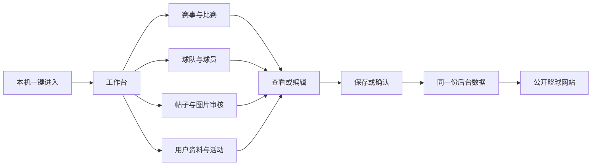

# 晓球管理中心使用与设计说明

这份说明写给目前独自管理晓球的你。管理中心用来修改真实资料、查看已有活动、处理比赛、审核帖子和图片，让公开网站读取同一份后台数据。从本机入口一键进入，不需要填写账号密码。长列表可以正常向下滚动，详细资料和处理表单集中在抽屉中。

## 打开和进入

双击项目根目录的 **打开晓球管理中心.cmd**，等待准备完成，然后在网页里点击 **进入管理中心**。固定地址是 `http://127.0.0.1:5173/`；公开晓球网站仍是 `http://127.0.0.1:3000/`。

如果服务已经运行，启动文件会复用它。正常启动不会重新生成演示数据，也不会覆盖你已经保存的信息。进入后，左边是功能导航，右上角是赛事选择，主要操作都在中间的工作区域。

本机入口会选用已经拥有组织管理权限的现有管理员身份，并创建普通管理会话。因此虽然不输入密码，后台仍知道是谁修改了资料，操作记录也能追溯。这个便捷入口只服务本机开发使用，生产构建不开放无密码入口。以后多人管理时，可以关闭单人方式，恢复账号登录及各自的权限。

## 页面按照什么逻辑安排

我把管理工作分成三个问题：**现在有什么要处理、这条资料是什么、我能怎样修改它**。工作台回答第一个问题，列表和详情回答第二个问题，编辑或审核界面回答第三个问题。

工作台只保留待办数字、赛事概览和常用入口。点击“待审核名单”会进入名单审核，点击“待确认战报”会进入比赛战报，点击“待处理反馈”会进入反馈页。这样首页不会因为宣传区、历史记录和完整表单变得很长。

右上角赛事选择主要影响比赛、名单、规程和晋级，也决定新官方资讯关联哪场赛事。账号、球队和球员档案属于组织的共用资料，不是每个赛季重新建立一份，因此这些目录不会随着赛事选择而变成另一份档案。默认先选择已发布赛事，避免一进入就用草稿或归档赛事请求公开结果。

## 每个入口做什么

| 入口       | 什么时候使用                 | 主要操作                                                   |
| ---------- | ---------------------------- | ---------------------------------------------------------- |
| 工作台     | 刚进入、想知道接下来处理什么 | 看待办，进入名单、战报或反馈                               |
| 赛事与比赛 | 创建或维护赛事、处理比赛     | 切换比赛战报、名单审核、赛程、赛季、球队与场地、规程与晋级 |
| 球队与球员 | 修正资料、更新介绍           | 按稳定编号编辑球队、球员档案，管理端查看和修正完整学号     |
| 发布帖子   | 编写官方资讯或普通帖子       | 上传图片，直接发布或保存到待审核                           |
| 帖子审核   | 核对待审核或已发布内容       | 查看正文和图片，编辑、批准、封禁、恢复                     |
| 反馈与举报 | 处理用户问题                 | 查看举报对象，回复反馈，处理被举报内容                     |
| 账号与权限 | 查找用户、纠正资料或处理异常 | 查看完整资料、活动和会话，编辑、冻结、封禁、恢复访问       |
| 图片管理   | 看清图片内容并处理违规       | 缩略图、放大预览、封禁和恢复，保留复核记录                 |
| 操作记录   | 想知道谁改过什么、为什么改   | 查询动作、对象、处理人和安全变更摘要                       |
| 系统状态   | 发现服务或后台任务异常       | 查看数据库、积压及失败任务的实际状态                       |

“待接通”的说明默认折叠，点开才看详细边界。它们用来说明尚未开放的能力，不会假装操作已经成功。

## 修改球队或球员资料

1. 进入“球队与球员”，选择球队档案或球员档案，搜索目标。
2. 点击该行的“查看详情”。右侧抽屉打开，列表仍留在原位置。
3. 点击“编辑资料”，更改名称、介绍、位置、身高等允许维护的字段。
4. 填写修改原因，点击“保存修改”。保存成功后列表重新读取后台数据。

这样设计是为了让你看完一个对象后能够回到原来的列表，不必翻过一大段详情。关闭编辑框而不保存，不会写入数据库。

账号与球员档案是不同对象：账号用于登录与角色，球员档案用于运动资料。改球队介绍或球员简介也不会覆盖已经锁定的参赛名单。进球、助攻和积分等比赛事实不能直接在球员资料里改，需要通过比赛报告更正。

## 查看、修改和处置用户

进入“账号与权限”，点击某个用户的“资料 / 活动 / 管理”。“完整资料”显示用户名、昵称、真实姓名、完整学号、邮箱、简介及关联球员；没有填过的字段显示“未填写”。点击“编辑用户资料”，填写修改原因后保存。邮箱和学号冲突会被拒绝，不会按同名覆盖别人。当前一键管理员的登录标识暂不允许在这里修改，避免下次无法进入。

“活动记录”按时间显示目前实际保存的业务审计、登录会话、帖子、评论和当前仍存在的点赞。“登录会话”单独列出最近20条会话及已记录的IP、客户端和时间。过去没有记录的浏览、点击和取消点赞历史无法补出来，页面会说明记录覆盖范围。会话被撤销也可能是管理员处理所致，不会被标成用户本人退出。

遇到异常时，点击“冻结账号”或“封禁账号”，填写原因再确认。冻结表示暂时停用，封禁表示长期禁止本组织访问；两者都会撤销本组织有效会话，禁止继续登录及账号操作。恢复访问需再次填写原因。历史帖子、比赛资料和处理记录保留，其他组织的身份不一起被改动。当前管理员自己及组织、平台管理员通过独立权限流程处理，不能在这里误封。

## 处理比赛

先在右上角选对赛事，再进入“赛事与比赛”。左边用于查找和选择比赛，右边处理当前这一场；两边的长内容各自滚动，导航和赛事选择保持在原位置。

战报详情分成“比分与判定”“比赛事件”“版本历史”。你可以先填写比分，再切换事件补进球、助攻或牌，不必让所有输入框同时铺开。切换这几个内容区不会丢掉当前输入。

一般流程是：**名单提交 → 管理员批准并锁定 → 填写战报 → 保存草稿 → 提交 → 确认报告**。保存草稿是留下一版待完善的记录；确认报告才形成正式结果。具体能执行哪一步，仍由后台根据状态和配置判断。

已经确认的比分需要调整时，填写原因并“开启更正”，再保存、提交、确认新版本。旧确认结果在新的版本确认前继续有效，历史版本保留。切换比赛、模块、赛事或关闭页面时，如果有未保存的战报，页面会提醒你。

“规程与晋级”用于核对正式结果和安排晋级。完整规程 JSON 是低频配置，默认折叠在“赛事规程配置”中；需要首次配置或开赛前调整时再展开。晋级先预览、核对来源结果，再确认写入。开始保存战报后，当前管理入口会阻止直接发布下一规程，避免已有报告与新规程混用；规程迁移还需要专门安排。

如果页面提示“缺少赛制阶段”“未配置完整规程”或“名单未锁定”，这是赛事尚未完成工作流配置。页面可以查看现存资料，但暂时不能录入或确认。未录入的比分不会伪装成 0:0。这些提示与之前接口返回“资源不存在”的故障不同。

## 发布和审核帖子

“发布帖子”是单独入口。先选当前已发布赛事，填写标题、正文、内容类型和原因，选择图片。一次最多9张，每张不超过4MiB，合计不超过16MiB；保存前能看到所选图片，也能移除。选择“管理员直接发布”会公开；选择“保存到待审核”会存为草稿，公开页面看不到。

“帖子审核”可以搜索并筛选待审核、已公开、已封禁内容。打开帖子后能看完整正文和图片，修改文字、批准草稿、封禁违规帖子或恢复发布。单纯修改待审核稿的文字不会自动将它发布。封禁后公开接口不再返回该帖子，正文和处理原因保留供复核。

目前普通用户原有发帖流程仍保留原来的发布规则，并没有变成所有帖子必须先审。管理员可以审核待审核稿，也可以巡查并下架已发布内容。

“反馈与举报”用于打开工单并“处理并回复”。保存处理状态和说明后，后台记录结果并通知提交者。已完成工单保留结果。

## 预览和封禁图片

“图片管理”集中列出本站储存图片及所属用户、球员、球队或帖子。列表显示真实缩略图，点击可放大预览。点击“封禁图片”，填写原因后确认，会移除当前引用并保留原文件和处理记录，封禁后的图片仍能由管理员查看。帖子相册中的某一张被封禁时，整组图片先从该帖子下架。

“恢复图片”恢复原图访问，只恢复仍为空的原引用；资料已经换成新图片时不覆盖它。这里只管理本站文件，其他网站的图片不能从来源站点撤回。已经下载或留在旧浏览器缓存中的文件也无法远程收回。

**当前接线状态：**本机管理站已使用新版原图拦截。现有公开网站仍在运行旧版API，因此封禁现在能移除新读取页面的引用，但旧图片直链尚不能保证阻断。页面显示这项真实状态；主目录完成本轮代码集成并重启API后，原图接口才会按封禁记录拒绝新读取。本轮隔离数据库测试已验证新接口封禁后返回404、恢复后可读取，不能把这个测试当成日常服务已经切换。

## 后续AI审核怎样接入

帖子和图片详情都有“AI辅助审核”入口。目前没有配置实际AI服务，按钮会禁用并显示“尚未配置”。人工查看、批准、封禁与恢复可以正常使用。

接入后，AI读取帖子文字和实际图片，返回“建议通过 / 需要复核 / 建议封禁”以及说明。处理仍由你确认，AI不会自行封用户或下架内容。接入接口已经准备好，协议已用本机模拟服务验证；尚未做真实模型的效果验收。

## 保存失败时怎样处理

页面不会把“按钮已经点过”当成保存成功。网络中断或服务器结果不确定时，会保留本次原内容和原请求编号，按“重试本次请求”核对结果。不要为同一件事重新开一份内容再提交。

如果提示资料版本已变化，说明有人或另一个窗口已经改过它。刷新后重新打开对象，核对新资料再编辑。规程编辑遇到新版本时会保留你写的 JSON、名称和原因，明确选择“以最新版本继续核对”后才更新编辑基线。

“资源不存在”的原故障来自管理页面与主目录 API 版本不一致。本机启动器现在会准备管理扩展，让管理入口直接使用同一数据库和原 NestJS 应用服务，其余比赛与公开接口继续使用已运行的 API；不需要靠页面填入假数据来消除报错。

## 为什么采用这些设计

管理网站是你反复使用的工具，所以我把查找、修改和审核放在主要位置，收掉大的欢迎宣传区。导航和顶部入口保持可见，数据多的页面自然滚动；用户和帖子每页25条，图片每页16张。把详情放进抽屉，是为了处理完一个对象后回到原列表。只有战报这种需要同时对照比赛与表单的工作区使用独立滚动。

发布、审核和图片管理分别有入口，是因为它们是三种不同工作：写内容、判断是否公开、检查具体文件。完整个人信息在你有组织管理权限的后台直接显示并允许修改，公开网站仍沿用原来的隐私规则。用户活动和全站操作记录分开，前者用于了解这个账号已保存的行为，后者用于追溯管理操作。

本机一键进入减少当前单人管理的步骤，同时保留真实管理员身份、修改原因和版本检查。这些规则在你一个人使用时也有价值：多个窗口、重复提交或者事后想找回修改原因，都可能发生。以后扩充团队，已有的身份和审核规则也能继续使用。

当前尚未开放正式密码恢复、角色授权编辑、身份认领、批量导入预览、私有证据、通用文件资产上传/永久删除和备份恢复。本站帖子图片上传、预览、封禁与恢复属于本轮已实现范围；公开原图拦截的日常接线和真实AI审核仍需完成。系统状态没有监测依据的项目显示“未确认”。初次保存报告与发布新规程之间的跨用户并发保护仍由赛事工作流负责人协调，不能把本机单人操作检查当成多人生产验收。
