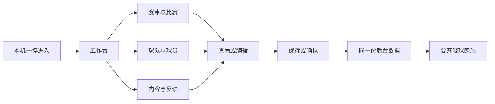

# 晓球管理中心使用与设计说明

这份说明写给目前独自管理晓球的你。管理中心的用途是维护资料、处理比赛和内容，让公开网站读取同一份后台数据。现在从本机入口一键进入，不需要填写账号密码；页面按具体工作划分，资料列表和详细编辑分开显示。

## 打开和进入

双击项目根目录的 **打开晓球管理中心.cmd**，等待准备完成，然后在网页里点击 **进入管理中心**。固定地址是 `http://127.0.0.1:5173/`；公开晓球网站仍是 `http://127.0.0.1:3000/`。

如果服务已经运行，启动文件会复用它。正常启动不会重新生成演示数据，也不会覆盖你已经保存的信息。进入后，左边是功能导航，右上角是赛事选择，主要操作都在中间的工作区域。

本机入口会选用已经拥有组织管理权限的现有管理员身份，并创建普通管理会话。因此虽然不输入密码，后台仍知道是谁修改了资料，操作记录也能追溯。这个便捷入口只服务本机开发使用，生产构建不开放无密码入口。以后多人管理时，可以关闭单人方式，恢复账号登录及各自的权限。

## 页面按照什么逻辑安排

我把管理工作分成三个问题：**现在有什么要处理、这条资料是什么、我能怎样修改它**。工作台回答第一个问题，列表和详情回答第二个问题，编辑或审核界面回答第三个问题。

工作台只保留待办数字、赛事概览和常用入口。点击“待审核名单”会进入名单审核，点击“待确认战报”会进入比赛战报，点击“待处理反馈”会进入反馈页。这样首页不会因为宣传区、历史记录和完整表单变得很长。

右上角赛事选择主要影响比赛、名单、规程和晋级，也决定新官方资讯关联哪场赛事。账号、球队和球员档案属于组织的共用资料，不是每个赛季重新建立一份，因此这些目录不会随着赛事选择而变成另一份档案。默认先选择已发布赛事，避免一进入就用草稿或归档赛事请求公开结果。

## 每个入口做什么

| 入口       | 什么时候使用                 | 主要操作                                                   |
| ---------- | ---------------------------- | ---------------------------------------------------------- |
| 工作台     | 刚进入、想知道接下来处理什么 | 看待办，进入名单、战报或反馈                               |
| 赛事与比赛 | 创建或维护赛事、处理比赛     | 切换比赛战报、名单审核、赛程、赛季、球队与场地、规程与晋级 |
| 球队与球员 | 修正资料、更新介绍           | 搜索档案，查看详情，编辑公开信息                           |
| 内容与反馈 | 发布官方消息、处理用户问题   | 发布或编辑资讯、隐藏内容、回复反馈                         |
| 账号与权限 | 查找账号、处理访问问题       | 查看脱敏资料，停用或恢复组织访问，撤销登录会话             |
| 媒体资料   | 核对目前使用的图片           | 查看用途、所属对象和引用状态                               |
| 操作记录   | 想知道谁改过什么、为什么改   | 查询动作、对象、处理人和安全变更摘要                       |
| 系统状态   | 发现服务或后台任务异常       | 查看数据库、积压及失败任务的实际状态                       |

“待接通”的说明默认折叠，点开才看详细边界。它们用来说明尚未开放的能力，不会假装操作已经成功。

## 修改球队或球员资料

1. 进入“球队与球员”，选择球队档案或球员档案，搜索目标。
2. 点击该行的“查看详情”。右侧抽屉打开，列表仍留在原位置。
3. 点击“编辑资料”，更改名称、介绍、位置、身高等允许维护的字段。
4. 填写修改原因，点击“保存修改”。保存成功后列表重新读取后台数据。

这样设计是为了让你看完一个对象后能够回到原来的列表，不必翻过一大段详情。关闭编辑框而不保存，不会写入数据库。

账号与球员档案是不同对象：账号用于登录与角色，球员档案用于运动资料。改球队介绍或球员简介也不会覆盖已经锁定的参赛名单。进球、助攻和积分等比赛事实不能直接在球员资料里改，需要通过比赛报告更正。

## 处理比赛

先在右上角选对赛事，再进入“赛事与比赛”。左边用于查找和选择比赛，右边处理当前这一场；两边的长内容各自滚动，导航和赛事选择保持在原位置。

战报详情分成“比分与判定”“比赛事件”“版本历史”。你可以先填写比分，再切换事件补进球、助攻或牌，不必让所有输入框同时铺开。切换这几个内容区不会丢掉当前输入。

一般流程是：**名单提交 → 管理员批准并锁定 → 填写战报 → 保存草稿 → 提交 → 确认报告**。保存草稿是留下一版待完善的记录；确认报告才形成正式结果。具体能执行哪一步，仍由后台根据状态和配置判断。

已经确认的比分需要调整时，填写原因并“开启更正”，再保存、提交、确认新版本。旧确认结果在新的版本确认前继续有效，历史版本保留。切换比赛、模块、赛事或关闭页面时，如果有未保存的战报，页面会提醒你。

“规程与晋级”用于核对正式结果和安排晋级。完整规程 JSON 是低频配置，默认折叠在“赛事规程配置”中；需要首次配置或开赛前调整时再展开。晋级先预览、核对来源结果，再确认写入。开始保存战报后，当前管理入口会阻止直接发布下一规程，避免已有报告与新规程混用；规程迁移还需要专门安排。

如果页面提示“缺少赛制阶段”“未配置完整规程”或“名单未锁定”，这是赛事尚未完成工作流配置。页面可以查看现存资料，但暂时不能录入或确认。未录入的比分不会伪装成 0:0。这些提示与之前接口返回“资源不存在”的故障不同。

## 发布消息和回复反馈

在“内容与反馈”选择“官方资讯与动态”，点击“发布官方资讯”，填写标题、正文和原因。新资讯关联右上角当前已发布的赛事。想下架时用隐藏操作，保留原记录和处理原因。

选择“反馈与举报”后，打开对应工单，在详情中“处理并回复”。填写处理状态和说明后保存；后台记录结果并通知提交者。已经完成的工单保留结果，不通过重复点击重新打开。

## 保存失败时怎样处理

页面不会把“按钮已经点过”当成保存成功。网络中断或服务器结果不确定时，会保留本次原内容和原请求编号，按“重试本次请求”核对结果。不要为同一件事重新开一份内容再提交。

如果提示资料版本已变化，说明有人或另一个窗口已经改过它。刷新后重新打开对象，核对新资料再编辑。规程编辑遇到新版本时会保留你写的 JSON、名称和原因，明确选择“以最新版本继续核对”后才更新编辑基线。

“资源不存在”的原故障来自管理页面与主目录 API 版本不一致。本机启动器现在会准备管理扩展，让管理入口直接使用同一数据库和原 NestJS 应用服务，其余比赛与公开接口继续使用已运行的 API；不需要靠页面填入假数据来消除报错。

## 为什么采用这些设计

管理网站是你反复使用的工具，所以我把查找、修改和审核放在主要位置，收掉大的欢迎宣传区。桌面保持固定工作区，是为了减少找入口和反复滚动的时间；每页默认10条记录，详细资料放进右侧抽屉，是为了把“找对象”和“处理对象”分开。

本机一键进入减少当前单人管理的步骤，同时保留真实管理员身份、修改原因和版本检查。这些规则在你一个人使用时也有价值：多个窗口、重复提交或者事后想找回修改原因，都可能发生。以后扩充团队，已有的身份和审核规则也能继续使用。

当前尚未开放正式密码恢复、角色授权编辑、身份认领、批量导入预览、私有证据、完整媒体上传/删除/恢复和备份恢复。系统状态对没有监测依据的项目会显示“未确认”，不会把它们当成已经完成。初次保存报告与发布新规程之间的跨用户并发保护仍由赛事工作流负责人协调，不能把本机单人操作检查当成多人生产验收。
