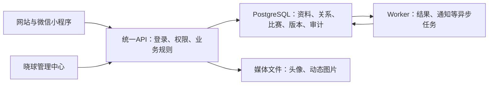

# 晓球管理中心：数据、运营与审计规划

2026-10-03。实现盘点基于 `main / 5096ae5`，本轮只编写规划与协作说明，没有新增后台页面、API、数据库模型或账号操作。本文接续[整体汇总](../status/整体汇总与下一阶段-2026-10-02.md)，更新[9月26日后台构想](信息管理与后台规划-2026-09-26.md)中已过时的实现状态；架构和公共契约仍按现有基线执行。

## 1. 名称与定位

建议名称为 **晓球管理中心**，导航分为赛事管理、人员与球队、内容运营、操作记录、系统状态。比“数据网站”更能表达它既能查看资料，也负责审核、处理反馈和维护比赛。

沿用现有 `apps/admin-web` 扩展，同一NestJS API和PostgreSQL作为数据来源。公开H5的“数据”入口继续面向球迷展示榜单；管理中心面向授权工作人员。管理页面通过应用服务修改数据，不能直接把数据库表做成任意编辑器。

## 2. 现在后端怎样工作

例如发布一条带图片的动态：客户端提交文字与图片 → API确认身份和组织、校验内容及图片 → 图片规范化后存入媒体目录 → 数据库写入动态、作者和图片地址 → 公开读取返回动态及图片地址 → 浏览器再按地址读取图片。点赞保存“哪个用户点赞哪条动态”，评论保存作者、正文和回复关系，数量由这些记录计算。

比赛流程另外保存名单快照、报告版本、规则版本和审核动作。管理员确认后更新正式结果，并通过Outbox安排后续消费；数据库事务、重复提交保护和版本检查共同避免半次保存、重复写入或旧版本覆盖。

## 3. 各种数据实际存在哪里

| 内容                                       | 当前保存位置/模型                                                                     | 管理中心应怎样展示                                                                     |
| ------------------------------------------ | ------------------------------------------------------------------------------------- | -------------------------------------------------------------------------------------- |
| 用户、实名、邮箱、角色、组织成员、登录会话 | PostgreSQL中的 `User`、`RoleAssignment`、`OrganizationMembership`、`UserSession`      | 用户目录与详情；账号状态、组织/球队权限、关联球员、会话处理；敏感字段按权限展开        |
| 密码                                       | `PasswordCredential`：scrypt哈希、独立盐、算法                                        | 只显示凭据状态及重置操作，不返回或展示哈希、盐、旧密码                                 |
| 球队与球员档案                             | `Team`、`PlayerProfile`、赛季报名和成员关系                                           | 区分长期档案、当前队伍、某赛季参赛关系、历史名单；稳定ID用于关联，姓名不能作为唯一身份 |
| 报名与阵容                                 | `RosterSubmission`、`RosterEntry`、不可变 `RosterSnapshot`；`TeamLineupPlan/Revision` | 提交、审核、锁定与补报；排阵草稿及历史；区分排阵和正式出场                             |
| 比赛事实及正式统计                         | `Match`、`MatchEvent`、`MatchAppearance`、报告版本、结果投影与晋级                    | 赛程、事件时间线、版本差异、确认结果；从事实重算，不能手改页面上的统计数字             |
| 动态、点赞、评论、比赛评分                 | `Post`、`PostLike`、`PostComment`、`MatchReview`                                      | 内容与作者、互动数量、状态和举报；限制分页读取，不把全部记录一次加载                   |
| 反馈/投诉、通知、私信                      | `ContentReport`、`UserNotification`、`DirectConversation/Message`                     | 反馈处理与通知结果；私信默认不提供管理员任意浏览，确需核验时按案件授权并留访问记录     |
| 操作记录与异步任务                         | `AuditLog`、`IdempotencyRecord`、`OutboxJob`                                          | 按人、对象、比赛、时间、操作和结果查询；任务积压与失败可单独查看                       |
| 用户/球员头像                              | 默认 `private-data/media/avatars/`；用户/球员表保存URL                                | 当前头像、用途及关联对象；两个头像字段独立更新，不默认同步                             |
| 动态图片与动画                             | 默认 `private-data/media/posts/`，按组织/作者分目录；可用 `POST_MEDIA_DIRECTORY` 调整 | 文件大小、尺寸、归属、引用和状态；GIF会规范化为保留动画的WebP                          |
| 演示媒体与设计素材                         | `apps/api/demo-media/`、前端 `src/assets/`、根目录 `参考图片/`                        | 区分程序自带示意素材、设计参考和用户上传文件，不把参考图当用户业务档案                 |
| 报名原件、备份、运行日志                   | 被Git忽略的 `private-data/` 等本机目录                                                | 原件与备份受限访问；不随源码上传GitHub                                                 |
| 单场关注、收藏、日历提醒                   | 当前部分功能在浏览器localStorage，按组织与账号隔离                                    | 标明“仅本机”；管理中心现在无法从服务器查询这些条目，跨设备同步需要后续接口             |

PostgreSQL本机通过Docker运行，数据持久化在Compose的 `postgres_data` 命名卷中，不是放在Git源码目录。图片是另一份文件数据，数据库里的URL不是图片本身。关闭网页或重启应用通常不会清空这些持久数据，但删除数据库卷或丢失媒体目录会导致数据损失。

当前多图动态仍使用封面URL配合内容哈希文件名推导相册成员，并没有统一的媒体资产表。最多9张的限制、真实格式解码及大小控制已经存在；完整上传清单、素材版本、归属、配额与引用统计仍需补齐。头像替换后未被引用的旧文件可能被清理，不能宣称现在能恢复所有旧照片。

## 4. 当前已有能力与需要新做的部分

| 部分       | 已有基础                                                          | 本次规划的新工作                                                                                  |
| ---------- | ----------------------------------------------------------------- | ------------------------------------------------------------------------------------------------- |
| 管理站     | 真实登录/会话、组织与赛事上下文，赛程工作台、球队与名单核对页     | 统一导航、首页待办、用户/球员/球队详情、完整流程接线                                              |
| 用户维护   | 注册/本人资料、组织管理员实名目录及读取审计                       | 分页用户管理、停用/解禁、角色调整、单个账号安全重置与会话撤销；这些不能用现有本机批量改密脚本代替 |
| 名单与比赛 | V2后端已实现名单提交/审核/锁定、报告保存/提交/确认/更正及版本     | 在管理中心集中展示与操作；不能把旧名单核对页面当作完整审核界面                                    |
| 反馈治理   | 用户提交反馈/投诉、管理员列表/处理/回复，帖子和评论隐藏及审计     | 管理站工单入口、案件证据快照、分类、分派、申诉和处理历史                                          |
| 媒体       | 用户/球员头像与动态图片读写、规范化；公开动态图片读取校验发布状态 | 统一媒体库、私有证件材料、可审查的保留/删除策略、生产存储与备份                                   |
| 审计       | 比赛报告、名单、部分身份/头像/治理操作已有记录                    | 管理站查询、完整前后差异、失败操作记录及统一覆盖清单；并非每次点击都有记录                        |
| 找回密码   | 前端邮箱/微信/人工核验弹窗                                        | 邮件与令牌、微信绑定、人工申请/附件/审核后端仍待接通                                              |

旧“姓名+学号重置”仅是受限演示接口；本机统一123脚本也只是本机工具。正式管理中心不复用它们作为身份核验机制。管理站既有mock模式不能作为真实用户资料或审核成功证据。

## 5. 管理中心的页面安排

每个对象使用“列表 → 详情 → 关联资料 → 操作历史”的一致结构。首页首先显示待处理事项，而不是直接堆全部数据库表。

| 模块       | 首轮页面和操作                                                             | 应避免的误解                                                  |
| ---------- | -------------------------------------------------------------------------- | ------------------------------------------------------------- |
| 工作台     | 待审核名单、待确认战报、待处理反馈、账号核验申请、失败任务；统一搜索       | 首页数字是当前权限范围内的数据，不是全平台任意数据            |
| 账号与权限 | 用户检索、本人资料/球员关联、组织和球队角色、停用/解禁、密码重置、退出会话 | 用户账号与球员档案是两个对象；修改偏好主队不改变队长权限      |
| 球队与球员 | 基础档案、队徽/头像、成员与参赛关系、认领冲突、导入预览、变更历史          | 当前成员表不能覆盖锁定名单；同名档案不自动合并                |
| 赛事与比赛 | 赛季/赛事/阶段/规程/赛程、名单审核、信息员分配、战报审核、更正影响预览     | 草稿或未确认报告不直接成为正式榜单                            |
| 内容与反馈 | 官方资讯、动态、评论、举报、反馈回复、处理通知与申诉                       | 隐藏内容与物理删除不同；处理记录必须能追溯                    |
| 媒体资料   | 当前引用、用途、格式/大小、所属对象、受限材料、替换与删除候选              | 有文件URL不等于文件能永久访问；公开素材与证件不能混用访问入口 |
| 操作记录   | 操作者/对象/时间/原因/前后变化/结果，关联报告版本或工单                    | 请求日志与业务审计不同；“有日志表”不等于覆盖所有操作          |
| 系统状态   | API/Worker健康、积压/失败、文件容量、备份结果、部署版本与数据质量问题      | 系统管理权限不能默认授予普通内容审核员                        |

角色至少区分组织管理员、赛事管理员、队长/信息员、内容处理人员和运维人员；新增角色名称与范围须由集成负责人确认公共契约。前端隐藏按钮不构成权限校验。导出、查看证件、查看完整身份字段及改权限均须服务端授权并留审计。

## 6. 管理员处理忘记密码

先搜索并定位唯一账号 → 查看核验申请和必要材料 → 记录核验依据/原因 → 发一次性、有期限的重置入口；没有可验证邮箱时使用人工核验后的受控交付 → 用户设置新密码 → 撤销旧会话 → 记录处理人、时间和结果，通知用户。

紧急发放临时密码可作为另一个受控方案：必须随机、限时、首次使用强制修改，不能在用户列表长期显示，也不能写入审计正文或普通日志。不通过站内私信向一个已经无法登录的人交付唯一恢复手段。

管理员只看到“已发起重置/已完成/已过期”等状态，不能看到旧密码。密码验证是将输入密码与已保存哈希核对，数据库不存在可供展示的明文密码；本机123只是此前为检查明确设置的例外，不是正式运营策略。

## 7. 怎样追溯信息员和管理员的修改

现有 `MatchReportRevision` 保存比赛ID、版本、动作/状态、完整报告字段、操作人ID、时间、原因、规则版本与双方名单快照；`AuditLog`另外记录操作者与角色、动作、对象、请求关联ID，以及版本变化。已经具备查“谁保存/提交/确认/更正了哪个版本”的基础。

管理中心应把它们呈现为时间线，并支持两版对比。例如“信息员A保存v1，2:1 → 提交v2 → 管理员B退回v3并说明原因 → A修订 → B确认 → 后续更正”。这里只是流程示意，不是本轮真实比赛记录。

保存/提交才创建版本，不记录输入框每个字。对比应能定位比分、进球/助攻、牌、名单和结果判定的变化。更正须创建新版本并显示对积分/晋级的影响，不能把历史确认版直接覆盖或删除。追溯使用稳定账号ID和当时角色，不能只记录可能被改名的昵称。

违规处理另建案件链：举报/人工发现 → 冻结当时的内容与必要附件、关联报告版本 → 调查说明 → 限权/退回/隐藏等处理 → 处理结果与申诉。现有 `ContentReport`主要保存目标引用、说明与处理结果，不具备完整不可变证据档案；只保留目标ID不足以防止事后内容或文件消失。

普通运营管理员不能删除或修改审计。当前审计表有必要字段，但数据库管理员仍可能改表，它不是已经实现的防篡改证据系统；后续需限制数据库权限、定期备份，关键证据可导出带哈希的封存包。密码、登录令牌、完整证件图片和私信正文不写入通用日志。

## 8. 哪些记录保留、保留多久

以下为待确认的产品默认建议，不代表目前已实现自动清理，也不等于法定期限。需要按赛事运营与实际身份材料用途确认后落成配置。

| 记录                                       | 建议保留策略                                                           | 理由                                                         |
| ------------------------------------------ | ---------------------------------------------------------------------- | ------------------------------------------------------------ |
| 比赛报告/规则/名单版本与更正记录           | 至少覆盖完整赛季、申诉期及之后2年；归档后尽量保留公开事实              | 支持争议处理、统计重算和跨赛季历史                           |
| 改权限、改密、停用、审核与敏感资料访问审计 | 建议2年，按组织限制查询；期满归档或最小化                              | 能追溯工作人员行为，避免无限堆积敏感明细                     |
| HTTP访问与排错日志                         | 普通成功请求不记录正文，详细日志建议30天；安全事件按案件延期           | 控制体积及个人信息暴露，重要业务另靠审计                     |
| 证件及找回身份材料                         | 案件完成后建议30天删除原图；未结案/申诉有明确延期                      | 核验结束后保留审核结论，减少长期持有证件                     |
| 举报证据                                   | 保留到案件/申诉结案，再按确认的案件策略归档                            | 不能因原内容下架失去依据，也不永久保存所有附件               |
| 失效会话、幂等记录、已完成Outbox           | 保留到相应过期/重试窗口后清理；失败任务需先处置                        | 它们是运行控制记录，不是永久行为档案                         |
| 未引用媒体                                 | 暂存上传失败残留可在24小时后清理；普通替换留7～30天恢复窗口            | 删除前复核全部引用和证据保留标记；现有清理需调整才能满足窗口 |
| 备份                                       | 建议每天备份、保留30天滚动副本，另留月度恢复点；关键比赛前后增加检查点 | 备份必须包含数据库和媒体，且验证能恢复                       |

点赞和取消点赞当前主要表达现有关系，不是完整的历史行为链。无需为所有点击、鼠标移动建立永久日志；保存关键写入、安全事件和敏感访问即可。统计只采集必要的聚合值，具体查询与导出范围均受权限控制。

## 9. 存储、交付与恢复

| 交付内容                       | 交付方式                                                      | 当前边界                                                                 |
| ------------------------------ | ------------------------------------------------------------- | ------------------------------------------------------------------------ |
| 程序代码、配置模板、迁移、文档 | Git/GitHub与部署产物                                          | Push不包含真实数据库、上传文件、个人资料或凭据                           |
| 数据库业务数据                 | 受限数据库备份；迁移定义结构，导入流程产生真实资料            | 真实数据不靠演示Seed恢复；测试库与日常库分开                             |
| 用户上传媒体                   | 本地持久目录起步；正式环境使用持久卷或对象存储适配器          | 现有Compose尚未挂载API媒体持久卷，不能据有Docker配置就认为媒体随重建保留 |
| 身份材料/证据                  | 单独私有存储、短时授权访问、用途及到期管理                    | 目前尚未接通证件上传与私有媒体服务，不能使用公开头像接口存证件           |
| 运营交付                       | 管理中心权限账号、数据字典、导入结果、备份/恢复说明、操作手册 | 管理员在受控页面维护数据，凭据用单独安全通道交付                         |

同一发布需要对应代码提交、数据库迁移版本、数据与媒体备份时间。数据库恢复到昨天、媒体只剩今天的新文件会造成断图或状态错配；恢复演练要一起检查。公开内容下架还要考虑浏览器/CDN缓存：当前头像URL有长缓存，动态图短缓存，不能保证已发出的公开文件能立即从所有客户端消失。

媒体容量按“人数×头像大小 + 动态数×平均图片数×平均大小 + 证据 + 备份”估算，用真实试运行增长量修正，不预先宣称容量或并发已经够用。需要监测存储占用、失效引用、无主文件、上传失败、备份失败和任务积压。

## 10. 容易漏掉但需要安排的内容

- 认领与重复身份：姓名相同、学号冲突、用户与球员错绑、跨队/跨赛季转队，应有人工核验和可追溯解除流程。
- 内容治理：反馈分类、举报分派、处理通知、申诉、官方账号身份，审核动作和公开内容分开保存。
- 敏感访问：管理员查看完整学号/证件、导出名单也要留记录；列表默认脱敏，不向普通赛事工作人员展示不必要字段。
- 并发与规模：分页/筛选、稳定排序、批量操作影响预览、版本冲突提示、重试和幂等，不能让两个管理员静默覆盖。
- 媒体生命周期：相同文件的多处引用、文件验证、配额、替换恢复、证据保留和缓存失效；不能看到“未公开”就直接删除文件。
- 账号退出与停用：撤销全部会话、角色变更及时生效；不只隐藏按钮或修改昵称。
- 数据导入导出：原件受限、试运行预览、错误行、稳定来源键和重复提交保护；禁止仅按姓名覆盖档案。
- 运行人员交接：最后成功备份、待处理案件、未配置规则的赛事、失败任务和恢复入口都应可见。

## 11. 下一轮按什么顺序做

| 阶段               | 建议任务                                                                                     | 可验收结果                                                          |
| ------------------ | -------------------------------------------------------------------------------------------- | ------------------------------------------------------------------- |
| 第一轮：运行前核心 | 管理中心公共导航/待办；用户目录/单个账号恢复与会话处理；名单和战报审核历史；现有反馈处理接线 | 管理员能定位账号、处理申请，能核对谁修改了比赛，能实际收到/处理反馈 |
| 同期基础           | 组织/赛事/角色范围；媒体持久化与备份恢复；关键动作审计覆盖清单                               | 越权被拒绝且有合适记录，重启不丢图，一次数据和媒体恢复演练成功      |
| 第二轮             | 球队/球员资料维护与认领、媒体库、导入预览、申诉证据                                          | 资料更正有版本与来源，案件在原内容变化后仍可追溯                    |
| 后续               | 跨设备收藏/提醒、邮箱/微信完整认证、运营统计及高级报表                                       | 每项以实际接通的服务验收，不把前端占位当上线能力                    |

可以并行分配“管理站基础与对象列表”“账号恢复/权限/会话”“比赛审核历史与案件”“媒体持久化与备份”四个任务。公共模型、API契约与锁文件由集成负责人统一负责，先确认需要的契约再授予独占范围；同一管理站公共壳层只安排一位写入负责人。首场真实比赛仍优先名单→报告→审核完整链，完整高级媒体库不是必须一次做完。

每个任务交付：源提交哈希、修改范围、实际API和浏览器检查、越权/重试/版本冲突结果、未完成项。最后由集成负责人合入main、验证共同场景；Push和部署按当轮明确授权执行。

## 12. 这次工作树与旧聊天怎样安排

已实查：`D:/AI/.codex/worktress/24db/xiaoqiu`起点为 `5096ae5`，与本次盘点时main一致、没有未提交修改，当前为detached HEAD。它是真正的Git工作树，放在外面不影响合并。尚未有分支名是Codex默认行为，不是创建失败。[OpenAI Docs：工作树](https://learn.chatgpt.com/docs/environments/git-worktrees)

本轮稍后复核，该工作树已创建任务分支 `codex/h5-team-nav-a`，三个导航文件的未提交修改留在独立目录，没有混入主目录main。这是预期的隔离工作方式。

在新聊天中让负责Agent先核对路径与HEAD，再通过“Create branch here”或 `git switch -c codex/任务名`建立任务分支；不要在那个工作树检出main。`No local environment selected`只说明没有选启动环境设置，依赖、环境变量、数据库与测试条件仍需准备。对外的日常网站继续固定127.0.0.1:3000。

主目录由本聊天维护main并负责集成。新工作树的文件不会实时复制进main，但我可以读取对应目录的差异与提交；先提交范围明确的成果，再审查/合并及回归，不必为同机合并先Push。共享数据库和媒体并不随Git分支隔离，测试任务必须避免重置或污染日常库。

旧Local聊天如果仍指向 `D:/MuDevSpace/xiaoqiu`，下次修改会作用于该目录当时检出的分支；现在就是main。这不是聊天永久绑定了以前的分支，也不是旧分支自动变成main。下一轮尽量新建独立工作树/分支，旧聊天留作记录或归档。

已结束、成果已提交并集成、私有资料已另行保存的聊天可以归档。归档不撤销main中的提交；**Codex管理的临时工作树可能随聊天归档被自动清理并保存恢复快照**，永久工作树的行为不同。因此不能把归档理解成目录一定原样保留；未提交修改、被忽略材料和仍需继续的任务先核对。[OpenAI Docs：工作树清理](https://learn.chatgpt.com/docs/environments/git-worktrees#worktree-cleanup)

当前旧P4集成目录和登录隔离构建目录曾保留历史/临时修改，不在本轮删除或归档授权范围。本轮没有创建/归档聊天、删除分支或替新聊天命名分支，只核对状态并写出安排。

## 13. 实现盘点依据

- [当前数据模型](../../prisma/schema.prisma)：实体、关系、版本、审计和任务字段。
- [媒体服务](../../apps/api/src/media/media.service.ts)：本机媒体路径、相册与文件引用/清理；[读取入口](../../apps/api/src/media/media.controller.ts)：公开访问与缓存行为。
- [密码算法](../../apps/api/src/auth/password.ts)、[组织实名目录](../../apps/api/src/auth/admin-identity.controller.ts)：当前密码与受限访问边界。
- [比赛报告服务](../../apps/api/src/match-report/match-report.service.ts)：保存版本、确认/更正与审计。
- [投诉/通知服务](../../apps/api/src/social/social.service.ts)：现有反馈与治理行为。
- [管理站登录](../../apps/admin-web/src/features/adminAuth/AdminAccess.tsx)、[工作台](../../apps/admin-web/src/features/adminSchedule/AdminScheduleWorkspace.tsx)：当前后台已接入模块。
- [本地Compose](../../infra/compose.yaml)：数据库命名卷与尚未补齐的媒体持久化。
