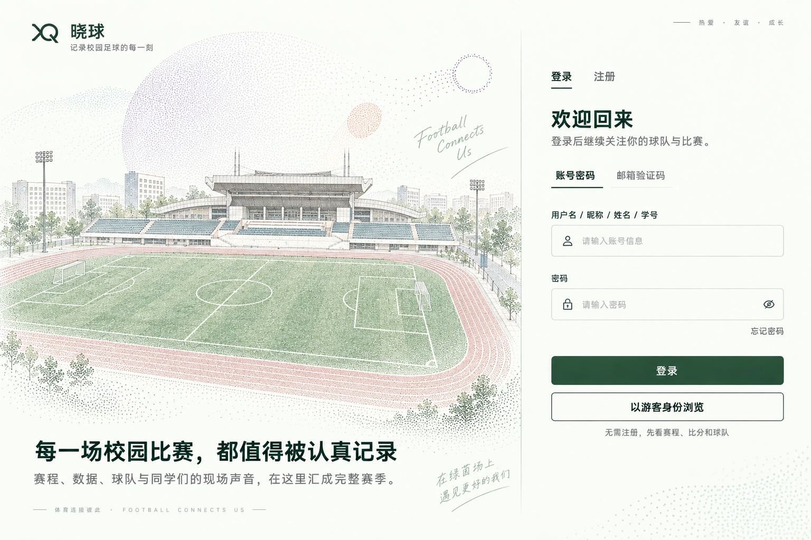

# 晓球登录入口定稿实施方案：点墨体育场与双区域光标

> 2026-10-01 · 开发准备方案。
>
> 视觉基准是用户本轮确认的「点墨校园足球登录页」。本轮只核查原图、保存参考副本并制定分阶段实施方案；应用源码、运行时图标和粒子引擎尚未修改或制作。
>
> 这份方案接续[早期方向研究](登录入口-粒子球场设计方案-2026-10-01.md)。早期 A/B 概念图保留作背景材料，后续页面构图按用户定稿实施。

## 1. 本次已经确定的设计



- 左侧使用定稿中的体育场、跑道、草地、树木和上方彩色点云，保留这张图的观看角度、层次与点墨线稿质感。
- 右侧保留同一浅纸色背景、细分界线、真实输入框和上下排列的登录/游客按钮。
- 深绿用于品牌、正文、表单与默认箭头；珊瑚色折角与跑道呼应。淡紫/蓝绿色是艺术层的小面积色彩。
- 左侧鼠标只显示简化足球：细外圈、中心小五边形和少量接缝。没有永久圆环、尾迹、文字、普通箭头或另一枚装饰球。
- 右侧默认鼠标采用用户提供的深绿折角箭头；输入框和可点击控件使用对应语义的 I 形/手形。
- 左侧艺术主体在鼠标附近产生明显避让和回弹，包括草地、看台和上方点云；文案、品牌、表单保持清晰。
- 跨过分界线时，足球与箭头有短暂过渡；快速来回跨线也应跟随当前方向，不排队播放旧动画。

这张图是整页设计参考。落地时会把体育场艺术层、品牌文案和表单分开，后者由真实 DOM 组成；不能把整张效果图当成含假输入框的页面背景。

## 2. 已完成的图片核查

所有原件均原样复制到[定稿与光标参考目录](../../参考图片/04-登录页定稿与光标-2026-10-01/README.md)，并比对 SHA-256，副本与用户文件一致。只读解析了 PNG 像素和 alpha，没有编辑原图。

| 原件 | 实际尺寸 | 透明度核查 | 当前用途 |
| --- | --- | --- | --- |
| 点墨校园足球登录页 | 1536 × 1024 | RGB，无透明通道 | 已选定的页面构图与艺术风格 |
| 鼠标样式方案 C | 1448 × 1086 | RGB，无透明通道 | 手形等样式候选，需拆出单个图标 |
| 长条光标示例 | 1237 × 146 | 有 alpha 通道，但全部像素 alpha=255 | I 形等样式候选，实际背景不透明 |
| 深绿描边折角箭头 | 1254 × 1254 | RGBA，约 92.771% 像素完全透明 | 可复用的默认光标源图 |

默认箭头还有两个应用前要处理的细节：
1. 大量透明留边使主体在整图中占比偏小；以 alpha≥16 观察时，主体约在 `x=407, y=278, width=481, height=716` 的范围内。
2. 背景中有极低 alpha 的残留点。alpha≥1 的边界会扩展到 982×1161，因此简单按“任意非零像素”裁切仍会留下过大空白。应按主图形整理外围，保留正常抗锯齿边缘。

结论：**这张箭头适合作为源素材，应用前需要整理尺寸、透明留边和点击热点。** C 与长条图需要单独提取符号或整理为矢量轮廓。核查记录见[asset-inspection.json](../../参考图片/04-登录页定稿与光标-2026-10-01/asset-inspection.json)。

图形评价：深绿轮廓与页面协调，珊瑚色折角形成识别点。小尺寸下要检查绿色边线和橙色折角是否清楚；图上大尺寸的柔和阴影和细节未必适合原样缩成鼠标。

## 3. 第一轮选择哪些光标

| 使用位置/状态 | 初选样式 | 运行尺寸起点 | 热点原则 |
| --- | --- | --- | --- |
| 左侧艺术区 | 简笔足球，原创少量线段 | 28×28 | 足球中心 |
| 右侧普通区域 | 已提供的深绿折角箭头 | 32×32，另做 48px 预览对照 | 箭头尖端 |
| 账号、密码、注册输入 | 长条图最左侧的细 I 形，整理成统一深绿线条 | 32×32 画布，符号约 22–26px 高 | I 形中心 |
| 登录、游客、页签、链接、密码可见切换 | C 的深绿线框手形 | 32×32 | 食指尖端 |
| 禁用控件 | 第一版使用浏览器 `not-allowed` | 浏览器负责 | 浏览器负责 |
| 提交中 | 保留真实按钮加载/禁用状态 | 沿用对应可用或禁用指针 | 不用整页忙碌光标阻碍其它操作 |

C 手形的掌心小球在 32px 下可能过密，素材准备时检查并简化内部细节，优先保证手指轮廓可辨。长条图里的调整大小、拖动、帮助等图标可保留作未来设计参考；登录页当前没有对应操作，不为展示这些图标新增交互。

第一轮交付四个运行资源：足球、默认箭头、I 形、手形。默认箭头沿用原轮廓和配色。其它资源统一实际线宽、透明背景、画布边距与热点。

热点表示浏览器认为“正在点哪里”的那个像素，不等于图标中心。每个最终导出文件应登记 `width/height/hotspotX/hotspotY`。原图的几何候选点只供裁切参考，最终热点通过小尺寸命中测试确定。

## 4. 浏览器怎样更换指针

### 4.1 常态采用 CSS 原生图片光标

网页可以在指定元素上设置 `cursor: url(...) x y, fallback`：
- `url` 指向图标资源；
- 两个数字是图标内部热点的坐标；
- 最后的 `default/text/pointer` 是资源不可用时的浏览器回退；
- 样式只控制网页内容，不改变 Windows 设置或浏览器工具栏。

Chromium 与 Firefox 常见的图片光标上限为 128×128，MDN 建议采用 32×32。1254×1254 原图直接传入通常会被忽略；把普通 `img` 的 CSS 宽度设成 32px，也不会改变 `cursor: url()` 文件的固有尺寸。[MDN：cursor](https://developer.mozilla.org/en-US/docs/Web/CSS/Reference/Properties/cursor)

以下是将来资源准备完成后的示意，路径与热点需按实际导出值填写：

```css
/* 示例：放在 H5 专用光标样式文件，资源交给构建工具处理 */
@media (hover: hover) and (pointer: fine) {
  .auth-page .auth-panel {
    cursor: url("../../assets/login-art/cursors/default-32.png") 3 3, default;
  }

  .auth-page .auth-scene {
    cursor: url("../../assets/login-art/cursors/football-28.png") 14 14, default;
  }

  .auth-page .auth-input .weui-input {
    cursor: url("../../assets/login-art/cursors/text-32.png") 16 16, text;
  }

  .auth-page .auth-tab,
  .auth-page .auth-link,
  .auth-page .auth-primary:not([disabled]),
  .auth-page .guest-entry__button {
    cursor: url("../../assets/login-art/cursors/hand-32.png") 12 3, pointer;
  }

  .auth-page [disabled] {
    cursor: not-allowed;
  }
}
```

数字 `3 3`、`12 3` 等是说明语法的暂定示例，不是本轮已测定的最终热点。密码眼睛如果按定稿展示，也要接入真实的可见/隐藏切换，并使用可点击指针。

Taro H5 的 Input 外层是组件包装，内部实际输入元素使用 `.weui-input`。光标样式要落到这个内部元素；不能只根据外框推测输入时的指针状态。手形也要覆盖真实页签、按钮和链接类，禁用状态优先。

### 4.2 常态使用原生图片光标的理由

位置跟随和显示交给浏览器处理，粒子动画较慢时也不需要用 React 连续重绘鼠标。左侧可以直接使用足球 PNG 光标，右侧使用三个语义图标；普通状态不需要一直追踪绘制一个 DOM 鼠标。

输入框里“跟着鼠标移动的 I 形指针”与“输入文字时闪烁的插入光标 caret”是两件事。自定义 I 形只替换前者，保留浏览器输入、选区、键盘与插入位置行为。

## 5. 跨分界线的动画怎样做

CSS 的 `cursor` 是离散切换，给它加 `transition` 无法直接把足球平滑变成箭头。因此把常态指针和过渡动画分开实现。[MDN：cursor 的动画类型](https://developer.mozilla.org/en-US/docs/Web/CSS/Reference/Properties/cursor#formal_definition)

**推荐方式：常态 CSS 指针 + 短暂的网页过渡图层。**

左→右：
1. 指针进入分界附近的非控件区域，先确认两个图标已加载。
2. 在真实指针位置显示同样的足球图像，再暂时隐藏该区域的原生指针；准备完成前不隐藏。
3. 约 150–220ms 内，足球接缝淡出、轮廓略收缩，箭头轮廓/图像渐入。
4. 箭头的尖端始终对准实际命中点。
5. 动画完成时，在同一更新帧恢复右侧 CSS 箭头，并撤掉网页图层。

右→左按相反顺序：箭头淡出，足球展开，最后交回左侧 CSS 足球。足球的中心和箭头尖端是两个不同的锚点，过渡必须分别按热点偏移摆放，避免交接时跳动。

必要规则：
- 只在分界附近触发短暂过渡；足球常态没有尾迹、额外圆环、阴影特效或提示文字。
- 图层采用 `pointer-events: none`，从不截获点击。
- 图层只存在于登录页，用当前页面的实际边界和局部坐标定位。
- 鼠标已进入输入框或按钮时，立即采用 I 形/手形，控件语义优先于未播完的动画。
- 快速反复越界时反向更新当前进度，不堆叠旧动画。
- 鼠标离开网页、切换标签页、登录后离开页面、取消初始化或图标加载失败时，清除过渡状态并恢复可见指针。
- 减少动态效果模式跳过过渡，直接切换 CSS 指针；触屏不启用鼠标装饰。

第一版采用渐变与收缩交接。真正的路径逐点变形需要把两种形状规范化成兼容的矢量路径，作为体验后可评估的增强，不作为第一轮必备条件。

## 6. 粒子体育场的实现方式

### 6.1 先准备独立的艺术素材

当前原图带有 logo、宣传文字、手写装饰和表单，素材阶段需要制作纯艺术图层：
- 保留体育场、跑道、树木、草地与上方彩色点云的构图、颜色和细节；
- 文字/品牌另行排版，右侧全部为真实控件；
- 手写装饰可作为独立透明素材；不让主要说明文字被粒子推散；
- 背景纸色/轻微颗粒独立处理，右下角装饰不进入表单点击区域。

产出艺术源图、静态回退图和必要的装饰层。先与定稿并排检查，再进行采样。运行时不能对整张登录页截图直接做粒子化。

### 6.2 采样与运动

建议首版使用 Canvas 2D，固定定稿视角：
1. 在离屏 Canvas 读取艺术源图的像素与颜色。
2. 根据透明度/与背景的差异去掉空白像素，生成带原始颜色的粒子原点。
3. 对看台、门柱、边线等细节保留足够采样密度；检查已有点墨纹理是否因再次采样而过度稀疏。
4. 鼠标坐标统一为艺术区实际 CSS 像素，足球热点就是排斥力中心。
5. 邻近粒子沿远离鼠标的方向受力；距离越近，排斥越强；同时存在向原点回弹的弹力与阻尼。
6. 鼠标离开后，粒子逐渐回到原图形，不把整个图片只做平移或缩放。

鼠标放在草地、跑道、看台和上方点云，都应该能看到附近的点退开。静态回退图用于动画未初始化/失败或减少动态效果模式；启用动态绘制后不在粒子下方铺一张满强度的原图，以免出现“粒子动了，但底图仍完整不动”的假避让。

初始调试范围：
- 排斥半径约 110–150 CSS px，具体强度以“明显避让且回弹自然”为准；
- 回弹约 500–900ms；
- 先从约 12,000–24,000 可见粒子验证，再根据体育场细节与实测性能调整；
- 首轮 DPR 上限暂定 1.5，指针位置与 Canvas 后备像素分别换算；
- 鼠标位于粒子同一点时使用稳定方向，避免除零；后台恢复时限制积分步长，避免粒子突然飞走。

这些是实验起点，不是已经通过验收的参数或帧率承诺。参考站上次观察约 62,668 个原点，可用于理解效果量级，不能直接当成晓球的性能预算。

Canvas、粒子数据和连续指针坐标用局部绘制状态管理；`requestAnimationFrame` 更新绘制，避免每个鼠标事件触发 React 状态重渲染。页面隐藏或卸载时暂停/清理帧循环和事件。`ResizeObserver` 更新真实布局尺寸，窗口变化后重新同步采样/定位。

## 7. 五轮实施，每轮都有可体验结果

| 轮次 | 修改范围与交付 | 本轮验收点 |
| --- | --- | --- |
| 1. 素材与静态页面 | 分层体育场、整理默认箭头、制作四个小尺寸图标；按定稿落地真实 DOM 登录页 | 构图接近定稿；表单可填写；登录/游客明确；透明边缘、字体和长表单正常 |
| 2. 光标最小可用版 | 左侧 CSS 足球，右侧默认箭头/I 形/手形；导出热点清单与尺寸预览 | 没有双鼠标或附加物；真实尖端点击准确；输入指针与 caret 正常；资源失败有回退 |
| 3. 体育场避让 | 接入 Canvas 采样、排斥、弹力与阻尼 | 指向草地/看台/点云均明显避让并回弹；首次加载不阻碍输入或游客进入 |
| 4. 跨线过渡 | 短暂网页图层、双向交接、快速反向及控件优先 | 足球与箭头接棒平顺；图标锚点不跳动；快速越界、滚动和窗口变化没有残留 |
| 5. 整合验收 | 校验登录/注册/恢复/游客路径，处理长表单与失败回退，记录性能和构建 | 应用行为与界面状态一致；没有页面空白、点击遮挡或后台持续绘制 |

每一轮报告修改文件、真实浏览器体验、检查结果和剩余问题。完成前一轮的核心验收再进入下一轮，不需要一次把所有动效做到最终状态。

下一轮的入口是**第 1 轮：素材整理与静态页面**。当前只是开发准备，尚未启动这五轮的应用实现。

## 8. 预计文件范围与现有工程接入

主要范围：
- `apps/mini-program/src/pages/login/index.tsx`：构图、真实图标控件、场景接入；保留认证和游客状态行为。
- `apps/mini-program/src/pages/login/index.scss`：统一背景、分界、字体、控件与长表单布局。
- `apps/mini-program/src/assets/login-art/`：成品场景、静态回退、小尺寸光标与热点清单。
- `apps/mini-program/src/components/auth-scene/`：H5 Canvas 绘制与静态平台回退。
- `apps/mini-program/src/components/auth-cursor/`：H5 专用指针样式和短暂跨线图层；其它平台保留原生交互。

`App` 继续直接返回 `children`。场景和过渡组件在登录页内接入，避免根节点添加同级内容导致 Taro 页面树异常。光标样式以登录页为范围，不通过 `html * { cursor: none }` 全局隐藏鼠标。

本次已确认工作区为 `D:\MuDevSpace\xiaoqiu`、分支为 `codex/h5-refinement`，有多项既存未提交修改。开发开始时核对有效基线和登录页唯一写入者，保留已有登录状态、游客与其它任务修改。当前任务目录没有新增并行任务卡，历史 P4 卡已归档；本方案不会自行启动历史任务或并行代理。

首选实现不新增依赖，不修改 API、公共契约或数据模型。若 Canvas 原型实测确实需要换绘制方式，再单独提出图形库依赖建议；锁文件仍由集成负责人处理。

## 9. 浏览器验收怎么证明

- 指针必须在真实浏览器中 hover 和点击确认。常规页面截图未必包含原生图片指针；不能只看 DOM 截图或 `getComputedStyle` 的 URL 就宣布实际指针已显示。
- 提供小尺寸透明底预览、热点命中检查，再进行真实指针走查或包含鼠标的屏幕录制。
- 在空白区、账号/密码字段、页签、登录/游客按钮、链接、密码可见按钮和禁用状态分别检查指针。
- 点击小目标时记录实际事件坐标，检查尖端/中心与命中点一致；在 100%、125%、150% 页面缩放下复查。
- 1366×768、1440×900、1920×1080 桌面视口及实时改窗口大小；长注册/恢复表单不会挤压或遮挡入口。
- 跨线反复移动、进入控件、离开窗口、切换标签页、滚动、登录后离开页面，检查过渡和绘制状态清理。
- Chrome/Edge 先验收，Firefox 再核对；触屏和小程序的指针展示不当作桌面鼠标验收结果。
- 指定电脑测帧耗时/掉帧与输入响应，记录场景密度、视口和 DPR；性能目标与实测结果分开写。
- 艺术初始化或资源加载失败、减少动态效果、鼠标不属于精细指针设备时，页面仍可正常填写和进入。
- 应用修改后运行 `pnpm --filter @xiaoqiu/mini-program typecheck`、`build:h5`、`build` 和 `git diff --check`。小程序构建与微信真机验收分别报告。

官方技术依据：
- [CSS cursor：图片、热点、回退、尺寸和离散切换](https://developer.mozilla.org/en-US/docs/Web/CSS/Reference/Properties/cursor)
- [Canvas 像素读取](https://developer.mozilla.org/en-US/docs/Web/API/Canvas_API/Tutorial/Pixel_manipulation_with_canvas)
- [pointer 媒体查询](https://developer.mozilla.org/en-US/docs/Web/CSS/Reference/At-rules/@media/pointer)

## 10. 本轮交付与未完成事项

本轮修改/新增：
- 本实施方案及早期方案的接续说明；
- 用户提供四张原图的项目内副本、来源/哈希记录与 PNG 核查记录；
- 参考图片目录说明和规划导航。

已完成的检查：
- `git status --short --branch`：确认当前分支和已有未提交状态；
- `Copy-Item`、`Get-FileHash`：副本与指定原图一致；
- 只读 Node PNG 解码：确认尺寸、透明通道、实际 alpha 分布和主图形边界；
- 核对官方 cursor 文档：确认热点、回退、固有尺寸和离散切换机制；
- 交付前检查本地链接、图片与 JSON 是否可读取。

尚未完成：分层场景和运行时小图标、实际应用接入、跨线原型、粒子性能、真实指针与设备验收。仅规划和参考副本变化，因此未运行应用构建或认证端到端测试；没有提交、合并或部署。

公共文件变更建议：当前无。
需要后续协调：登录页有效基线和唯一写入者；若后来新增图形依赖，再协调锁文件。
