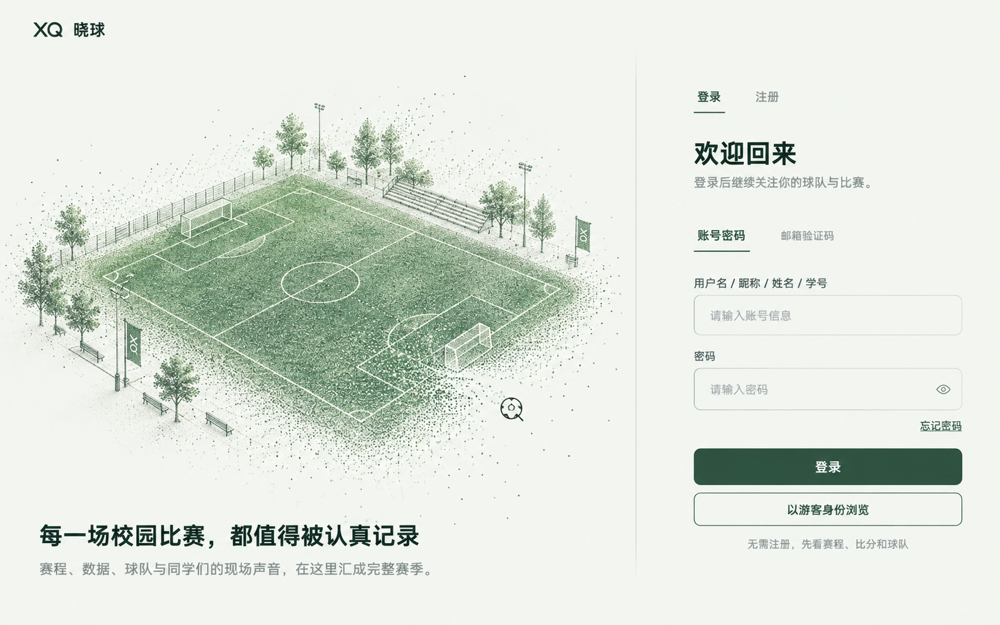
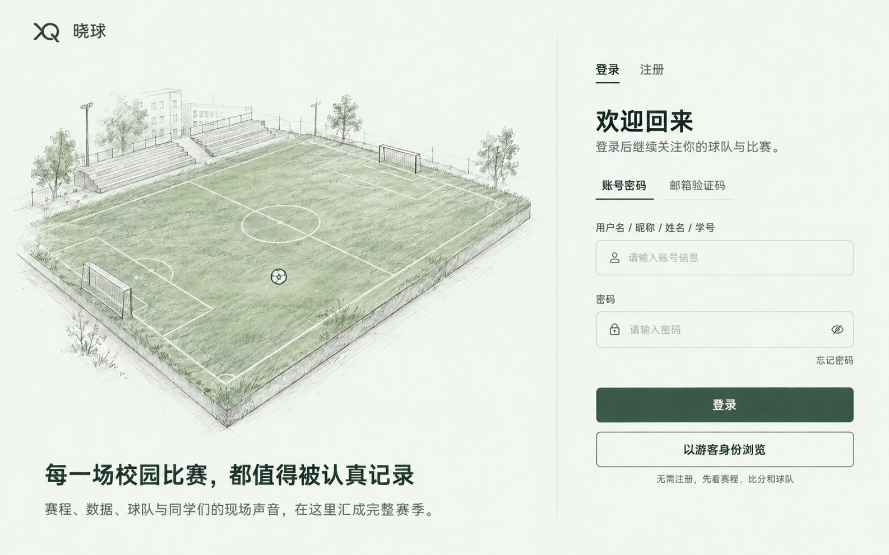

# 晓球登录入口：粒子球场与线稿光标设计方案

> 接续说明：用户随后提供并选定了点墨体育场登录页及新光标参考。后续实施以[登录入口定稿实施方案](登录入口-定稿实施方案-2026-10-01.md)为准；本文保留早期研究和 A/B 方向记录。

> 2026-10-01 · 设计讨论草案。当前交付是网站研究、两张静态概念图和实施规划。概念图不代表页面已开发，也不证明动效、性能或真实设备兼容性。
>
> 用户要求：先规划并看视觉方向；参考 https://leaderai.eu/ 的粒子交互，左侧改为足球场沙盘，左侧鼠标为简洁铅笔足球，进入右侧恢复原生鼠标，跨越分界时有过渡。右侧表单与左侧保持统一、简约、有艺术感。

## 1. 当前页面与本轮边界

当前工作区为 `D:\MuDevSpace\xiaoqiu`，分支为 `codex/h5-refinement`。仓库有多处尚未提交的修改。本轮只新增本方案、研究记录、生成提示词和概念图，应用源码保持本轮开始时的状态。

现有登录页是 Taro + React 的共享页面：
- 左侧采用校园足球背景图和深色遮罩，右侧白底表单。
- 已有登录/注册、账号密码/邮箱验证码、找回密码、游客浏览。
- 邮箱验证码目前仍是明确的服务接入占位；此次设计不会把它画成已接通服务的证明。
- 游客浏览已是登录下方同宽的按钮，继续作为快速进入公开赛事的明确入口。
- 当前全屏功能已经进入共享设置弹窗，`App` 直接返回 `children`。本方案沿用当前结构，不重新引入早期的全局悬浮全屏入口。

本轮概念图面向桌面 H5。触屏适配的后续建议是静态/轻动效球场与原生交互，不依赖鼠标悬停；触屏布局细节尚未定稿。

## 2. 参考站实际如何实现

已于 2026-10-01 打开参考站，并通过鼠标移动观察了主体形变，同时检查页面 HTML、公开粒子脚本和运行时对象。

| 检查项 | 当前观察 |
| --- | --- |
| 视觉源 | 首页的 `#logo.next-particle` 图片，源地址为 `/wp-content/uploads/2023/03/hero-image2-1.png` |
| 实现库 | 页面加载 `nextparticle.min.js`；脚本从源图读取像素，生成粒子原点 |
| 本次运行的绘制方式 | `CanvasRenderingContext2D`，实例 renderer 为 `default` |
| 粒子数量 | 1440 × 1000 桌面视口下，运行实例记录 62,668 个 origins；这不是所有设备上的固定数量 |
| 首页参数 | gravity 0.2、particleGap 2、mouseForce 230、noise 10 |
| 交互 | 鼠标推开局部粒子，随后向原位置回弹；实际观察到主体中心形成较大的空洞 |
| 圆环光标 | 独立 DOM 图层跟随鼠标，CSS 管理大小/透明度；参考站全局隐藏了原生鼠标 |

因此可以在现有 H5 内实现同类观感：原创足球场图形/几何 → 粒子采样或生成 → Canvas 绘制 → 鼠标局部扰动和回弹。参考站的源图采样和圆环光标是两个独立部分。

来源：
- [LeaderAI 首页](https://leaderai.eu/)
- [首页使用的粒子脚本](https://leaderai.eu/wp-content/themes/yootheme-child/js/nextparticle.min.js)
- [首页视觉源图](https://leaderai.eu/wp-content/uploads/2023/03/hero-image2-1.png)
- [圆环光标样式及事件所在页面源码](https://leaderai.eu/)

本地研究摘要：[`reference-observation.json`](../../参考图片/02-登录页概念-2026-10-01/reference-observation.json)。参考站截图留在本任务可视化目录，属于研究记录。

## 3. 两种视觉方向

### A：粒子球场（建议主体方向）

倾斜视角的轻盈球场沙盘，草地由浅绿颗粒组成，边线、球门与少量看台细线保持清楚。外缘颗粒逐渐消散到背景中。鼠标经过时局部粒子退开、卷动并回弹。

优点是最接近用户喜欢的参考站观感；实施时应把扰动限制在草地和少量外缘粒子，避免鼠标一靠近就抹掉整个球场。

### B：铅笔沙盘（建议线条与光标方向）

同样的左右布局，左侧更接近建筑草图：铅笔排线、浅绿草地、纤细球门和简洁看台。运动适合采用轻微视差、局部线条呼吸和少量颗粒，整体更安静。

建议最终组合：**A 的粒子球场主体 + B 的铅笔线条/足球光标 + 两版共同的同背景表单**。

两张图均由内置 ImageGen 生成。它们用于对齐视觉，不作为直接截图验收标准。图中自动绘出的密码眼睛、输入图标、品牌笔画变化都不是本轮新增功能或品牌改动的承诺；实现时按现有产品内容逐项核对。足球场的精确边线与光标矢量路径需要重新制作，不能把生成图中的细节当成准确几何。

## 4. 页面构图与表单

- 桌面左右约 60:40；以可读的表单宽度 360–420 CSS px 为约束，再分配艺术区。
- 两侧共享浅灰绿底色，例如 `#F3F6F1`；文字延续晓球的深绿 `#173F29`，次级文字用灰绿。
- 右侧表单直接排在同一背景上，输入框采用轻微底色与细边框。不会再出现一块突兀的白色矩形容器。
- 中线是一条低对比细线，上下渐隐。视觉分区主要通过留白、布局和艺术主体建立。
- 标题、正文、表单标签有清楚的字号层级。输入与按钮文字以 16px 起步，输入框和两个主按钮高约 52px；实际浏览器测量，不依赖 Taro 缩放后猜测。
- 左侧标语与球场分开排版，避免粒子运动遮住文案。现有核心文案继续使用。
- “登录”是深绿实心按钮；“以游客身份浏览”紧接下方，是同宽描边按钮，并保留无需注册即可查看赛事的说明。
- 登录/注册切换、表单校验、账号状态、找回密码及游客路径都沿用现有行为。注册内容更长时，右侧应能正常滚动，艺术区不挤压输入框。
- 按钮和选项采用短促的色彩/边线过渡，输入焦点清晰；装饰不进入输入框点击区域。

## 5. 动效与光标的具体行为

| 场景 | 计划表现 | 初始调试参数 |
| --- | --- | --- |
| 初次进入 | 球场细线与颗粒逐渐显现；表单立即可用 | 艺术入场约 500–800ms，不作为登录等待条件 |
| 左侧停留 | 颗粒轻微浮动，球场保持稳定 | 漂移幅度约 0.5–1px，不做持续旋转 |
| 鼠标扫过球场 | 局部草地颗粒受力退开，再回到原点 | 作用半径约 70–100px；回弹约 400–700ms |
| 左侧轻微视差 | 随鼠标小幅变化观看角度/图层位置 | 约 ±2° 或数个像素，后续实测调节 |
| 左侧足球光标 | 一圈细铅笔线、中心小五边形、少量接缝 | 直径约 24–28px，无黑白实心块、无真实球体高光 |
| 左→右跨线 | 内部接缝淡出，外圈收缩消失，右侧原生鼠标恢复 | 边界过渡区约 36–48px，约 150–220ms |
| 右→左跨线 | 小圈展开，五边形与接缝随后出现 | 从当前过渡进度反向，不堆叠多段动画 |
| 右侧表单 | 原生箭头、按钮指针和文本插入光标 | 不隐藏输入框 caret，不用足球追着填写 |
| 页面隐藏/离开 | 停止艺术帧循环并释放事件 | 页面恢复时按当前布局重新同步 |
| 减少动态效果偏好 | 静态球场，原生鼠标，直接切换状态 | 不播放粒子排斥、视差和跨线变形 |

**跨线动画的技术边界：** 原生系统鼠标不能像网页 SVG 一样连续变形成足球。可以平滑衔接的是左侧绘制的足球图层：在边界附近收缩/淡出，并由右侧原生鼠标接手。浏览器实验要验证这个接棒过程，避免出现两个明显的鼠标或短暂无鼠标的空档。

自定义光标仅作用于艺术区，并限定在精细指针设备。艺术光标图层必须 `pointer-events: none`，鼠标位置与真实命中点保持一致；表单、链接和可点击按钮使用原生指针。SVG 足球只需少量线段，可在实际开发时确定笔触。

## 6. 推荐技术路线

### 首选：Canvas 2D + 原创矢量球场，形成 2.5D 观感

1. 制作原创球场矢量几何：边界、半场线、中心圈、禁区、球门和极少的校园轮廓。
2. 草地与边缘按控制密度生成粒子；边线和球门用独立线稿层，保持识别度。
3. 通过简单的投影/图层视差形成倾斜沙盘；采用平面 Canvas 绘制和局部回弹模拟。
4. 粒子位置、速度和鼠标连续坐标放在局部绘制状态/typed arrays 中，以 `requestAnimationFrame` 更新，避免每次 pointermove 引起 React 重渲染。
5. 光标是单独的 SVG/DOM 层，按艺术区实际边界处理进入、退出与跨线。
6. 用 `ResizeObserver` 读取真实区域尺寸；鼠标用 `clientX/clientY` 与 `getBoundingClientRect()` 对齐，兼容滚动和窗口改变。
7. 先做静态矢量/图片底稿作为加载与失败回退，再启用粒子。艺术资源不会成为表单出现的前置条件。

第一版预计无需新增第三方依赖。参考站的 NextParticle 作为实现研究，不直接复制其站点代码或源图片。

**待实测的性能预算：** 首次原型从约 6,000–15,000 个可见点开始，设备像素比上限暂定 1.5；交互目标为指定测试电脑上接近 55–60fps，静置可降低帧率。以上是调试起点和目标，不是已测结果。如果 Canvas 原型在所需密度下仍无法稳定运行，再评估 WebGL 点精灵/着色器；自由旋转完整三维球场属于另一个复杂度，不作为第一版默认范围。

### 现有 Taro 的接入边界

计划新增独立的 `components/auth-scene/`，区分 `index.h5.tsx` 动效实现与通用静态回退；在登录页艺术区内接入。
- 登录页 `index.tsx/.scss` 是主要修改范围，保留当前逻辑和状态行为。
- `App` 继续直接返回 `children`；不通过额外同级节点挂艺术层，以免重现 Taro 页面树异常。
- 不改 API、认证契约、数据模型、全局鼠标样式、全屏设置入口或其它业务页。
- 后续开发前核对当前未提交登录页状态及唯一写入者，固定有效基线后再做局部改动。
- 若后续实测要求新增图形库，列为依赖建议，由集成负责人处理锁文件；本方案当前无此依赖要求。

## 7. 四步实施与逐轮体验

| 步骤 | 交付物 | 这一轮需要看清楚什么 |
| --- | --- | --- |
| 1. 定稿静态布局 | 真实浏览器中的统一背景、左右比例、表单和静态球场 | 先看构图与字体是否符合概念方向；登录、注册、游客操作仍可用 |
| 2. 验证球场动效 | 隔离的 Canvas 场景，局部排斥、回弹和低幅视差 | 球场始终可识别，运动自然，性能可接受，表单不被拖慢 |
| 3. 接入足球光标 | 左侧线稿足球、跨线过渡、右侧原生鼠标 | 光标定位准确，快速来回越界不闪烁，填写与点击不受影响 |
| 4. 整合与验收 | 接入正式登录页、静态回退、构建和浏览器记录 | 登录各状态正常，绘制循环和事件正确清理，视觉与实际行为一致 |

每一步完成后给一次效果与证据，让设计可以逐轮调整；本轮只完成步骤前的规划与概念图。

实施验收应覆盖：
- 1366×768、1440×900、1920×1080 桌面视口，以及改变窗口大小；登录与游客入口易于发现，不被艺术区遮挡。
- 账号/密码输入聚焦、Tab 键、按钮禁用/提交、错误提示、注册长表单与找回密码的真实布局。
- 游客进入、返回登录、已有会话重定向等现有状态行为。
- 左右跨线、快速反复越界、离开浏览器、重新进入、页面滚动和路线切换后的鼠标状态。
- 普通运动与减少动态效果两种模式；艺术初始化失败时原生鼠标和表单可用。
- 指定电脑的真实帧率/帧耗时、显存或内存趋势和隐藏标签页时的暂停情况。
- 应用源码变化后运行 TypeScript、H5 构建、微信小程序构建和差异检查；构建通过与微信真机验收分别报告。

## 8. 本轮交付与待决定项

已交付：
- 参考站的实际浏览器检查及实现判断。
- A 粒子球场与 B 铅笔沙盘概念图。
- 页面、动效、光标边界、接入位置和分步验收规划。
- [生成提示词记录](../../参考图片/02-登录页概念-2026-10-01/image-prompts.json)。

尚未完成：实际应用开发、跨线动效原型、帧率测试和设备验收。没有修改登录页源码，没有运行无关的应用回归，也没有提交或部署。

本轮检查记录：

| 执行方式 | 结果 |
| --- | --- |
| \`git status --short --branch\` | 确认工作区与 \`codex/h5-refinement\` 分支，发现并保留已有未提交改动 |
| \`Invoke-WebRequest\` 获取指定公开页面与粒子脚本 | 核对源图采样、动画循环、鼠标参数和光标代码；默认网络受限后经工具批准完成只读访问 |
| Node + 浏览器 CDP 的临时研究脚本 | 打开真实参考站并发送鼠标移动，截图核对形变，记录 Canvas 2D 与 62,668 origins |
| 内置 ImageGen | 生成两张概念图；对 B 的鼠标标记进行一次局部修正 |
| \`Copy-Item\` 与 \`Get-FileHash\` | 保存两张规划图片，并确认副本与生成原图哈希一致 |
| 文档链接、JSON 与 PNG 元数据检查 | 最终交付前核对本地引用、JSON 可读性和图片尺寸 |

公共文件变更建议：当前无。
后续集成协调：固定当前登录页有效基线和该页面唯一写入者；只有新增依赖时才需要协调锁文件。

建议先确定 **A 为主、融合 B 的线稿与光标**。概念图可以确认构图和质感；动效质量需要步骤 2/3 的真实浏览器体验确认。
