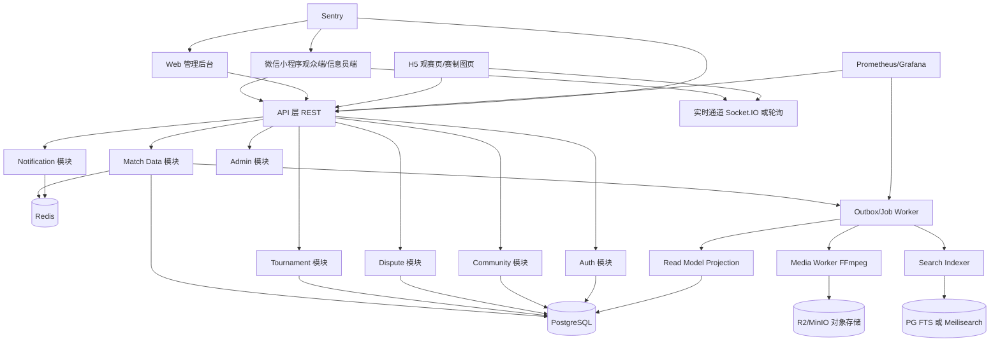
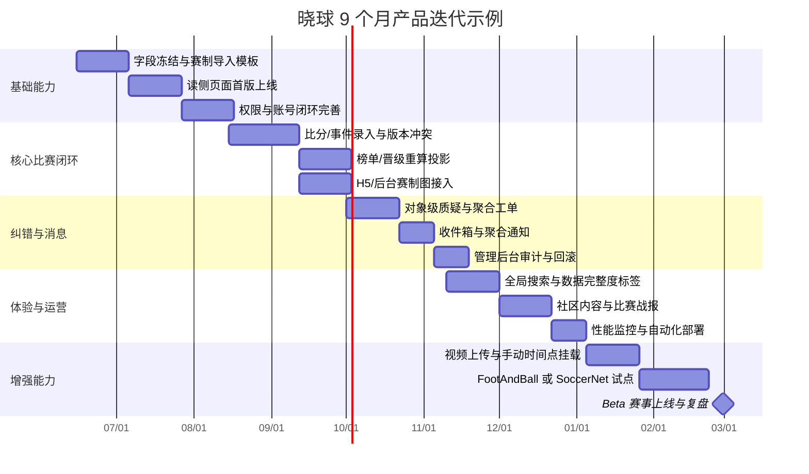

# 校园足球平台开源与现有产品深度研究报告

## 执行摘要

从你上传的《核心架构》看，**“晓球”已经不是一个普通毕设式原型，而是一个方向正确的校园足球产品底座**：你已经明确了小程序首发、轻量后台、模块化单体、服务端权威计算、按作用域授权、版本审计、对象级质疑、事件完整度、聚合通知等关键设计，这些点明显强于大多数仅做“比赛信息展示 + CRUD”的学生项目。尤其是 `RoleAssignment` 的作用域授权、`MatchRevision/AuditLog`、比分与事件分层、对象级 `Dispute`、以及“空白字段先提交者生效”的并发保护，已经非常接近真实业务系统需要的治理能力。fileciteturn0file0

本次检索后，我的核心结论是：**真正对校园足球产品最有价值的开源资产，并不是“现成校园足球平台整站源码”，而是四类可拼装能力**。第一类是**赛制与淘汰赛引擎**，以 `brackets-manager.js` 和 `brackets-viewer.js` 为代表；第二类是**联赛/球员/数据展示型 CMS**，以 SportsPress 为代表；第三类是**结构化足球数据模板与种子数据**，以 `openfootball/football.json`、`league-starter` 为代表；第四类是**视频/动作识别增强能力**，以 `FootAndBall`、`SoccerNet` 系列为代表。官方平台方面，中国足协官网和中足联官网都已经把“赛事—俱乐部—球员—数据—视频”作为成熟的信息架构主线，这说明校园产品一旦想做成“真正实用”，不能只停留在比分页，而应把**赛程、数据、内容、消息、视频、审核**作为统一产品面来设计。citeturn44view0turn45view0turn14view0turn15view0turn17view0turn55view0turn55view1

如果目标是“大一学生可落地、低成本、可持续演进”，我不建议你立刻拆微服务。更优路径是：**继续保持模块化单体**，但补齐几个当前文档中尚未完全显式化的层——`Outbox/Event Bus`、实时比分通道、可缓存的只读投影视图、媒体资产绑定、搜索抽象层、观测与备份演练。技术上，用户端可在**原生小程序 / Taro / uni-app**中选；后台可用 **Next.js** 或独立 SPA；后端建议在 **NestJS / Spring Boot / FastAPI** 中按团队熟悉度选择；数据库仍以 **PostgreSQL** 为主、**Redis** 做缓存与消息分发；搜索优先 **PostgreSQL 全文检索**，真的遇到搜索痛点再引入 **Meilisearch**；对象存储建议 **Cloudflare R2 或 MinIO**；部署上用 **GitHub Actions + Coolify** 就足够学生团队完成自动化上线；监控组合用 **Prometheus + Grafana + Sentry** 最均衡。citeturn48view0turn47view1turn49view0turn49view1turn49view2turn49view3turn49view5turn50view1turn50view2turn54view3turn51view1turn53view4turn54view2turn54view0turn52view0turn52view1turn54view1

从“投入产出比”看，最值得你优先接入或借鉴的不是视频 AI，而是下面三件事。第一，**把淘汰赛图和赛制编排能力做对**，优先复用 `brackets-manager.js + brackets-viewer.js`；第二，**把数据导入、赛季结构和种子数据做标准化**，优先借鉴 `openfootball`；第三，**把 UI/UX 做成移动优先 + 信息员低摩擦录入**，并把你已有的“事件完整度、版本冲突、工单聚合”真正体现在页面和通知上。视频识别与自动集锦属于“明显加分，但不影响 MVP 成败”的中后期能力。citeturn14view0turn15view0turn17view0turn16view0turn27view0turn28view1turn55view0turn55view1

## 研究范围与判断基线

本次研究优先使用了四类来源：**官方赛事/协会网站**、**GitHub 官方仓库页与组织页**、**官方技术文档**、以及少量与仓库直接关联的 README/issue 页面。中文资料方面，最有价值的官方样本并不是高校自建技术文档，而是中国足协官网和中足联官网这类**已经把赛程、积分榜、球员、俱乐部、视频内容整合起来的现网门户**；高校官方站点更多是新闻稿或赛事快讯，稳定公开的技术细节较少，因此在“可复用代码与架构”层面，最终仍以开源仓库与官方文档为主。citeturn44view0turn45view0turn46view0

评估你的现有方案时，我把上传文档作为基线：你当前方案已经确定了**微信小程序 + 轻量 Web 管理端**的首发形态、**模块化单体 + REST API + PostgreSQL + Redis/对象存储/任务队列**的后端格局，并明确了鉴权、白名单注册、赛制层级、比分/事件分层、版本冲突、对象级质疑、站内消息等核心业务规则。换句话说，后面的建议不是从零开始“重写”，而是在你这套底座上做**工程化补全和产品化打磨**。fileciteturn0file0

需要说明的限制有两点。其一，部分 GitHub 页面在公开抓取环境中**能稳定看到仓库描述、语言、星标、issue、组织页更新时间，但不总能稳定暴露深层目录或精确最近提交时间**；遇到这种情况，我在表中会明确写“公开页面未直接显示”或改用“组织页 Updated 时间 / latest release 时间”。其二，若某仓库许可协议在已抓取片段中未稳定显示，我会明确标注“**需复核 LICENSE**”，而不是臆测。这样做虽然保守，但更符合你后续真实复用时的合规需要。citeturn31view0turn35view0turn38view0turn34view0turn34view1

## 相关项目与产品盘点

下表覆盖了**官方平台、开源模板、开源组件、视频增强仓库**等不同类型项目。对“校园足球”来说，真正可复用的通常不是整站，而是**赛制、数据模型、展示组件、导入模板、视频处理能力**。

| 项目 | 类型 | 链接/来源 | 主要功能模块 | 技术栈 | 架构/部署方式 | 活跃度 | 许可协议 | 优点 | 不足 | 可复用路径或切入点 |
|---|---|---|---|---|---|---|---|---|---|---|
| 中国足协官网青少年/赛事专区 | 官方平台 | 官方站 citeturn44view0turn46view0 | 赛事新闻、赛果、积分榜、射手榜、U19/U15/U13 分区、青少年栏目 | Web 门户，具体栈未公开 | 官方集中式门户 | 首页可见更新到 2026-06-07；青少年赛事会议稿 2025-12-10 | 非开源 | 权威、栏目完整、年龄组结构明确 | 无源码、交互偏资讯门户 | **信息架构**：年龄组入口、赛果/积分榜/射手榜三分栏、青少年栏目组织方式 |
| 中足联官网 CFL | 官方数据平台 | 官方站 citeturn45view0 | 新闻公告、赛程、俱乐部、球员、数据、视频、青少年精英联赛 | Web 门户，具体栈未公开 | 官方联赛数据平台 | 2026 赛季数据与战报持续更新 | 非开源 | “赛程—俱乐部—球员—数据—视频”链路完整 | 非开源，偏职业联赛场景 | **栏目结构**：赛程/球员/数据/视频的统一导航模型 |
| ThemeBoy/SportsPress | 开源插件/商业化产品 | GitHub citeturn15view1turn31view0turn28view0 | 联赛、球队、球员、赛历、统计、榜单、模板扩展 | PHP / CSS / JS | 作为 WordPress 插件部署到站点 | 仓库页可见 Updated Mar 14, 2026；最新 release 为 2020-12-20 | 开源，**需复核仓库 LICENSE** | 功能全、信息架构成熟、适合作产品基准 | WordPress 绑定重；对你的小程序后端不可直接平移 | **强复用的是产品结构，不是整包代码**；适合作为后台字段与页面编排蓝本 |
| Drarig29/brackets-manager.js | 开源赛制引擎 | GitHub citeturn14view0turn34view0turn28view1 | 单败、双败、循环赛 bracket 管理 | JavaScript / TypeScript | npm 库嵌入宿主服务或前端 | latest release 2026-05-17；issue 活跃到 2026-03 | 开源，**需复核 LICENSE** | 直接解决赛制编排与晋级规则，复用价值极高 | 仍需你自己补事务、持久化和与业务表的绑定 | **优先接入为赛制域服务**；用你自己的表做 authoritative persistence |
| Drarig29/brackets-viewer.js | 开源淘汰赛 UI | GitHub citeturn15view0turn34view1turn27view0 | 单败、双败、循环赛 bracket 展示 | TypeScript / SCSS / JavaScript | 前端组件库 | latest release 2026-05-17；issue 活跃到 2026-05 | 开源，**需复核 LICENSE** | UI 可直接提升观感，适合 Web/H5 观赛端 | 小程序直接复用风险高；移动端交互仍需大量定制 | **Web/H5 直接引包**；小程序建议转 H5 页面或二次绘制 |
| openfootball/football.json | 开放足球数据仓库 | GitHub citeturn17view0turn35view0 | 多联赛 JSON 数据、赛程、结果 | JSON 数据仓库 | 静态 Git 仓库；适合作导入种子/离线构建 | Updated May 30, 2026 | CC0 1.0 | 冷启动极友好；数据结构清晰；可做导入模板 | 不是校园数据，也不是实时平台 | **赛程/结果 JSON 结构、导入脚本、离线 seed 模型** |
| openfootball/league-starter | 开源赛季模板 | GitHub citeturn16view0turn41view0 | league quick starter，快速开始联赛/杯赛数据建模 | football.db / Football.TXT 风格模板 | 静态模板仓库 | Updated Jan 27, 2026 | CC0 1.0 | 适合你设计“赛季—赛事—阶段—轮次—比赛”导入模版 | 仍需接你自己的业务库与后台 | **Starter template 根目录**，适合做“赛事导入向导”样板 |
| openfootball/awesome-football | 足球数据源清单 | GitHub citeturn35view0 | 数据集索引、数据源目录 | Markdown / 数据目录索引 | 静态仓库 | Updated Jun 7, 2026 | 仓库页未显示 SPDX，需复核 | 适合做数据源白名单和数据供应链调研起点 | 不是产品代码 | **数据源索引清单**，适合作你后续 ETL/采集清单 |
| teijo/jquery-bracket | 经典 bracket 组件 | GitHub citeturn19view0turn34view2 | 单败/双败 bracket 展示 | TypeScript / CSS / JavaScript | 前端插件 | 公开页面未直接显示最近更新时间；可见 21 tags | 开源，**需复核 LICENSE** | 老牌、简单、接入快 | 较老，交互和视觉不如新库 | 适合做**低成本 Web 管理端 bracket 原型** |
| jac99/FootAndBall | 视频识别增强 | GitHub citeturn20view1turn55view0 | 球员与足球联合检测、训练、推理 | Python / PyTorch | 离线推理脚本或 GPU worker | 公开页可见 33 commits；issue 3 个；最近更新时间未在首屏直出 | MIT | 可做自动打点、自动生成事件建议 | 需要视频与算力；对 MVP 不是刚需 | **`network/`、`models/`、`run_detector.py`、`train_detector.py`、`config.txt`** |
| SoccerNet/sn-spotting | 视频事件标注/评估 | GitHub citeturn20view2turn38view0turn55view1 | 动作 spotting、下载、特征提取、评估、标注工具 | Python | 数据集工具链与基准实现，偏离线 | Updated Feb 7, 2024 | GPL-3.0 | 可给校园比赛做“高光/进球时间点”半自动标注 | 数据依赖重，NDA/视频权限限制较多 | **`Download/download_ball_data.py`、`Features/`、`Evaluation/`、`Annotation tool`** |
| vi3itor/GameplayFootball | 足球引擎/演示 | GitHub citeturn22view0turn41view2 | 足球游戏引擎、动画工具、数据资源 | C++ / SDL2 / OpenAL 等 | 本地编译运行 | Updated Jan 16, 2024 | Apache 2.0 | 对“交互演示、训练、3D 可视化”有启发 | 与校园赛事平台距离较远 | **`src/`、`data/`、`tools/animator/src`**，更适合作演示或实验功能 |
| SilvioGiancola/SoccerNetv2-DevKit | 视频挑战开发包 | GitHub citeturn17view1turn31view1 | SoccerNet challenge 开发与工具链 | Python | 离线开发包 | 公开页未稳定显示 repo Updated 时间 | 开源，**需复核 LICENSE** | 适合看“数据集 + 工具 + benchmark”的组织方式 | 不是平台型应用 | **DevKit 结构与数据组织方式**，适合你的视频能力扩展阶段 |

从上面的盘点可以看出，**现成“校园足球平台源码”本身并不多**，而可直接借力的高质量资产反而集中在“赛制引擎、展示组件、数据模板、视频辅助”四块。这和你当前架构很契合：你已经把账号与权限、审计、工单、消息这些“平台基础设施”设计出来了，下一步应该优先拼接的是**可视化赛程 + 稳定赛制计算 + 低摩擦录入 + 结构化数据种子**，而不是急着做一个大而全的视频 AI 平台。fileciteturn0file0

## 功能与架构比较

先给出一个结论：**你的“晓球”在“权限与审核、并发保护、纠错审计”上已经明显领先多数开源样本；但在“实时通道、视频回放、搜索、观测与运维产品化”上仍有明显可补齐空间。** 这也是为什么我建议你继续沿着现有架构演进，而不是推倒重来。fileciteturn0file0

说明：下表中的“实时比分”“移动端支持”等字段，针对的是**项目原生能力**；像 `brackets-viewer.js` 这类组件库并不是完整平台，因此很多列会出现“需宿主实现”。

| 项目 | 用户角色 | 赛程管理 | 比分实时更新 | 直播/视频回放 | 统计与排行 | 报名与队伍管理 | 消息/讨论 | 权限与审核 | 移动端支持 | 性能/延迟策略 | 数据存储与备份 | 运维复杂度 | 来源 |
|---|---|---|---|---|---|---|---|---|---|---|---|---|---|
| 晓球当前架构 | 游客/学生/队长/信息员/赛事管理员/超管 | 强 | **已有比分/事件模型，但缺少专用实时层** | 未在当前文档中成型 | 强 | 强 | 强 | **很强** | 小程序优先 | 乐观锁、版本冲突、事务、聚合提醒 | PostgreSQL + Redis/对象存储/队列 | 中 | fileciteturn0file0 |
| 中国足协官网青少年/赛事 | 游客 + 后台运营 | 中 | 弱，偏结果发布 | 有视频栏目，但不是逐场自助回放平台 | 强 | 弱 | 弱 | 中 | 移动 Web 可看 | 门户式发布，偏静态/缓存 | 官方后台，未公开 | 中高 | citeturn44view0turn46view0 |
| 中足联官网 CFL | 游客 + 后台运营 | 强 | 中 | **有精彩视频栏目** | 强 | 中 | 弱 | 中 | 移动 Web 可看 | 官方数据门户，偏读多写少 | 官方后台，未公开 | 中高 | citeturn45view0 |
| SportsPress | 游客/管理员 | 强 | 中，更多是录入后展示 | 可扩展内容页，但非原生直播平台 | 强 | 中 | 弱 | 中 | 取决于站点主题 | 依赖 WordPress 缓存与站点策略 | WordPress + 数据库 | 中 | citeturn15view1turn31view0turn28view0 |
| brackets-manager.js | 管理员/开发者 | 强 | 否 | 否 | 中 | 否 | 否 | 宿主实现 | 宿主实现 | 纯逻辑计算，延迟低 | 由宿主决定 | 低 | citeturn14view0turn28view1 |
| brackets-viewer.js | 游客/开发者 | 读展示强 | 否 | 否 | 中 | 否 | 否 | 宿主实现 | Web/H5 友好，小程序需二开 | 前端渲染；复杂交互仍待增强 | 前端态/宿主存储 | 低 | citeturn15view0turn27view0 |
| football.json | 开发者/数据管理员 | 强 | 否 | 否 | 中 | 否 | 否 | 否 | 任意端可消费 | 静态 JSON，读延迟低 | Git 仓库 + 版本化 | 低 | citeturn17view0turn35view0 |
| league-starter | 开发者/数据管理员 | 强 | 否 | 否 | 中 | 否 | 否 | 否 | 任意端可消费 | 静态模板 | Git 仓库 + 版本化 | 低 | citeturn16view0turn41view0 |
| jquery-bracket | 游客/开发者 | 展示强 | 否 | 否 | 弱 | 否 | 否 | 否 | Web 为主 | 前端渲染 | 前端态/宿主决定 | 低 | citeturn19view0turn34view2 |
| FootAndBall | 开发者/视频运营 | 弱 | 可辅助“准实时”识别，但不是业务实时系统 | 视频分析强 | 可生成辅助统计 | 否 | 否 | 否 | 否 | 面向高分辨率视频的实时处理优化 | 模型文件 + 本地/对象存储视频 | 中高 | citeturn55view0 |
| sn-spotting | 开发者/视频分析 | 弱 | 否 | **视频事件分析强** | 中 | 否 | 否 | 否 | 否 | 以离线特征提取与评估为主 | 数据集与特征文件 | 高 | citeturn55view1turn38view0 |
| GameplayFootball | 开发者/演示 | 否 | 否 | 基于引擎可演示 | 否 | 否 | 否 | 否 | 桌面/本地为主 | 本地引擎实时渲染 | 本地资源 + 编译产物 | 高 | citeturn22view0turn41view2 |

这张表真正传达的信息不是“哪个项目最全”，而是：**几乎没有一个开源项目同时把校园足球真正需要的“身份、赛制、实时、审计、社交、移动端”全部做好**。所以最现实的做法是：你的平台继续承担“业务真相层”，再从外部仓库吸收**赛制、展示、数据模板、视频增强**这些专项能力。citeturn14view0turn15view0turn17view0turn55view0turn55view1

## 最值得复用的开源项目深挖

### SportsPress 适合借产品结构 不适合生搬代码

SportsPress 最大价值不在于“拿来即用”，而在于它已经把**联赛、球队、球员、赛程、数据页、模板扩展**做成了一套成熟的体育站点信息架构。它的仓库长期还在更新，说明这类“体育数据 CMS”有稳定需求；但 issue 里同时可以看到**同分规则错误、模板自定义成本、玩家列表问题、严重故障、无障碍缺陷**等真实生产系统问题，这对你很有参考意义。citeturn31view0turn28view0

对“晓球”来说，我更建议你**复用 SportsPress 的产品分层思路**，而不要直接迁移其 WordPress/PHP 工程。一句话说：**抄页面和字段，不抄运行时**。你可以重点借鉴以下几个方面：

| 可借鉴模块 | 复用方式 | 对晓球的具体启发 | 改造成本 | 风险 |
|---|---|---|---|---|
| 球队/球员/赛事/榜单页面分层 | 信息架构级复用 | 让“比赛、球队、球员、榜单、内容”形成固定导航，而不是散落在页面里 | 低 | 低 |
| 统计页与榜单页的字段组织 | 字段设计复用 | 你的 `Match` / `MatchEvent` / `RankingRule` 已经具备底层能力，应尽快做出稳定榜单页面 | 低 | 低 |
| 模板扩展思路 | 组件与 slot 思维 | 避免把所有页面写死；小程序和 Web 共用 design token | 中 | 中 |
| 审核与手动修正操作流 | 后台交互复用 | SportsPress 的 issue 反向说明：规则边界和模板定制必须有后台兜底入口 | 中 | 中 |

优先级上，这部分建议是**P1 / 难度低到中**。真正要避免的是：把 WordPress 当成你业务后端。你现有的审计、质疑、版本冲突模型已经更适合自研服务端继续演进。fileciteturn0file0

### brackets-manager.js 是你最应该尽快接入的赛制引擎

`brackets-manager.js` 的定位非常清楚：它是**赛制逻辑引擎**，支持循环赛、单败、双败。对校园杯赛尤其重要，因为你已经在文档中设计了 `AdvancementRule`、阶段、轮次、分组、比赛等结构；引入这类引擎后，你可以把“赛制计算”从业务代码里抽出来，减少自己手写 bracket 推导的错误率。仓库的公开 issue 又恰好提醒了两件你不能忽视的事：**存储适配层并不等于真实数据库事务**，以及**round-robin / double elimination 的 currentMatches 等边界能力仍在完善中**。citeturn14view0turn28view1

建议的复用姿势不是“库直接写库”，而是：**你自己的数据库表是真相源，第三方库只负责赛制运算**。你可以做一个 `BracketDomainService`，输入你的 `Stage/Group/Round/Match/AdvancementRule`，输出对阵、席位和下一轮映射；真正落库、审计、回滚、重算，仍走你的事务和版本控制体系。这样既吃到成熟赛制逻辑，又不会被第三方 storage adapter 的边界掣肘。fileciteturn0file0turn28view1

| 明确可复用点 | 推荐接法 | 改造成本 | 风险评估 |
|---|---|---|---|
| 单败/双败/循环赛赛制生成能力 | 作为纯 domain library 接入后端 | 低 | 低 |
| 晋级与席位映射 | 与你现有 `AdvancementRule` 融合 | 中 | 中 |
| currentMatches 等赛中视图 | 作为“只读投影”输出，不直接驱动主表 | 中 | 中 |
| storage adapter 思路 | 参考，不直接当 authoritative DB adapter | 中 | 中高 |

这是本报告里**ROI 最高的直接代码复用项之一**。优先级我给 **P0**，难度 **中**。citeturn14view0turn28view1

### brackets-viewer.js 很适合 Web/H5 观赛端 小程序要谨慎

`brackets-viewer.js` 是 UI 侧最有价值的资产之一：它可以快速把你已有的 bracket 数据渲染成可看、像样的赛制图。问题在于，它的 issue 明确暴露出若干真实交互缺口，比如**需要更丰富的 tooltip、每组 rounds tab、鼠标拖动、阶段完成后展示 standings，以及对 openbracketformat 的支持**。这意味着它非常适合直接用于 **Web 管理端 / H5 观赛页**，但若你要把它原封不动搬进微信小程序，改造成本会明显上升。citeturn15view0turn27view0

我建议的策略是分端处理：**后台与 H5 先直接用，微信小程序端做“轻量 bracket 视图”**。也就是说，小程序首页或数据页只展示“阶段 tabs + 当前轮次 + 核心对阵卡片 + 查看完整赛制图”的入口，完整赛制图跳 H5 或由服务端预渲染图片/Canvas。这样能用最低成本拿到产品观感提升，又不把自己锁死在小程序的 DOM 兼容细节里。citeturn15view0turn27view0

| 明确可复用点 | 推荐接法 | 改造成本 | 风险评估 |
|---|---|---|---|
| bracket 可视化整体布局 | 先用于 Web 后台与 H5 | 低 | 低 |
| 轮次/阶段导航 | 参考其展示结构，自行做小程序 tabs | 中 | 低 |
| tooltip/交互增强 | 结合你自己的 Match 卡片字段重写 | 中 | 中 |
| 小程序直接移植 | 不建议优先走这条路 | 高 | 高 |

这一项的优先级我给 **P0-P1**，难度 **Web 端低 / 小程序端中高**。citeturn15view0turn27view0

### openfootball 数据家族最适合做赛季模板和导入种子

`football.json`、`league-starter`、`awesome-football` 这组仓库的价值不在“直接变成校园产品前端”，而在于它们提供了**结构化赛程/赛果数据的规范感**。尤其 `football.json` 和 `league-starter` 都保持更新，且使用 **CC0** 这类极宽松的数据许可，非常适合你在不涉及校园隐私数据的前提下，先把**导入导出、赛季模板、测试种子数据、后台导入向导**做起来。citeturn17view0turn35view0turn16view0turn41view0

对你现有架构最直接的帮助有三点。第一，把你文档中的 `Season → Tournament → Stage → Group → Round → Match` 结构真正变成**可导入模板**。第二，在开发阶段使用公开足球样本做**端到端测试数据**，避免每次手动搓测试比赛。第三，为未来开放“赛事导入/导出”预留标准化接口，比如 JSON seed、CSV roster、比赛结果 patch。fileciteturn0file0turn17view0turn16view0

| 明确可复用点 | 推荐接法 | 改造成本 | 风险评估 |
|---|---|---|---|
| `football.json` 的赛程/结果 JSON 结构 | 作为 seed/import schema 参考 | 低 | 低 |
| `league-starter` 的 quick starter 模板 | 直接变成后台“创建赛事向导”样板 | 低 | 低 |
| `awesome-football` 数据源清单 | 用于后续 ETL/数据白名单整理 | 低 | 低 |
| 直接拿公开联赛数据当生产数据 | 不建议 | 低 | 中 |

这一类建议优先级 **P0**，难度 **低**，因为它几乎不改你的底层架构，只是让开发效率和规范程度显著提高。citeturn35view0turn41view0

### FootAndBall 与 sn-spotting 适合做中后期视频增强 而非 MVP 主线

`FootAndBall` 明确给出了 `network/`、`models/`、`run_detector.py`、`train_detector.py`、`config.txt` 等可落地入口，它擅长从高分辨率球赛视频中检测球员与球；README 还强调了它是**面向高分辨率长镜头足球视频的轻量化检测器**，并支持实时处理。`sn-spotting` 则提供了更完整的**下载、特征提取、评估和标注工具链**，包括 `Download/download_ball_data.py`、`Features/`、`Evaluation/`、Annotation tool 等目录。两者都适合做“自动建议进球时刻 / 高光片段锚点 / 赛后视频回看导航”，但并不适合占用你现在 MVP 的主开发带宽。citeturn55view0turn55view1

我建议把它们统一定义为**增强 worker**，不进入主事务链。也就是说，比赛结束后，把视频文件和元数据扔给异步 worker：能识别出来就生成“候选事件时间点”，不能识别出来也不影响比分、榜单、晋级和消息系统。这种接法最符合你“服务端可信、允许逐步完善、事件可晚补录”的已有原则。fileciteturn0file0turn55view0turn55view1

| 明确可复用点 | 推荐接法 | 改造成本 | 风险评估 |
|---|---|---|---|
| `FootAndBall` 的检测推理脚本 | 赛后异步 worker，产出候选时间点 | 中 | 中 |
| `sn-spotting` 的 `Features/` 与 `Evaluation/` | 做视频事件 pipeline 或离线验证 | 中高 | 高 |
| `Annotation tool` | 给运营或管理员做视频标注内工具 | 中 | 中 |
| 直接上生产自动改比分 | 明确不建议 | 高 | 高 |

这类能力我给 **P2**，难度 **中高**。它能显著加分，但不应挤占你把“赛制、录入、消息、榜单、运维”做稳的时间。citeturn55view0turn55view1

## 用户痛点与改进优先级

从开源仓库 issue 和现网平台结构反推，校园足球平台最常见的问题并不是“没有功能”，而是**功能在真实运营里不够稳、不够快、不够清楚**。尤其是比分、榜单、淘汰赛图、模板定制、无障碍、多人协作这些地方，最容易在第一场真实比赛就暴露问题。citeturn28view0turn28view1turn27view0

| 典型痛点 | 证据来源 | 建议方案 | 优先级 | 实施难度 |
|---|---|---|---|---|
| 同分/对赛规则容易出错，榜单不可信 | SportsPress 出现 head-to-head tiebreaker 问题。citeturn28view0 | 把 `RankingRule` 做成**可配置 + 可回放 + 可测试**；每次赛果变更后产出“榜单重算审计” | 高 | 中 |
| 录入与展示脱节，比分先出但事件没补齐，用户容易质疑 | 你的架构已设计 `EMPTY/PARTIAL/COMPLETE/REVIEW_REQUIRED`，但这需要前台显式化。fileciteturn0file0 | 在比赛详情、榜单、球员页都显示“数据完整度徽标”；未补齐时展示“官方比分已确认，事件明细待补” | 高 | 低 |
| bracket 观感不佳、轮次切换不顺、移动端交互弱 | `brackets-viewer.js` issue 明确提到 rounds tabs、tooltip、drag、standings。citeturn27view0 | 小程序端做轻量卡片视图，Web/H5 用成熟 bracket 组件；默认提供阶段 tabs + 当前轮次锚点 | 高 | 中 |
| 多人同时录入容易覆盖数据 | `brackets-manager.js` 仍有 transactions 相关诉求；你文档已做 version/conflict 设计。citeturn28view1turn0file0 | 继续坚持**字段级 patch + 乐观锁 + 409 冲突 + 一键转质疑**；不要做整页覆盖提交 | 高 | 中 |
| 模板和页面定制成本高 | SportsPress issue 里有 template customization 诉求。citeturn28view0 | 把前端抽成统一 design token + slot 区域；赛事页、球队页、球员页共用同一内容骨架 | 中 | 中 |
| 无障碍容易被忽略 | SportsPress issue 出现图片空 alt 文本问题。citeturn28view0 | 颜色对比、替代文本、语义化标题、键盘可达、减少仅靠颜色表达胜负 | 中 | 低 |
| 视频与数据分离，回看体验差 | CFL 有视频栏目；sn-spotting/FootAndBall 提供视频能力但不是业务平台。citeturn45view0turn55view0turn55view1 | 给 `MediaAsset(match_id, event_id, cue_point_ms)` 建模；先做“手动挂时间点”，再考虑自动建议 | 中 | 中高 |
| 审核流要么太重，要么太松 | SportsPress 有“玩家提交分数自动审核”诉求；你文档已设计对象级质疑与信誉体系。citeturn28view0turn0file0 | 低风险字段走快审，高风险字段必须人工确认；不要把核心比分开放自动通过 | 高 | 中 |
| 搜索不可用，老比赛难找 | 官方平台都把赛程/球员/俱乐部分入口做得很清楚。citeturn45view0turn44view0 | 首发先做“球员/球队/比赛/帖子”统一搜索框；小规模用 PG FTS，后续必要时接 Meilisearch | 中 | 低到中 |

如果只允许你现在立刻新增三项，我建议是：**榜单双重校验与可回放、前台显式数据完整度、Web/H5 赛制图接入**。它们对“可信、好用、像个正式产品”的提升最大，而且不要求你先上视频或复杂实时基础设施。citeturn28view0turn27view0turn14view0

## 面向你当前架构的参考架构与实施建议

### 对你现有方案的判断

你的当前设计里，已经有很多“以后不用返工”的东西：**按作用域授权、白名单身份、用户名/微信绑定、赛季分层、比分与事件分层、版本与审计、对象级质疑、聚合通知、模块化单体**。这些不但能支持校园杯赛，也足以支撑你以后上 Web 观众端、独立 App、甚至校级多赛事扩展。fileciteturn0file0

真正还需要补强的，不是重写业务域，而是把几个“平台层”显式化。第一，增加 **Outbox / Domain Event** 机制，确保“比分保存成功”与“通知、缓存失效、榜单投影重算”之间不会发生漏执行。第二，增加**实时比分通道**，至少在决赛和热门比赛启用。第三，增加**只读投影视图**，把 standings、top scorers、team form、match feed 做成可缓存对象，而不是每次读都现算。第四，增加**媒体资产层**，把图片、短视频、回放片段和赛事/事件绑定起来。第五，增加**可观测与回放能力**，让你在比赛周出问题时能快速定位是录入冲突、重算失败、通知丢失还是缓存没有失效。fileciteturn0file0turn49view5turn50view1turn52view0turn52view1turn54view1

### 推荐参考架构

这个架构最关键的一点是：**仍然是模块化单体，不拆微服务；但把异步任务、投影、媒体、搜索、观测做成清晰边界**。这会让你的项目在学生团队可控范围内，获得接近正式产品的稳定性。fileciteturn0file0turn52view0turn52view1turn54view1

### 各层技术栈选型表

| 层 | 推荐选项 | 备选 | 优势 | 风险/代价 | 适合校园场景建议 |
|---|---|---|---|---|---|
| 用户端前端 | **原生微信小程序** 或 **Taro** | **uni-app** | Taro 支持 React/Vue 多端能力；uni-app 强调“一套代码，多平台发布”；原生小程序最贴近微信生态。citeturn48view0turn47view1 | Taro/uni-app 会带来跨端抽象成本；原生小程序未来 H5/App 复用差 | **若未来一年只做微信：原生小程序。若明确会做 H5/App：优先 Taro，其次 uni-app** |
| 管理后台 / Web 观赛 | **Next.js** | 传统 SPA（Vue/React） | Next.js App Router 支持更现代的全栈 Web 组织方式，并强调可访问性和 App Router/Pages Router 双体系。citeturn49view0 | SSR/路由心智更复杂 | 后台和 H5 观赛页都可以用 Next.js，尤其适合承接 bracket 与数据详情页 |
| 后端 | **NestJS** | **Spring Boot** / **FastAPI** | NestJS 上手快、TypeScript 约束强；Spring Boot 自带 production-ready 特性；FastAPI 有 OpenAPI、WebSocket、BackgroundTasks 等开发效率优势。citeturn49view1turn49view3turn49view2 | Spring Boot 学习曲线相对更陡；FastAPI 团队规模大时约束弱于 Java/TS 架构 | **你若单人或双人全栈：NestJS 最均衡；若学校团队 Java 人多：Spring Boot；若你 Python 最熟：FastAPI** |
| 实时通信 | **REST + Socket.IO** | **短轮询/长轮询** | Socket.IO 提供 fallback、自动重连、缓冲等能力；很适合比分/事件推送。citeturn49view5 | 移动端后台保活不适合作长连接常驻；复杂度高于纯 REST | **MVP 可先短轮询，决赛/热门场次再开 Socket.IO** |
| 主数据库 | **PostgreSQL** | MySQL 8 / SQLite 只用于本地开发 | PostgreSQL 有 MVCC、WAL/PITR、JSONB、全文检索、行列级安全、分区与高并发能力。citeturn50view2 | 运维复杂度中等 | **你当前继续用 PostgreSQL 是正确路线，不建议改库** |
| 缓存 / 队列 / 分发 | **Redis** | 纯数据库队列（极简 MVP） | Redis docs 明确支持 cache、streams、JSON、real-time streaming / event processing。citeturn50view1 | 引入后需要关注一致性与过期策略 | **先用 Redis 做热点缓存 + 比分频道 + 异步任务分发即可** |
| 搜索 | **PostgreSQL FTS** | **Meilisearch** | PostgreSQL 自带全文检索；Meilisearch 主打单二进制、REST API、低延迟、快速上云。citeturn50view2turn54view3 | Meilisearch 是额外组件，需要双写或异步索引 | **先从 PG FTS 起步；真的出现“搜索不好用”再接 Meilisearch** |
| 对象存储 | **Cloudflare R2** | **MinIO** | R2 提供 bucket、presigned URL、S3 兼容与事件通知；MinIO 是 S3-compatible、自托管友好。citeturn51view1turn53view4 | R2 是托管服务；MinIO 需要自己运维备份 | **无重视频时优先托管对象存储；若学校内网/实验室自管资源足够，再考虑 MinIO** |
| 媒体处理 | **FFmpeg Worker + 手动标点** | FootAndBall / sn-spotting 增强 | FootAndBall 可做球与球员检测；sn-spotting 提供特征提取、评估、标注工具。citeturn55view0turn55view1 | GPU、视频版权、算力和数据清洗成本高 | **MVP 只做“视频上传 + 手动时间点”；AI 在第 2 阶段再加** |
| CI/CD | **GitHub Actions** | **Coolify** 或两者结合 | GitHub Actions 可在仓库内自动化 CI/CD；Coolify 是开源 PaaS，支持 SSH、任意服务器、自动 SSL、S3 备份、Git 集成。citeturn54view2turn54view0 | 自己维护 runner / 服务器时需要一些 DevOps 常识 | **最佳搭配：GitHub Actions 测试构建，Coolify 负责部署与续签证书** |
| 监控与错误追踪 | **Prometheus + Grafana** | **Sentry** | Prometheus 适合指标与告警；Grafana 适合可视化 metrics/logs/traces；Sentry 擅长错误与性能问题定位。citeturn52view0turn52view1turn54view1 | 三者一起上会比“啥都没有”复杂，但收益巨大 | **最小配置：Sentry 必上；规模稍大再配 Prometheus + Grafana** |
| 权限体系 | **继续沿用 scoped RBAC** | 加 SSO 适配层 | 你当前 `RoleAssignment(user_id, role, scope_type, scope_id)` 已经很成熟。fileciteturn0file0 | 如果未来接校园 CAS/OAuth，需要单独身份适配 | **不要把校园 SSO 写死在核心域里，做 `ExternalIdentity` 适配层** |

### 针对校园场景的配置建议

如果你是**非官方校级项目、预算未指定、团队 1-3 人**，我推荐的最现实配置是：**小程序 + Web 后台 + 模块化单体后端 + PostgreSQL + Redis + 托管对象存储 + GitHub Actions + Coolify + Sentry**。这套组合的现金成本相对可控，学习曲线不会像 Kubernetes / 微服务那样陡，而且已经足够完成真实校园杯赛的一整套闭环。其核心优势是：**开发速度快、问题定位快、运维面小、后续还能平滑升级**。citeturn54view2turn54view0turn54view1turn50view2turn50view1

如果未来需要**校园单点登录**，不要推翻现有白名单与微信绑定模型，而是加一层 `ExternalIdentity(provider, external_id, user_id)`。这样你可以做到：普通用户仍可沿用低门槛注册，校方管理员和正式比赛工作人员可走更严格的 CAS/OAuth 入口；两套身份最终汇总到同一 `User`。这会比一开始就强绑 SSO 更稳妥，也更符合你当前“低门槛首发、逐步增强”的原则。fileciteturn0file0

如果你计划**后期做视频回放**，要预先约定隐私边界：学生号码继续只做后台身份核验、不对外展示；视频存储尽量使用对象存储的**时效 URL**；赛事若有录像，需要在报名与上传流程里加入“赛事记录与展示说明”；后台保留媒体删除、下架与申诉入口。你文档里已经对学号公开、日志脱敏、会话撤销做了很好的约束，视频层应该沿用同样思路。fileciteturn0file0

### UI/UX 与性能优化建议

你现在最应该坚持的一个原则是：**把信息员体验和观众体验分开优化**。信息员最需要的是“最快录入、最少误触、冲突可解释”；观众最需要的是“最新比分、清晰赛制、球员榜单、好找内容”。这两个角色共用一个产品，但不该共用一套页面心智。fileciteturn0file0

| 建议 | 具体做法 | 优先级 | 难度 |
|---|---|---|---|
| 比分低延迟更新 | 热门比赛页启用 Socket.IO；普通比赛先短轮询；比分保存后立即推比赛卡片、榜单投影与通知 | 高 | 中 |
| 信息员录入移动优先 | 进球/红黄牌/助攻使用底部抽屉 + 大按钮 + 最近球员快捷选择；比分与事件分开提交 | 高 | 中 |
| 数据完整度可视化 | 在比赛详情、榜单、球员页展示 `EMPTY/PARTIAL/COMPLETE/REVIEW_REQUIRED` 标签 | 高 | 低 |
| 赛制图可读性 | 小程序端默认简版阶段视图；完整 bracket 放 H5；当前轮次、晋级路径、已结束状态用统一视觉语言 | 高 | 中 |
| 全局搜索 | 顶部统一搜索“球员/球队/比赛/动态”，首发先做精确 + 前缀匹配 | 中 | 低 |
| 无障碍 | 图标与队旗补 alt/替代文本，色彩不只靠红绿表达，重点页保证键盘与读屏可达 | 中 | 低 |
| 内容层丰富度 | 给比赛页加入“战报、精彩瞬间、图集、关联动态”四个模块，减少只看比分的单薄感 | 中 | 中 |

前端组件与模板方面，最实用的复用入口是：**`brackets-viewer.js` 用于 H5/后台赛制图**；**Taro 生态与物料市场**适合小程序多端组件思路；**uni-app 插件市场**适合快速补齐社区、媒体、表单类组件。Taro README 明确提到其“开放式跨端跨框架解决方案”和物料市场；uni-app 官方文档则明确把插件市场和跨多端发布作为生态能力的一部分。citeturn48view0turn47view1turn15view0

### 部署与运维最佳实践

真正让学生项目“像产品”的，往往不是多写两个功能，而是把运维做成**不会在比赛当天掉链子**。这里给你一份适合学生团队的落地清单：

| 项目 | 建议 | 优先级 | 难度 |
|---|---|---|---|
| 自动化部署 | 用 GitHub Actions 做测试/构建，Coolify 拉镜像或拉代码部署 | 高 | 低 |
| 日志 | 所有写操作带 request id、match id、operator id、scope id | 高 | 低 |
| 错误监控 | 小程序/Web/后端都接 Sentry | 高 | 低 |
| 指标监控 | 后端、数据库、Redis、Worker 接 Prometheus；Grafana 看延迟/失败率/队列堆积 | 中 | 中 |
| 数据库备份 | 每日全量 + WAL/PITR 或至少定时 dump；每月做一次恢复演练 | 高 | 中 |
| 对象存储 | 开启版本化或至少保留关键视频/封面副本；上传用时效 URL | 中 | 低 |
| 安全加固 | 管理后台单独域名、强密码、登录限速、最小权限、证书自动续签 | 高 | 低 |
| 流量突发 | 热门页面走缓存，榜单/赛程生成只读 projection，视频走对象存储/CDN | 中 | 中 |
| 灰度与回滚 | 每次比赛周前发一个稳定 tag，保留一键回滚镜像 | 高 | 低 |

**学生团队最小可行运维方案**可以非常克制：1 名主力全栈负责后端与部署，1 名兼职前端/测试/运营同学协助；平时每周 2-4 小时维护，比赛周额外安排 1 次值守。技术上不必上容器编排大集群，**1 台稳定服务器 + 托管对象存储 + 自动化部署 + 错误监控** 就已经能覆盖大部分校园赛事。只有当你开始做大量视频回放或多校联赛时，才需要把重点转向对象存储、转码 worker 和带宽成本。这个判断是基于学生团队能力边界与上述工具特性作出的工程推断。citeturn54view2turn54view0turn54view1turn52view0turn52view1

### 可直接复用或参考的仓库清单

下表是面向“晓球”最值得立刻纳入 backlog 的仓库清单。说明：部分仓库公开抓取页未稳定暴露深层树形目录，因此我优先列出**已确认的根级模块/脚本路径**和最现实的复用建议。

| 仓库 | 关键路径/模块 | 复用建议 | 适合阶段 | 来源 |
|---|---|---|---|---|
| Drarig29/brackets-manager.js | 赛制管理库本体；以包级接入为主 | 作为后端赛制域服务，不直接当 DB 真相层 | 立刻 | citeturn14view0turn28view1 |
| Drarig29/brackets-viewer.js | UI 展示库本体；包级接入 | Web/H5 直接引入赛制图，小程序做降级视图 | 立刻 | citeturn15view0turn27view0 |
| openfootball/football.json | 仓库级 JSON 数据结构 | 做测试 seed、导入模板、赛事样例 | 立刻 | citeturn17view0turn35view0 |
| openfootball/league-starter | starter 模板根目录 | 做后台“创建赛事向导”和导入模版 | 立刻 | citeturn16view0turn41view0 |
| openfootball/awesome-football | 数据源索引清单 | 整理外部数据源白名单，做 ETL 预研 | 立刻 | citeturn35view0 |
| ThemeBoy/SportsPress | 页面/字段/模板思路 | 借产品结构，不建议直接搬运 WordPress 运行时 | 立刻 | citeturn15view1turn31view0 |
| teijo/jquery-bracket | bracket 前端插件 | 若你要快速出一个后台原型，可作为低成本备选 | 早期原型 | citeturn19view0turn34view2 |
| jac99/FootAndBall | `network/`、`models/`、`run_detector.py`、`train_detector.py`、`config.txt` | 赛后视频自动打点、生成候选事件 | 中后期 | citeturn55view0 |
| SoccerNet/sn-spotting | `Download/download_ball_data.py`、`Features/`、`Evaluation/`、Annotation tool | 做视频事件标签与高光时间点工具链 | 中后期 | citeturn55view1 |
| vi3itor/GameplayFootball | `src/`、`data/`、`tools/animator/src` | 交互演示、训练或 3D 可视化实验，不做主线 | 研究性扩展 | citeturn22view0turn41view2 |
| NervJS/taro | `packages/`、`examples/`、`scripts/`、`tests/` | 若你决定走“一套代码多端”，这是前端主力备选 | 立刻 | citeturn48view0 |
| uni-app | 官方插件市场/工程化文档/跨端能力 | 若你更偏 Vue 生态，适合快速多端覆盖 | 立刻 | citeturn47view1 |

## 路线图与下一步行动清单

下面给你一份**9 个月可执行路线图示例**。它不是唯一答案，但很适合你当前阶段：先把“可真实使用”做稳，再慢慢叠加视频、搜索和体验优化。

这条路线图背后的真实意思是：**MVP 的成功标准不是“功能最多”，而是“第一届杯赛从报名、赛程、录入、纠错到榜单都能顺畅跑完”**。在这个前提下，视频、搜索、社区和多端才是自然生长出来的第二曲线。fileciteturn0file0turn14view0turn15view0turn17view0

### 下一步行动清单

1. **先冻结核心领域模型**：把 `Season/Tournament/Stage/Group/Round/Match/MatchEvent/RankingRule/AdvancementRule` 的数据库迁移和导入模板定稿。优先级高，难度中。fileciteturn0file0turn16view0
2. **优先接入赛制引擎**：把 `brackets-manager.js` 接成后端内部 domain service，而不是前端工具。优先级高，难度中。citeturn14view0turn28view1
3. **先在 Web/H5 做完整淘汰赛图**：用 `brackets-viewer.js` 把产品观感拉起来，小程序只做简版入口。优先级高，难度中。citeturn15view0turn27view0
4. **把“数据完整度”真正展示到前台**：别让 `EMPTY/PARTIAL/COMPLETE/REVIEW_REQUIRED` 只停留在后端设计文档里。优先级高，难度低。fileciteturn0file0
5. **增加 Outbox + Read Model Projection**：比分保存后，统一驱动榜单重算、通知发送、缓存失效。优先级高，难度中。fileciteturn0file0
6. **用 GitHub Actions + Coolify 打通自动部署**：把“提交即测试、合并即上线到预发布”的链路做起来。优先级高，难度低。citeturn54view2turn54view0
7. **小程序和后台都接 Sentry**：在真实比赛周前先把错误追踪补上。优先级高，难度低。citeturn54view1
8. **冷启动数据不要手搓**：用 `football.json` / `league-starter` 做测试赛事和导入模板，减少早期重复劳动。优先级中，难度低。citeturn17view0turn16view0
9. **把视频能力明确降级为“第二阶段”**：先做上传与手动事件锚点，再考虑 `FootAndBall` / `sn-spotting`。优先级中，难度中高。citeturn55view0turn55view1
10. **预留 SSO 适配层但不要现在强上**：如果学校后续支持 CAS/OAuth，只新增 `ExternalIdentity` 适配，不推翻现有登录体系。优先级中，难度中。fileciteturn0file0

如果把整份报告压缩成一句话，那就是：**你的底层架构已经足够好，下一步不要追求“重新设计”，而要追求“把赛制做对、把录入做快、把榜单做稳、把观感做像产品、把运维做不掉链子”。** 只要这五件事做到位，“晓球”就会从一个学生项目，变成一个真正能在校园杯赛里被持续使用的产品。
