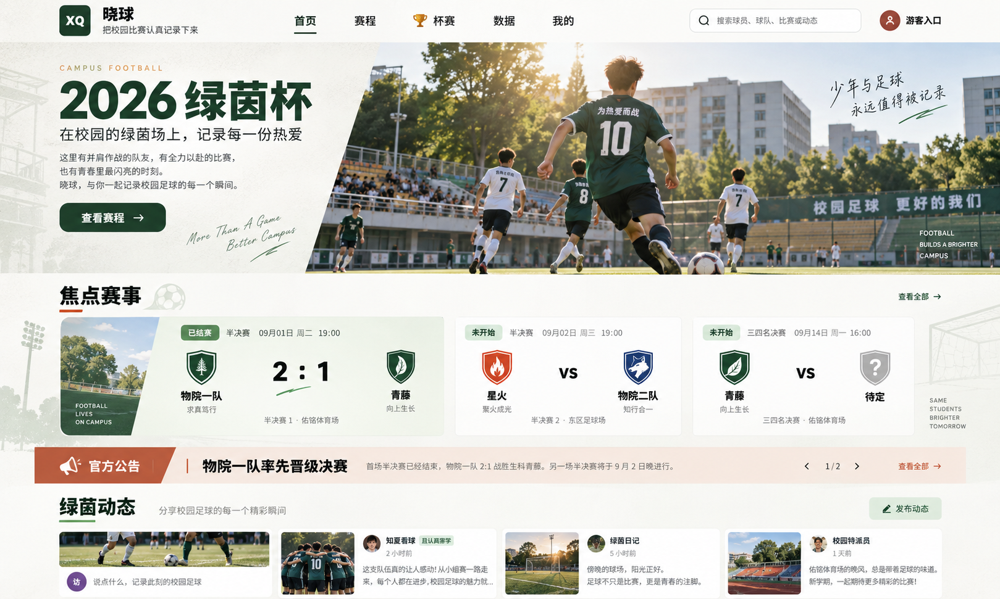
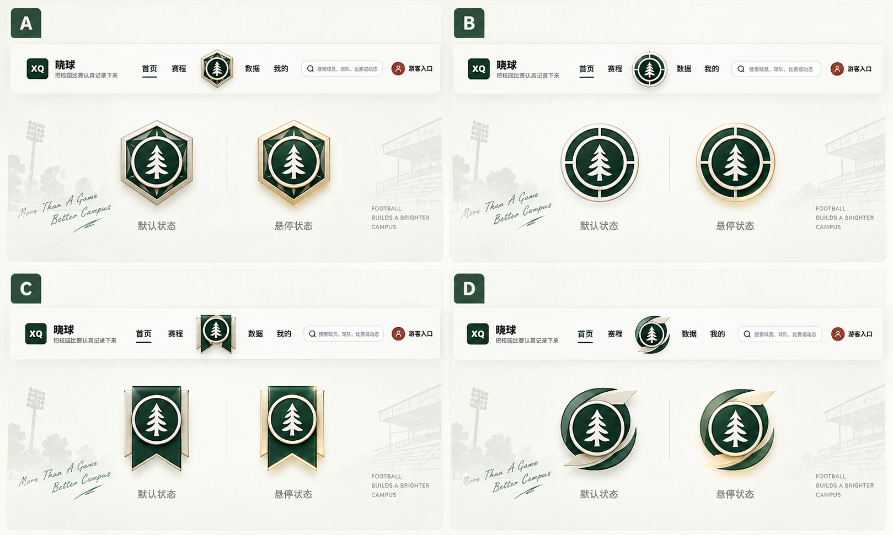
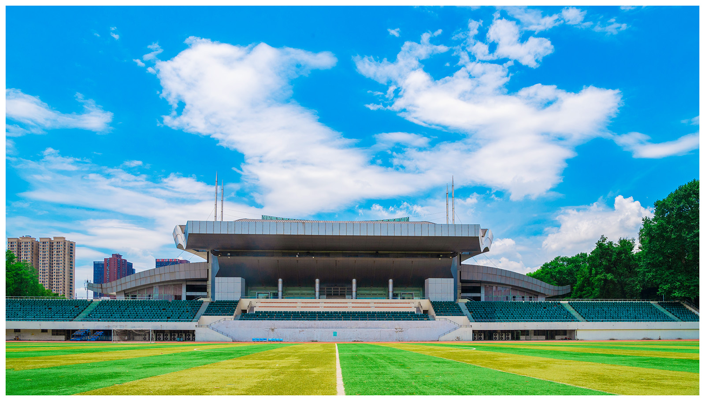
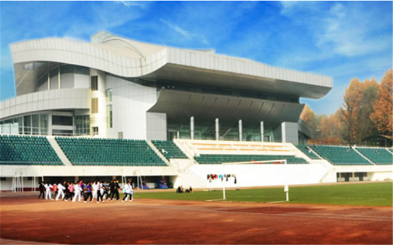
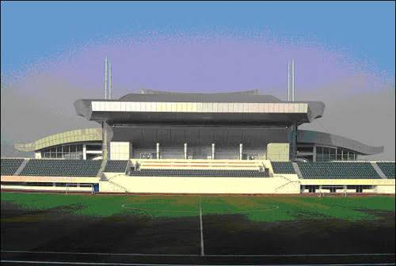

# 晓球首页 · 第一轮制作任务书

> 日期：2026-09-26<br>
> 本轮目标：在现有项目中试做一个可运行的首页，用实际页面校准视觉，完成后交给用户体验一轮。<br>
> 本轮只交付首页及其必要的共享导航改动，不开展全站重设计，不自动派发多个并行任务。<br>
> 本文件是首页制作入口；[视觉基线 README](README.md) 提供设计背景，[参考来源](sources.json) 用于追溯。源文档中的多页推进与历史人员分工不是本轮新增任务。

> 整理说明（2026-10-01）：本文件随参考图片整体迁移，相对图片链接保留。正文是首轮设计任务的历史记录，其中“未制作”等表述不代表当前状态；当前素材位置及状态见[前端素材说明](../../apps/mini-program/src/assets/home-visual/README.md)。

## 1. 给制作人的简短任务

请在 `D:\MuDevSpace\xiaoqiu` 的实际工作区中，先核对分支与未提交修改，再依据本文完成首页第一轮视觉实现。2026-09-26 检查时，分支为 `codex/h5-refinement`，首页、共享导航、会话及其他文件已有未提交修改，必须在其基础上继续，不覆盖或回滚。

沿用 Taro + React + TypeScript + SCSS、现有 Repository/API 和路由。以 R01 为外观基准，品牌换为 R10，中央主队入口采用 R03 右下 D 外框，背景使用 R07—R09 所示真实校园场馆的简化线稿。先补齐必要素材，再实现首页；不要交付一张整页图片，也不要为了截图写死数据。完成后提供本地网址、桌面和手机截图、实际验证结果、仍缺素材与设计差异，等待用户本轮反馈再扩展。

本轮可由一位制作人连续完成，无需再拆成三个 Agent。不要自行合并 main、清理工作区或把他人既有改动一并提交。

## 2. 哪些已确定，哪些由制作人判断

**已经确定：**

- 暖白底、深绿色文字与按钮、少量陶土橙、真实校园气氛；保持 R01 的整体方向。
- 桌面五入口顺序：首页、赛程、居中主队、数据、我的。R01 的“杯赛”不是本轮导航名称。
- 品牌采用 R10；D 是主队按钮的装饰外框，中心内容随主队变化，不固定为松树队徽。
- 先做首页；赛程、数据、主队和我的只检查共享导航是否回退，不重新排版这些页面。
- 保留当前首页搜索、公告、比赛、动态、发布及登录状态行为。

**制作人可以自主微调：**字号、间距、斜切角度、裁切位置、背景线稿浓度、卡片比例，以及少量组件拆分。以下数值是首轮起点，不是从效果图测得的严格像素值。

**需要显式说明的偏差：**素材仍未完成、现有数据不足以支撑画面、必须改变已有行为或接口的地方。不要用假数据或无响应按钮隐藏问题。普通 CSS 调整不需要反复等待确认。

## 3. 外观基准与必须保留的现有行为

### 3.1 已认可的整体参考 R01



参考重点：左文右图的斜切首屏、暖白深绿层次、不等宽焦点赛事卡、低对比建筑背景、橙色公告条、紧凑的社区内容。参考图中的年份、赛事名称、比分、球队图案、广告文字均不能直接视为当前真实内容。

### 3.2 接手时的代码事实

本节来自文件检查，不代表本轮已运行验收：

- `pages/index/index.tsx` 已将 `announcements[0]` 用作首屏公告：标题、正文摘要和图片来自公告，点击进入公告详情。其余公告在下方呈现。
- 本轮保留这个“公告优先”的逻辑，只将外观调整为 R01 的左文右图。不要恢复成永远写死的“2026 绿茵杯”。当前赛事/赛季仍需在首屏清楚显示；没有公告时再展示赛事名称与简短介绍。
- 首屏公告已有图片时优先显示该图片；没有图片或图片加载失败时，使用本轮校园摄影作为装饰性回退。长公告标题与长摘要必须有自己的排版，不按短标题硬套超大字号。
- `HomeResponse` 已提供 `tournament / announcements / focusMatches / teams / posts / viewer`。
- `PostSummary.imageUrl` 仍是单图字段。参考图里的多个社区卡片可以复现，但不能据此扩展成一条动态多图上传。
- `TeamSummary` 暂无队徽图片 URL。复用现有 `TeamCrest` 和简称回退；若有本地演示队徽，只用稳定 `teamCode` 映射，不为首页视觉修改 API。
- 现有会话代码已处理游客返回登录、跨标签页身份同步。首页重做不能回退这些行为。

## 4. 首页按区域怎样做

| 区域 | 桌面首轮要求 | 行为与数据 |
| --- | --- | --- |
| 顶部导航 | 暖白、细分隔；左侧新图标与“晓球”，中间五入口；D 主队入口略突出，右侧账户菜单。首页选中态用克制下划线/颜色，不继续使用大块实心导航底 | 复用 PublicShell 的主队状态、路由、账户菜单与退出逻辑；游客和未选主队使用中性占位 |
| 首屏 | 左侧暖白文案区约 38%—44%，右侧摄影区约 56%—62%；以一处斜切衔接。图片不铺到文字后面；不做全屏大海报 | 有公告：显示当前赛事/赛季、小型公告标识、公告标题、摘要、“查看公告”；无公告：赛事标题、介绍、“查看赛程”。明确按钮承担点击，不让空白装饰区假装有动作 |
| 搜索 | 首轮沿用首屏下方单独搜索条，避免为视觉把搜索状态搬进所有页面的导航；暖白边框与小型搜索图标 | 保留输入、回车/点击提交、四类搜索结果、分类切换与退出搜索；这是相对 R01 顶栏搜索的有意差异 |
| 焦点赛事 | 展示 API 当前返回的焦点赛事，沿用现有最多三场规则；第一卡约占一半，其余两卡分剩余宽度。比分/队名是重心；日期和场地次之 | 沿用现有排序与比赛详情链接。未开始用 VS/开球信息，已赛用真实比分，待定球队有明确占位；仅一场或两场时不填假卡 |
| 官方公告条 | 保留橙色标签和横向阅读节奏；首屏已展示的第一条公告不重复铺一遍，其余公告全部可访问 | 首轮采用静态列表，可按宽度换行；不照抄 R01 的自动轮播、“1/2”和前后箭头。暂无其余公告时不制造空橙色大条 |
| 绿茵动态 | 标题、一个发布入口、实际动态卡片。宽屏优先两列，自适应一列；图文卡与无图卡都完整；避免为塞入首屏把文字缩小 | 保留作者/身份、时间、正文摘要、单图、点赞、评论数、详情与现有私信入口。发布后沿用现有成功/失败及列表更新逻辑 |
| 页尾和背景 | 页尾简洁；线稿只出现在内容边缘或区域留白处，阅读区干净 | 装饰不拦截点击、不进入读屏内容；不添加未实现的新入口 |

首屏高度起点：桌面导航约 72—88 CSS px，首屏约 300—380 px；在 1440×900 下，应看到焦点赛事标题及至少一张可识别的比赛卡。标题太长时宁可缩小标题或调整高度，不隐藏赛事/公告的核心信息。

视觉参数起点：主色沿用现有 `#183f2a`；纸白在现有背景基础上适当偏暖，橙色集中用于公告与少量强调。正文桌面约 15—16 px、手机至少 14 px；辅助信息不依靠极浅灰和极小字。卡片圆角以 6—10 px 为主，徽章形状单独处理。主队 hover/focus 仅轻微提亮或位移，不持续旋转，不加入滚动劫持或复杂动画库。

## 5. 手机布局：直接按此试做，无需等待另一套精修稿

在 390 与 430 CSS px 宽度验证，另测 1024 宽的中间状态：

1. 顶部只保留品牌与账户入口；底部保持五入口，顺序一致。D 外框缩小到不遮挡相邻按钮，底部留出安全区。
2. 首屏按“赛事/公告文字 → 摄影”纵向排列，减小斜切或取消斜切；图片建议约 16:9，不把整张桌面海报等比缩小。
3. 搜索条保持独立且可点击，不缩成难以识别的图标。
4. 比赛卡、动态卡都改为单列，完整显示长队名；不依赖横向滑动才能看到其他焦点赛事。
5. 公告标签与标题可换行，摘要适度截断并保留详情入口。
6. 建筑线稿最多保留一个局部。禁止页面级横向溢出，固定底栏不能遮住最后一条动态或发布弹窗按钮。
7. 手机 390×844 下优先控制首屏与搜索区高度，让焦点赛事标题尽量在首次滚动前可见；不为此牺牲字号和触控区域，触控目标以至少 44×44 px 为起点。

## 6. 图片与素材清单

**本任务书只整理需求，没有生成下面的待制作素材。** `references/` 是参考原件；表中的输出路径均为建议落地路径，并不表示文件已经存在。制作人可用可用的图像工具准备素材，不要求用户逐块切整页图。

建议正式资源集中在 `apps/mini-program/src/assets/home-visual/`，品牌与外框由共享组件引用；不要在应用中直接引用 `docs/research` 的大图。

| 编号 | 用途与建议文件 | 现有来源/状态 | 输出与验收要求 | 缺素材时的处理 |
| --- | --- | --- | --- | --- |
| A01 必需 | 品牌 `brand-mark.png` | R10 已存在且已记录真实 Alpha 透明；边缘和小尺寸仍待检查 | 保持图形和绿/橙配色，不重画成 XQ 方块。整理画布留白，建议保留 512 px 以上宽的透明 PNG；显示约 36—48 px 高，保持比例。检查 32/40/48 px 及浅深底 | 可直接使用 R10 的派生副本；不要拉伸，也不要把查看器黑底烘焙进去 |
| A02 必需 | 主队 D 外框 `team-nav-frame-d.png` | 仅有 R03 右下 D 效果参考，独立外框尚不存在 | 建议 1024×1024 透明 PNG；深绿流线、米白金属高光，中间透明孔。只做外框，去掉中心松树与队徽底盘。默认与 hover 优先共用一张由 CSS 提亮 | 先做明确标记的简化外框以联调；缺正式外框时只能报告布局预览，不能报告 D 视觉完成 |
| A03 必需 | 首页摄影回退 `home-campus-football.webp` | R01 有带界面文字的摄影效果，干净原图缺失；旧 `campus-football-hero-v2.webp` 可作临时占位 | 推荐 2400×1400 或更大的横图：校园足球近景、人物背影/运动、树木与看台、自然斜阳；人物和球留在中右区域，留裁切余量。干净无文案、无 UI、无水印；交付 WebP，另留母版。桌面目标约 500 KB 内，手机尽量使用约 200 KB 内的派生图，清晰度优先于死卡大小 | 先沿用旧图并列为明显设计差异；不可从 R01 裁一块带标题和斜切白底的图当生产摄影 |
| A04 必需 | 场馆正面线稿 `stadium-front-lineart.png` | R07—R09 实景参考存在，线稿尚未绘制 | 建议 2400×1000 左右透明 PNG，低饱和灰绿线条；源线条正常可见，页面再调淡。保留大挑檐、中央主席台、两翼、阶梯看台，首页只裁用少量局部 | 可先不放背景，但必须注明校园背景未完成；不可用通用欧洲球场或照片滤镜描边顶替 |
| A05 可后置 | 场馆侧面线稿 `stadium-oblique-lineart.png` | R07 是主要参考，R08/R09 校准结构 | 同 A04 风格，建议 1800×1200；用于后续裁切变化；首页一张正面母版已够，不必为首轮强制制作 | 首轮省略即可，不阻塞 |
| A06 可选 | 首张比赛卡侧图 `match-campus-detail.webp` | 可从已交付的 A03 或提供的场馆照片另作构图 | 建议约 640×800，作为窄侧边装饰；不遮挡队名、比分，也不暗示是该场比赛实拍 | 直接省略该装饰区域，不空留占位框 |
| A07 按数据复用 | 球队队徽/占位 | 暂无已确认的独立队徽包；R01/R03 图案只是示例 | 优先现有 TeamCrest；有经确认素材时按 teamCode 统一映射，透明图建议 256×256。不同队伍不都套同一松树。D 框中心可容纳不同形状队徽 | 简称+球队颜色作为明确回退；不得临时给每队发明正式队徽 |
| A08 按数据复用 | 公告图、动态配图、头像 | 从 API 的 imageUrl / avatarUrl 读取 | 沿用 resolveMediaUrl；有图、无图和加载失败均要排版稳定。图片保留宽高/比例占位 | 无图显示文本布局或现有头像回退，不补造用户发布的照片 |

首页首轮最小素材组合为 **A01 + A02 + A03 + A04**。A05、A06 可后置；A07、A08 沿用数据与回退。不要把整个页面里的每个图形都做成 PNG：标题、比分、按钮、斜切、边框、搜索图标和普通几何装饰仍由组件/样式绘制。

来源和身份必须如实：用户提供的场馆照片是结构参考；若 A03 采用生成图，它只能作为装饰性校园足球画面，不标注成某场真实比赛实拍，不要求伪造可辨认的真人或真实报道。图片来源、生成说明及输出尺寸可记录在资源目录的简短 README 中。

### 6.1 品牌源图 R10

透明图在某些查看器里可能显示黑底，不能据此加一层黑色背景。


### 6.2 D 外框参考 R03

只采用右下 D 的流线外框语言，A/B/C 均不采用。中心松树图形不是外框的一部分。



### 6.3 场馆参考 R07—R09

R09 决定正面比例，R07 解释弧形侧翼和厚度，R08 辅助理解旧照片中的结构；不把不同时期的设施机械拼到一起。







### 6.4 可直接交给素材制作者的要求

**A02：D 外框**

> 参考提供的 A/B/C/D 图中右下 D 方案，制作独立的主队按钮装饰外框。保留两片深绿色流线弧带和克制的米白金属高光，围绕中心形成有运动感的包围轮廓。去掉中心松树、圆形队徽、文字、网页和候选编号；中央留透明孔，能叠放任意球队队徽。外侧背景也透明，不画棋盘格。输出 1024×1024 PNG，保留少量安全留白，缩小到约 64 px 后仍清楚；不增加复杂雕花和强烈金色光晕。

**A03：首页摄影回退**

> 参考已认可首页右侧摄影的情绪和构图，制作一张独立、干净的校园足球横向画面。自然午后斜阳，前景一位穿深绿色球衣的大学生球员背影带球，远处少量队员、树木、校园建筑与看台。人物与足球位于中右侧，边缘留出裁切余量，画面真实自然、青春、不过度商业广告化。不要标题、口号、网页导航、按钮、白色斜切遮罩、水印或可辨认的学校/赞助商文字。不要把参考页里的文案画进照片。横图至少 2400×1400，另提供手机裁切建议；若生成尺寸受工具限制，保留实际原始尺寸并注明，不靠放大冒充细节。

**A04：校园场馆线稿**

> 以提供的三张同一场馆照片为结构依据，清晰正面照为主，侧视照辅助。画透明背景的简化建筑线稿，保留宽大挑檐、起伏檐口、檐下开口与立柱、中央主席台、左右弧形侧翼、阶梯看台及少量球场线。灰绿色单色、少量极浅块面，省略人物、广告字、逐个座椅与无关高楼；不直接抠照片或滤镜描边，不替换成通用体育场。源线条正常可见，页面中再减低对比。不画网页、标题或卡片，不把棋盘格画进图片。输出宽幅透明 PNG，并按照片核对轮廓后交付。

上述提示词是制作起点，不是“生成一次即验收通过”；需要检查透明边缘、画面裁切及小尺寸表现。

## 7. 实现范围与现有文件

| 文件/目录 | 本轮用途 |
| --- | --- |
| `apps/mini-program/src/pages/index/index.tsx` / `index.scss` | 首页布局、现有数据组件的呈现与响应式；先看已有 diff |
| `apps/mini-program/src/components/public-shell/` | 品牌、D 主队按钮及必要导航样式；它影响所有页面，改后必须抽查 |
| `apps/mini-program/src/components/product-ui/` | 复用 TeamCrest、PostCard 等；需要首页特例时增加局部 class/variant，避免改变所有调用处 |
| `apps/mini-program/src/components/public-ui/` | 复用加载、空态、错误和重试；不要丢掉已有状态 |
| `apps/mini-program/src/assets/home-visual/` | 本轮新资源及来源说明，建议新建 |
| `apps/mini-program/src/features/product/product.repository.ts` / `product.types.ts` | 阅读并复用现有数据；视觉实现原则上不需修改 |
| `apps/mini-program/src/features/product/session.ts` / `src/app.tsx` | 现有会话同步逻辑，作为回归对象，不为视觉重写 |

沿用当前框架与依赖，优先页面内样式变量；先核实 `packages/design-tokens` 是否实际被当前页面消费，再决定是否需要统一。不要为了这个首页引入 Next.js、Tailwind、全套组件库、动画库或新增后端服务。

首轮不修改数据库、API 契约、生成的 Client、权限模型、Seed 与锁文件；如确实发现视觉需求必须涉及这些，单独列明原因，不混入首轮试做。不要调用 Seed 覆盖用户现有体验数据。

若在共享导航加入新素材，允许其他页面自然使用新品牌与 D 框，但只把首页作为视觉完成对象；其他页面要能正常导航、登录和阅读。不要使用无边界的全局标签选择器重写所有页面。

## 8. 制作顺序与交付节奏

1. **盘点**：确认真实工作路径、分支、已有 diff、启动方式、素材清单。简短说明可复用什么、缺什么，不另写一份庞大架构方案。
2. **准备素材与一个局部样板**：优先 A01—A04，组合导航、首屏和第一张真实比赛卡；先在桌面浏览器看比例，避免只堆素材。
3. **完成首页一轮**：接公告、社区、搜索与手机布局；必要微调由制作人自行完成，不为每个间距询问用户。
4. **自查后交付体验**：按下节验证，提供可访问网址和截图；清楚列出和 R01 的有意差异及未完成项。用户反馈前不自动扩展其他页面。

素材暂缺不阻止搭建布局，但交付时分清“布局可体验”和“视觉达到本轮要求”；不能把占位图标记成最终素材。

## 9. 验收：必须看到实际结果

### 9.1 视觉

- [ ] 桌面 1440×900 与 1920×1080；手机 390×844 与 430×932；中间宽度 1024 截图检查。
- [ ] 导航品牌是 R10，主队外框为 D 或明确说明仍是临时替代；中央入口始终表示主队。
- [ ] 左文右图、暖白深绿、焦点卡比例、橙色公告区与 R01 的主要层次接近；没有把旧插画冒充新摄影完成。
- [ ] 长公告标题、长队名、两位数比分、待定球队、无动态图片都不重叠、不撑破布局。
- [ ] 浅底和深底检查品牌边缘；绿色、红色、蓝色以及缺失队徽状态下 D 框中心都稳定。未有正式队徽包时用测试占位核对适配，不修改真实球队资料。
- [ ] 图片与线稿均为独立资源；文字、比分和按钮可以正常选择/缩放/点击。正文与操作文字对比清楚，焦点可见，装饰不遮挡触控。

### 9.2 真实交互

- [ ] 游客打开首页能读取 API 数据；从“登录或注册”及“我的”进入登录页，不被游客标记送回首页。
- [ ] 已登录、未选主队、已选主队显示正确；更换主队后回到首页能看到更新，刷新不丢失。
- [ ] 同源两个标签页之间登录/退出同步，旧标签页不长期保留旧身份。
- [ ] 搜索球员/球队/比赛/动态、切分类和退出搜索可用；快速修改关键词不会显示上一轮迟到结果。
- [ ] 首屏公告/其他公告能进入对应详情；无公告回退到赛事信息；比赛卡和“查看全部”打开正确页面。
- [ ] 动态详情、点赞、发布与失败提示按原流程工作；游客受限操作引导登录。需要写入时仅用演示账号和明确的测试内容。
- [ ] 在测试浏览器中模拟 API 失败后点击重试、恢复网络后刷新，页面能恢复；同时测试空数组与图片失败，不改日常数据库来制造这些场景。
- [ ] 抽查赛程、数据、主队、我的：共享壳层没有遮挡、横向溢出或路由回退；手机底栏、弹窗、减少动态偏好正常。

### 9.3 工程验证

按改动范围执行并记录结果：

```powershell
pnpm --filter @xiaoqiu/mini-program typecheck
pnpm --filter @xiaoqiu/mini-program test
pnpm --filter @xiaoqiu/mini-program build:h5
# 对实际修改的 TS/TSX 文件运行 ESLint
pnpm exec eslint <本轮修改文件>
git diff --check
```

共享组件改动后还需验证微信构建 `pnpm --filter @xiaoqiu/mini-program build`。当前两种构建都使用 `dist/`，顺序执行；微信构建之后重新构建/启动 H5 再交付网页，避免覆盖产物导致交付地址不可用。构建通过不代表小程序真机已验证。不要把已有少量逻辑测试通过当成上述浏览器流程已全部通过。

记录首屏资源体积；可运行 Lighthouse 时报告测量环境和结果，未测就注明未测，不声称已达到性能指标。不因本轮视觉改动运行可能写入日常数据库的全量集成测试。

### 9.4 最终交付格式

- 当前路径、分支、修改文件；是否提交及提交号。
- 实际可打开的首页 URL，服务从哪个工作目录启动；不要只贴编译日志。
- 桌面与手机截图位置，至少包含完整首页和首屏。
- A01—A08 的实际文件、已完成/临时替代/未做状态；新增资源的来源说明。
- 上述验证哪些通过、哪些失败或未做；明确模拟数据测试与真实 API 验证的区别。
- 相对 R01 的差异：至少说明公告优先、搜索条位置、公告不自动轮播、社区列数等有意调整。
- 交给用户体验，不自动开做下一页。

## 10. 转发方式

同仓库制作人：直接给出本文件路径，并让其打开本文引用的图片。

外部制作人：发送 `HOME_FIRST_PASS.md` 和同目录 `references/`，保持相对位置；最好连同原 `README.md` 与 `sources.json` 一起发送。本文已嵌入首页、D 外框、品牌及三张场馆参考，图片文件仍需随文档传递，Markdown 不是内嵌二进制的单文件。

可附这段消息：

> 请按《晓球首页 · 第一轮制作任务书》先做一轮首页。以参考图的暖白深绿、校园摄影和斜切布局为方向，使用最新品牌和 D 主队外框；缺少的图片按第 6 节制作或明确标为占位。基于当前未提交改动继续，保留公告优先、真实数据、搜索和会话行为，不照抄效果图中的功能与数字。你可以自行处理一般实现细节；完成桌面与手机验证后给我网址和截图，我先体验这一页，再决定下一轮。
